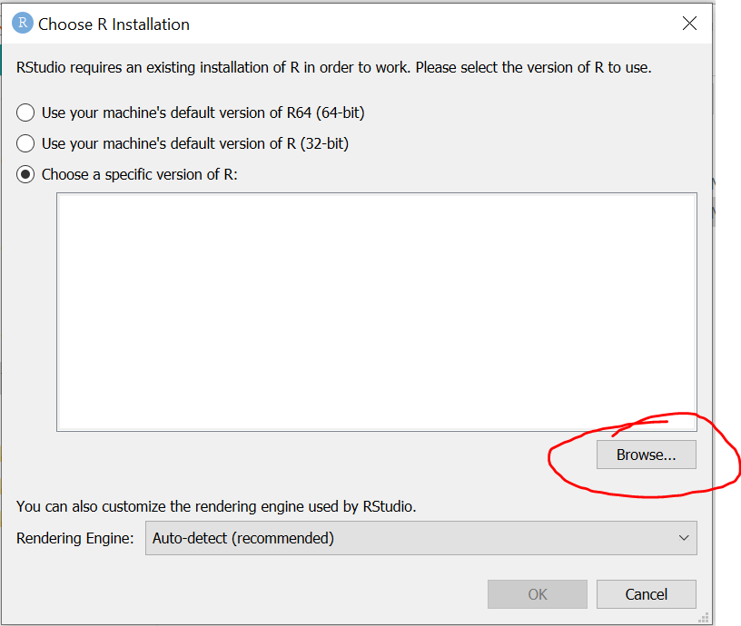
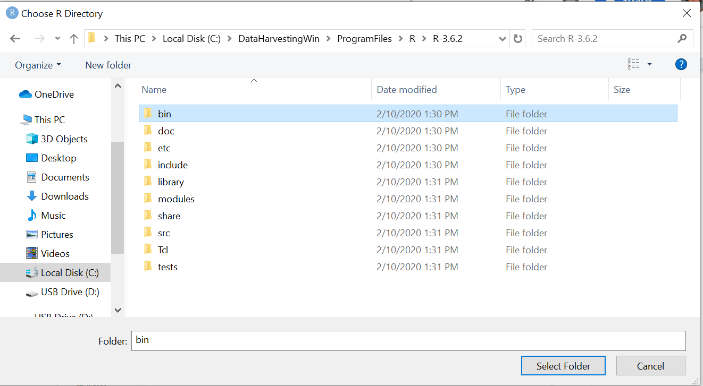
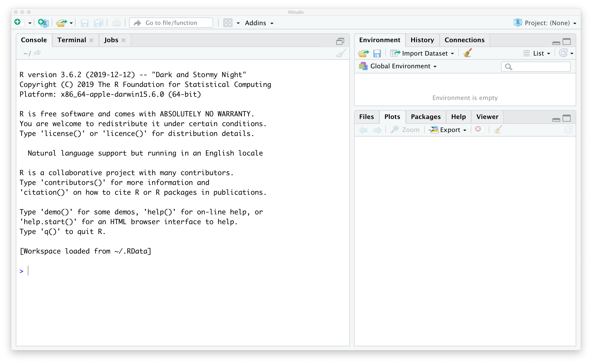
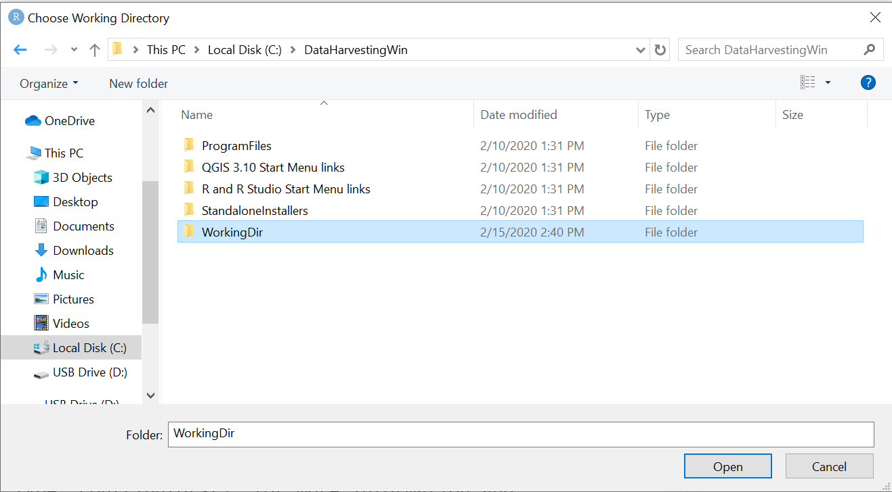
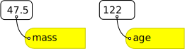
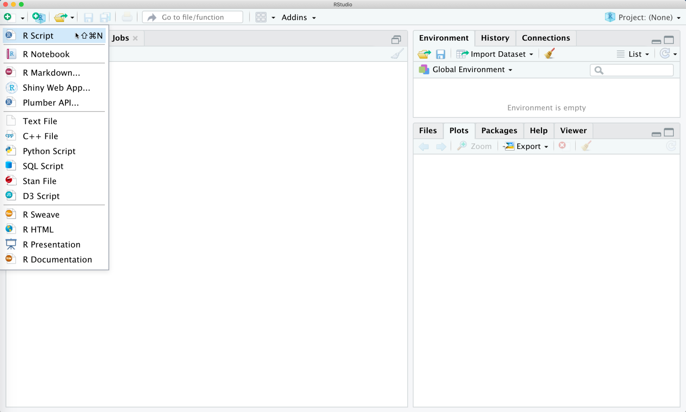
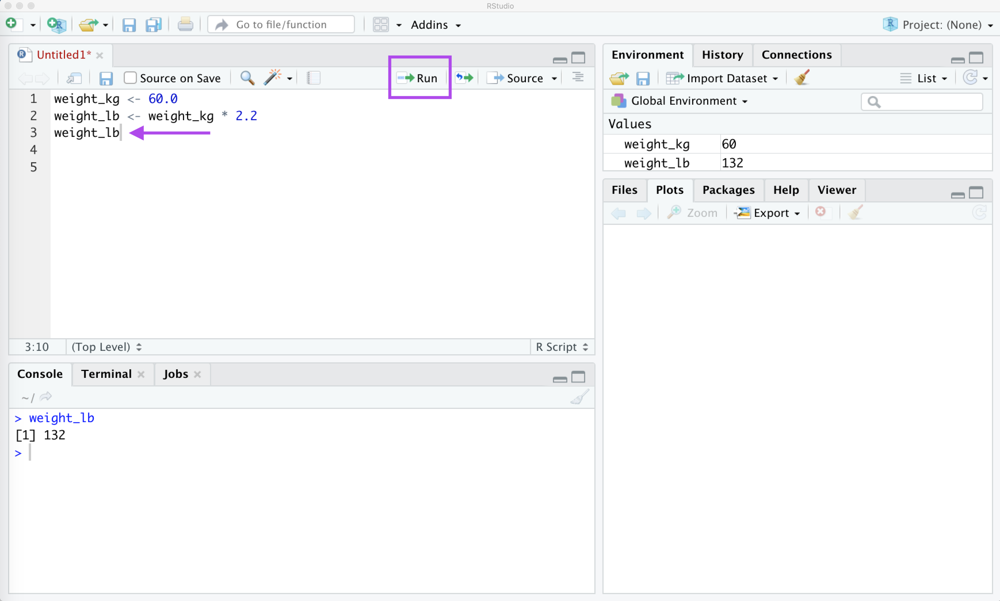

---
# Please do not edit this file directly; it is auto generated.
# Instead, please edit 01-R-RStudio.md in _episodes_rmd/
title: "Introduction Programming with R and RStudio"
include_overview: true
source: Rmd
questions:
 - What is a program?
 - Why would do we want to use a program?
objectives:
 - Learn programming concepts and terms
---

<!-- JPN: updated fig path here manually for plots to show -->

<!-- JPN: attribution formatting -->

## TO-ADD

 * vigenettes - what is it, where can you find it in R studio interface & online
 * how to use "help" *and* how to google for help
 * "::" <- what does this mean, multiple packages with the same name
 * how to set working directory, get working directory, how to point and click => session => working directory
    * throw this on top of all your scripts
 * windows vs. mac directories => mention this, but with the point and click this should not be an issue
 * ADD: stuff about '/workdir/' which is where '/data' will live
 * Add in all set workdirectory and the, and sourcing the functions file, everytime

 Do we need to link the terms to a glossary?

# Programming concepts and language

Programming doesn’t have to be scary, and we have some real-world examples to help you understand what’s going on with these words we’re typing in a window. The words in bold will come up in a programming context later on, but it might help to have a mental reference picture to associate with these words.

Let’s imagine that instead of a program to work with numbers and letters, we’re creating a program that cooks breakfast instead.

In order to make breakfast, you need:
 * A **working directory** (the place where you’re doing things, such as your kitchen countertop)
 * Available **data** (information about what you’re working with)
     * Data could be an inventory of your pantry, a grocery shopping list, a map of the store, a collection of prices at the store, and so forth.
 * **Types** of **objects** -- a method of grouping what can be done to what types of things.
     * Food is one type of thing; people are another; pets are a third.
     * A specific food object can be an egg or a pancake; a particular pet object can be your cat or your dog.
 * Some **inputs** that may be **objects** of appropriate **types** (breakfast food ingredients)
     * You create breakfast by performing actions on objects of food types, and then you feed it to things of the people and pet types.
 * Some **functions** (recipes that work with the ingredients)
     * Inputs to functions are usually stored in **variables** -- you don’t always want to make the same thing every day, so the instructions have placeholder names for things that are similar to each other but may vary. (A “todays_cheese” variable could hold Stilton for one day’s omelet and cheddar for the next.)
 * You need to match your **object** types to your **functions**.
     * You shouldn’t use a pet-type object as an input to a breakfast-making function. (Nobody wants to eat the goldfish for breakfast.)
     * You might be able to use a dinner-type food object as an input to a breakfast-making function, but use caution.
 * Some **outputs** (food ready to be consumed) 
 * A **destination** (where to put the food that’s ready to be consumed)
     * You could put your outputs in your working directory (eat breakfast in your kitchen) or you could send it to another location (put leftovers in the refrigerator)

<a href="https://www.flickr.com/photos/11849171@N00/8330968310">"Breakfast"</a> by <a href="https://www.flickr.com/photos/11849171@N00/8330968310">viviandnguyen_</a> is licensed under <a href="https://www.flickr.com/photos/11849171@N00/8330968310">CC BY-SA 2.0</a>

## Intro to R and RStudio

In this episode we’ll cover the basics of using R, which is a programming language for statistics, data analysis, and data visualization. In the past decade or so, R has become very popular in both science and business, largely because (1) it is free, and (2) thousands of people have written new code extending its functionality, and that code is also free. If you perform an analysis in R, you can share that analysis so that anyone in the world can reproduce it without having to purchase proprietary software.

If you’re already proficient with Excel, you will probably already know how to accomplish a lot of what we are doing in this episode using Excel instead of R. One reason why we are teaching you this material, however, is to get you comfortable with R since we will be using R for geospatial analysis (which is not so easy in Excel).

In this lesson, we will be making use of another software called “RStudio” as a way to interact with the programming language R. RStudio makes writing our programs more user-friendly. Using RStudio instead of R is a little like having a toaster. You can make toast over a fire, but having a toaster makes the job easier and less scorch-prone.

We launch RStudio by double clicking on its icon, as we would with other software on our computers. 

> ## Windows Users: Click Here for more details
> If you’re running R Studio from a copy made from the USB stick, then the first time you launch R Studio, you’ll be asked where your installation of R is located.
> 1. Choose the “Choose a specific version of R” item next to the large text box.
> 
> 2. Use the **Browse** button to navigate to:
>    * **DataHarvestingWin/ProgramFiles/R/R-3.6.2/bin/**
>    * and choose **Select Folder**.
> 
> Next, you’ll be prompted which version you want to use. You could choose either 32 bit or 64 bit; either should work, but 64 bit is likely to be what your computer is capable of.
> 
> In the image below, the 64 bit version has been chosen and you can now press OK.
> 
> At this point, R Studio should open next.
>
{: .windowsUsers}

<!--In this episode we’ll cover the basics of using R, which is a programming language for statistics, data analysis, and data visualization. In the past decade or so, R has become very popular in both science and business, largely because (1) it is free, and (2) thousands of people have written new code extending its functionality, and that code is also free. If you perform an analysis in R, you can share that analysis so that anyone in the world can reproduce it without having to purchase proprietary software.

If you’re already proficient with Excel, you will probably already know how to accomplish a lot of what we are doing in this episode using Excel instead of R. One reason why we are teaching you this material, however, is to get you comfortable with R since we will be using R for geospatial analysis (which is not so easy in Excel). 

In this lesson, we will be making use of another software called "RStudio" as a way to interact with the programming language R.  RStudio makes writing our programs more user-friendly.  **Some sort of analogy here would be grand (Jill) -- Dena's analogy: It's a little like having a toaster. You can make toast over a fire, but having a toaster makes the job easier and less scorch-prone.**

We launch RStudio by double clicking on its icon, as we would with other software on our computers.  If this is the first time you have opened it, the entire left pane will be taken up by something called the `Console` that you can see as the left hand panel in the figure below: -->

<!--
 **Do we want a screen shot of this instead of the R code?  Or will this be enough of a "following along" type of thing that that sort of thing isn't necessary? Dena: We do want a screen shot of a successful opening of R Studio so they have checkin points.)** 
-->

## Getting your RStudio workspace ready for the workshop

Let’s get our “countertop” ready to “cook breakfast” by: 
  1. Setting up our working directory
  1. Loading libraries and sourcing functions in order to make the tools we’ll use available to RStudio
  1. Locating our data ingredients

### Setting your working directory

Under the **Session** menu, choose **Set Working Directory**, then **Choose Directory**.

In each software collection on the USB drive (both Windows and Mac), we’ve made subdirectories called **WorkingDir** with another subdirectory called **data**. (Even if you’ve installed from scratch rather than copying from the USB drive, the instructions will be easier to follow if you have a folder called **WorkingDir** that contains another one called **data**.)

So if you’re using our file collection after copying it to your local hard drive on Windows, choosing your working directory will look like this:

(If you’re running from the USB drive, the drive letter there will likely say D instead of C, but the rest will be the same.)

 JPN: needs to put in how this looks for Mac 

After you click the Open button, you’ll see a new command has been added to your console, which is the text-based way of saying your home directory has been set:

> ## Windows
> (console)
>
> setwd("C:/DataHarvestingWin/WorkingDir")
>
{: .callout}

> ## Mac
>  JPN: put in for mac 
{: .callout}

Now we’ve identified where we want to work and can start loading libraries and data.

### Loading libraries

R and RStudio are used in many different fields, including biology, genomics, and geospatial data. If we loaded everything that R was capable of handing at once, though, it would take even more space than it already does! 

So with this set of instructions, we’re telling R that we want a set of published tools that are appropriate for working with geospatial data and public data sources, and also some custom-written scripts specifically for this workshop.

 1. Right-click to open  the code for the <a href="https://raw.githubusercontent.com/data-carpentry-for-agriculture/trial-lesson/gh-pages/_episodes_rmd/package_load_and_test.R">package_load_and_test.R script</a> in a new web browser window. This file will tell R which published tools should be loaded into its memory and make sure they’re all working.
 1. Create a new R script file for yourself in R Studio by clicking on **File -> New File -> R Script**.
 1. Copy and paste the test script from the browser window into your new script file.
 1. Save the file as **package_load_and_test.R** in your working directory so that you’ll be able to use it again. 
 1. Run each line by selecting it and clicking the **Run** key. Each test should let you know whether an error was encountered in the loading process.

After you’ve finished with the library loading part of the script, the testing part of the script should make sure each library component is working. 

Just as above, select what you want to run and click the Run button. (Tip: Select everything between pairs of green # lines to run one test at a time and see its output.)

### Sourcing functions for this workshop

The library loading process above uses formally published and reviewed software packages that are available to everyone in the world. However, we’ve also written some custom functions to make this workshop easier, and you can add them to your R environment in a similar method. 

Instead of using the “library” command, though, we’ll use the “source” button instead. (You can also do this with functions you write for yourself, if you wish to make more functions.)

 1. Open the <a href="https://raw.githubusercontent.com/data-carpentry-for-agriculture/trial-lesson/gh-pages/_episodes_rmd/functions.R">functions.R script</a> in a new browser window.
 1. As above, create a new R script file in R Studio by clicking on **File -> New File -> R Script**.
 1. Copy and paste the functions script from the browser window into your new script file.
 1. Save it as **functions.R** in your working directory.
 1. Click the **Source** button near the top right of your script window to load these functions as well.

**Tip:** You’ll want to re-run the library loading script and re-source the functions script whenever you restart R Studio, so remember to re-open them tomorrow morning!

 Could also do source() here, maybe add if we have time 

### Locating data ingredients - LOOP BACK HERE

This section needs fleshing out once we know whether we’ll have the data done and verified complete in time to feed them onto the USBs or not? Skipping to next section

## The stuff in your “kitchen”: Getting oriented with R Studio

So far, we’ve seen some things happen in the four quadrants of R Studio:
 * **New R script files** are made in the top left quadrant, and if you have more than one of them open at a time, you’ll see more than one tab with the file names on them.
   * **Tip:** If you want to save the commands you’re working on, this is where you’ll put your work. There’s no real downside to keeping your notes in a script file; you can easily come back to your work later.
 * **The console** is in the lower left quadrant, and that’s where the “action items” happen. When you clicked through the test script elements, text-based responses came up in the console whether or not a graphic was rendered with that test.
   * **Tip:** In R Studio, it’s helpful to get in the habit of typing your work in a script window, selecting your section, and hitting Run instead of typing directly in the console. You can’t easily get back what you typed in the console in a previous session. (Script files are like recipe cards that you save; entries on the console are like scribbling on the back of a napkin.)
 * Information about your **environment** is in the top right quadrant. This includes libraries that are loaded, variables that have had information put into them, and so forth. Several of the tests caused changes in this area.
 * The lower right quadrant holds several tabs, but the two you’ll use most often are the **Plots** tab and the **Packages** tab. 
    * The map-drawing tests produced images in the Plots tab.
    * When you ran the library-loading lines, checkmarks appeared by those libraries’ names in the Packages tab. 
    * (Tip: That’s a handy way to know what your current environment includes. If you’ve just reopened RStudio after a time away, and you’re not sure what RStudio remembers from your last session, look at the Packages tab to see if your libraries are loaded or not. In our case, **dplyr** is an easy one to find near the start of the alphabet; if it’s not checked when you open RStudio, you’ll want to re-run the package_load_and_test.R script.)
    * Check it out: Click from tab to tab to see what’s in each of them.

## Let’s crack some eggs: Getting started with functions and variables

From our cooking-breakfast example earlier, here are some of the programming terms and analogies for what they mean.

### What is a function?
A **function** is a bit of code that we want to be able to reuse again and again. For example, let’s say you want to make omelets every morning, wouldn’t it be great if you had some sort of machine that would do it for you?

Let’s imagine an omelet-making scenario. You start with some eggs, some cheese, and some other ingredients, use utensils and heat, and end up with something cooked and edible on a plate -- or more than one plate, if several people want omelets that morning.

The number of eggs and amount of cheese you use can vary depending on how many you want, so we call the bit of space that stores that information a **variable**.

Sometimes the recipe you received is dependent on other things that you want to leave yourself notes about as well. Just like scribbling on a recipe card, you can leave **comments** in your code by beginning a commented section with a # character.

Here’s what that omelet process might look like in terms a step closer to programming:

<pre>function make_omelet(how_many, todays_cheese, cheese_quantity, other_ingredients) {

# Multiply number of omelets wanted by 2 eggs each
   eggs <- how_many * 2 

# Multiply cheese per omelet by number of omelets to decide how much cheese is needed
   total_cheese <- how_many * cheese_quantity 

# Mix ingredients
   for each bowl
       crack eggs
       discard shells
	add total_cheese
       if other_ingredients
           bowl <- bowl + other_ingredients
       else
           ready to cook

# When ready to cook
  pour bowl into hot pan 
	# if more than 3 eggs, get more hot pans
  cook
  serve
  wash_dishes
}
</pre>

In this example, we’re telling the system these things:
  * A function (repeatable sequence of commands) named make_omelet takes several inputs (the ingredients list in parentheses)
  * The part in the curly braces {} tells the function what to do with the inputs (also called arguments or parameters – you can think of this as an ingredients list if it helps)

To use a function we have to *call* it in a specific way. Let’s try with an R function called `print` which will just echo back what we give it as an input parameter:

~~~
todays_cheese <- "Stilton" # assign the value of Stilton to a variable called "todays_cheese" -- we don’t want to use apostrophes in variable names, so today’s_cheese wouldn’t work.

print(todays_cheese) # print out the value of the variable to the screen
~~~
{: .language-r}

~~~
[1] "Stilton"
~~~
{: .output}

From now on, whenever we use `todays_cheese`, R will substitute the value we assigned to it. In layman’s terms, **a variable is a placeholder name for something that can be changed regularly**.

In R, variable names:
  * can include letters, digits, and underscores
  * cannot start with a digit
  * are case sensitive. There is no glossary link here
  
This means that, for example:
  * `cheese1` is a valid variable name, whereas `1cheese` is not
  * `eggs` and `Eggs` are different variables

> ## Variable Naming Conventions
> Historically, R programmers have used a variety of conventions for naming variables. The `.` character in R can be a valid part of a variable name; thus the above assignment could have easily been `todays.cheese <- "Stilton"`.
>
> This is often confusing to R newcomers who have programmed in languages where `.` has a more significant meaning, or to people who are used to file names like `resume.doc` where the component after `.` identifies the type of a file. 
>
> Today, most R programmers prefer these standards:
>   * Start variable names with lower case letters
>   * Separate words in variable names with underscores
>   * Use only lowercase letters, underscores, and numbers in variable names. (The book R Packages includes a chapter on this and other style considerations.)
>
{: .callout}
 

## Variables and data types

Something that it’s important to keep track of is what type of data you’ve stored in a particular variable. Words are treated differently than numbers, and numbers with decimals are treated differently than numbers without decimals. So, for example:

  * `cheese_variety` could be "Stilton" or "cheddar", but you probably don’t want a number here. This variable type is called a text string.

cheese_amount could be “a quarter cup”, but numbers are much easier to calculate with than words, so we might represent that as “0.25”. This variable type is called a floating point number.

eggs could possibly be 2.5, but it’s much easier to use either 2 whole eggs or 3 whole eggs. When you want to make sure you’re working with whole units, this variable type is called an integer.

Tip: The first time you use a number-type variable, if you want it to always be an integer, don’t include a decimal point when you assign it (eggs <- 2). On the other hand, if you do want to have the ability to have decimal points in that variable in the future, make sure to include the decimal point even if it’s .0 (cheese_quantity <- 2.0)

Another variable type we’ll be introducing in a few minutes is a dataframe, which lets you hold a whole spreadsheet’s worth of information in one variable. This will be very useful for working with things more complicated than omelets, such as agricultural data!

# OTHER STUFF FROM BEFORE

This has a prompt where commands can be entered.

~~~
5 + 7
~~~
{: .language-r}

~~~
[1] 12
~~~
{: .output}

<!-- JPN: here is a test plot you can uncomment if you wanna try it
I'm gonna trya thing

~~~
plot(c(1,2,3), c(4,5,6))
~~~
{: .language-r}

-->

<!-- JPN: this is just a test to see if I get what is going on here

~~~
data = read.csv('data/fertilizer_use.csv')
print(head(data))
~~~
{: .language-r}

~~~
  Year Crop Nitrogen Phosphate Potash
1 1964 Corn     1623      1053    829
2 1965 Corn     2151      1336   1204
3 1966 Corn     2596      1626   1513
4 1967 Corn     3044      1857   1750
5 1968 Corn     3116      1855   1778
6 1969 Corn     3287      1789   1765
~~~
{: .output}
-->

After you hit enter, you will see the result of the command.  Let's try a few others:

~~~
# Performing arithmetic
6 + 2
~~~
{: .language-r}

~~~
[1] 8
~~~
{: .output}

Whoa!  What did I do just there with this `#`?  This is called "leaving a comment in your code" and everything following the `#`
symbol is called a *comment*. A
comment is a line, or part of a line, that is ignored by R.  This means you can
use comments to explain what is happening in the code or why you did something
a certain way.  Comments start with the `#` character, and can take up the
whole line or just the end of a line.  As we go through this workshop, I
encourage you to put lots of comments in your code. Think of them as a way to
take notes!  Here is an example of a comment at the end of a line while we are doing some arithematic:

~~~
2 ^ 3 # this raises two to the third power
~~~
{: .language-r}

~~~
[1] 8
~~~
{: .output}

## Variables in R

### Outline of this Section

 1. what is a variable? Vocab: *variable*
 1. how do we assign a variable? Vocab: *assign*
 1. What can we do with this variable? -> Generic manipulations (addition, multiplication, etc)
     * for this, use a "real world" thing that farmers might be into... something something nitrogen levels?
 1. Talk about how this variable now shows up in the data area and have a screen shot of where that is

I stole this bit from the Python Fundementals Episode, not sure if that is groovy or not.  I *think* its ok if we follow the rules of their license but we should double check. I also stole a few things from the R-fundementals workshop and so we need to credit them as well.

Also I've left in the links to glossary references that may or may not be there - for example if you click on the "assign" link, it goes nowhere right now.

Also, we should change this whole `weight_kg` thing into something that is more agri-centric?  I think?

This is great but not very interesting.
To do anything useful with data, we need to assign its value to a _variable_.
In R, we can [assign]({{ page.root }}/reference/#assign) a value to a
[variable]({{ page.root }}/reference/#variable), by typing a little left arrow sign `<-`.
For example, to assign value `60` to a variable `weight_kg`, we would execute:

~~~
weight_kg <- 60
~~~
{: .language-r}

From now on, whenever we use `weight_kg`, R will substitute the value we assigned to
it. In layman's terms, **a variable is a placeholder name for something that can be updated regularly**. (In calendar terms, "today" is a variable name that represents a date that changes every 24 hours. Being able to refer to something as "today" is a lot simpler than updating that number every day at midnight.)

In R, variable names:

 - can include letters, digits, and underscores
 - cannot start with a digit
 - are [case sensitive]({{ page.root }}/reference/#case-sensitive).

This means that, for example:
 - `weight0` is a valid variable name, whereas `0weight` is not
 - `weight` and `Weight` are different variables

Also from the R-programming workshop, possibly said another way:

> ## Variable Naming Conventions
>
> Historically, R programmers have used a variety of conventions for naming variables. The `.` character
> in R can be a valid part of a variable name; thus the above assignment could have easily been `weight.kg <- 57.5`.
> This is often confusing to R newcomers who have programmed in languages where `.` has a more significant meaning **, or to people 
who are used to file names like resume.doc where the component after . identifies the type of a file. --Dena**.
> Today, most R programmers 1) start variable names with lower case letters, 2) separate words in variable names with
> underscores, and 3) use only lowercase letters, underscores, and numbers in variable names. The book *R Packages* includes
> a [chapter](http://r-pkgs.had.co.nz/style.html) on this and other style considerations.
{: .callout}

### Types of data

Do we need to get into datatypes here?  Or can we just skip it and get into it when we look at an actual dataset that has columns of different datatypes?DENA: Introduce each concept right when we need to know it and right when we're going to use it. That way it's directly relevant to what's in front of them next.)

R knows various types of data. The ones you are likely to come across are:

* integer numbers (whole numbers)
* floating point numbers (numbers with decimals), and
* names or words that sort data into "categories" (maybe something better here?)  Save types of data until we get into the columns stuff?**Dena: This isn't a helpful example to me; I honestly don't know what data type this is trying to describe.**

In the example above, variable `weight_kg` has an integer value of `60`.
To create a variable with a floating point value, we can execute:

~~~
weight_kg <- 60.0
~~~
{: .language-r}

Here I don't know if we should get into the print function right now like they do in the Python lesson or not

I also don't know if we want to use "<-" all the time or the "=" sign.  I *feel* like "=" is more intiuative but I'm not 100% sure on that one, could be my Python bias showing :) **Dena: "<-" saves all kinds of confusion about "=" vs "==" and so forth, and it's something that won't lead to confusion about whether it's the mathematical use case or not? I've never seen it before since I'm not an R person, but I like it.**

We can do arithematic with variables like we did with numbers before:

~~~
# Performing arithmetic with our variable: multiply it by a factor of 2.2
weight_kg * 2.2
~~~
{: .language-r}

~~~
[1] 132
~~~
{: .output}
<!-- weight in lbs = 2.2 x weight in kg -->

The above command, however, did not change the value of `weight_kg`:

~~~
weight_kg
~~~
{: .language-r}

~~~
[1] 60
~~~
{: .output}

To change the value of the `weight_kg` variable, we have to
**assign** `weight_kg` a new value using the equals `<-` sign:

~~~
weight_kg <- 60.0 * 2.2
weight_kg
~~~
{: .language-r}

~~~
[1] 132
~~~
{: .output}

> ## Variables as Sticky Notes
>
> A variable is analogous to a sticky note with a name written on it:
> assigning a value to a variable is like putting that sticky note on a particular value.
>
> 
>
> This means that assigning a value to one variable does **not** change
> values of other variables.
> For example, let's store the subject's weight in pounds in its own variable:
>
> 
> ~~~
> # There are 2.2 pounds per kilogram
> weight_lb <- 2.2 * weight_kg
> weight_kg
> ~~~
> {: .language-r}
> 
> 
> 
> ~~~
> [1] 132
> ~~~
> {: .output}
> 
> 
> 
> ~~~
> weight_lb
> ~~~
> {: .language-r}
> 
> 
> 
> ~~~
> [1] 290.4
> ~~~
> {: .output}
>
>
> 
>
> Let's now change `weight_kg`:
>
> 
> ~~~
> weight_kg <- 100.0
> weight_kg
> ~~~
> {: .language-r}
> 
> 
> 
> ~~~
> [1] 100
> ~~~
> {: .output}
> 
> 
> 
> ~~~
> weight_lb
> ~~~
> {: .language-r}
> 
> 
> 
> ~~~
> [1] 290.4
> ~~~
> {: .output}
> We can see that even though we updated `weight_kg`, the variable `weight_lb` was not changed.
>
> 
>
> Since `weight_lb` doesn't "remember" where its value comes from,
> it is not updated when we change `weight_kg`.
{: .callout}

Note: there is another way of explaining this in the R lesson: [http://swcarpentry.github.io/r-novice-inflammation/01-starting-with-data/index.html](http://swcarpentry.github.io/r-novice-inflammation/01-starting-with-data/index.html)

Do we want to have this example for them too or just get right into scripts and whatnot?

> ## Assigning Values to Variables
>
> Draw diagrams showing what variables refer to what values after each statement in the following program:
>
> ~~~
> mass <- 47.5
> age <- 122
> mass <- mass * 2.0
> age <- age - 20
> ~~~
> {: .language-r}
>
> > ## Solution
> >
> > ~~~
> > mass <- 47.5
> > age <- 122
> > ~~~
> > {: .language-r}
> > 
> > 
> >
> > ~~~
> > mass <- mass * 2.0
> > age <- age - 20
> > ~~~
> > {: .language-r}
> > 
> > 
> > 
> {: .solution}
{: .challenge}

## Writing and Saving R Scripts 

 NOTE: I'm wondering if we want to push this section to later -- i.e. if we want to just go right to "getting your data into R" and do some examples just using the console and then start worrying about saving files later in the day once they have some cool plots that they made with R that they might want to reproduce. DENA: Yes, move it later -- we're after early gratification with minimal fear and dread.) ETA after a second read: It makes a reasonable amount of sense here, but the outline I'm less sure of what we're doing with it?

### Outline of this section
 1. Analogy - scripting is like writing a set of instructions, a letter, something. Vocab: *scripts/scripting* 
 1. Where do we write scripts in RStudio - screen shot of window, a screen shot of what to do if there is only the console and no script - how do you open a script interface 
 1. Redo stuff with variable in script (nitrogen levels calculation), but call it something different
 1. How to run a script - Run vs. Source -> they are in the same place!  Screenshot of this. Vocab: *running a script*
 1. Point out that it shows up in the data-listing place
 1. ~~How do we find out the value of our new variable that we wrote in a script?~~
    1. ~~Using the console like before - because in RStudio the console and scripting interface are linked! (this is not true in other things like PyCharm... this is slightly an aside though so use an aside thing)~~
    1. ~~Using a print statement - emphasize that you *have* to use print in the script to see the variable!~~
 1. How to save our script -> where does it save to?
 1. Closing and re-opening a script to re-run.

Now that we have some idea of what kinds of calculations we want to do in R, we might want to know how to save our work.  We do this in something called a _script_ which is essentially a list of instructions that will tell R what to do, in the order we give them.

We can open up a _script file_ where we will type in all our instructions by going to the little green plus at the top left of RStudio and selecting "R Script" from the dropdown menu (this was for a Mac, not sure if its different for windows):

In our new scripting window, we can type the commands that we had worked through before into this script and then tell R to do the calculation by putting our cursor on the last line (end of line 3) and pressing the "Run" button in the upper right corner of the scripting window:

Do we want to teach them about Source vs. Run at this point? 

You can see that these variable names have now popped up in the _Global Environment_ window at the upper left -- this is a way we can keep track of our variables as we run our scripts.

Finally, we want to be able to save all of our hard work!  We can do this like we would save any file on our computer, but make sure you put it in a place were you'll remember on your computer. (do we need screen shots?  I assume everybody knows how to save a file and how to choose where to save it but maybe this isn't 100% correct?)

You'll note now that the little upper tab on the left of the scripting window has the file name I chose, but with the extension `.R`.  This is the extension of an R-script and it means that its in a format that R can execute.

If you close this file and want to re-open it, you can use `File -> Open File...` to open it up in R. (This could be different on a Windows, also not sure how much detail we want here and if we want a screen shot or not)

<!--## OPTIONAL: What is a function?

Not 100% sure we want to go into this much detail, but we could do a thing here where we put everything we just did with our variable into a function.  I think this might be too much at this point, and maybe if we get them into writing their own functions we can circle back around to this.  **Dena: Yeah, right here is not where I'd do functions -- either earlier or in the next file, but saving the file is generally the "end" of a sequence, you do a thing and then you save it and then you're done?**

-->

## Getting your data into R

### Outline of this Section
 1. Let's talk about the dataset we are going to use here -- facts about this dataset
 1. This is what this dataset looks like (show snapshot of csv)
 1. To get this data into R where we can do math to it like we did with our variable above we have to do something called "reading in our data".  To do this, we'll use something called a *function* to assign a variable the value of this table -- i.e. we want a variable that will store all the rows and columns of our dataset
     * Talk a bit about what a function is here -- omelets? Vocab: *function*
     * we also have to talk about the fact that we give the file name as a parameter to this function. Vocab: *function parameter*

As an example of a dataset in spreadsheet form that we can use to demonstrate
the R language, we are using the [USDA - Economic Research Service's fertilizer
use and price dataset](https://www.ers.usda.gov/data-products/fertilizer-use-and-price.aspx).
Of the various tables of data on this website, will be looking at Table 2 called "Estimated U.S. plant nutrient use by selected crops"
which shows 1,000 nutrient short tons of nitrogen,
phosphorus, and potash used on corn, soy, cotton, wheat, and other crops in the
US from 1964-2016.

This table has been reformatted into a CSV file for ease of import into
R.  You can download the CSV from: <a href="https://raw.githubusercontent.com/data-carpentry-for-agriculture/trial-lesson/gh-pages/_episodes_rmd/data/fertilizer_use.csv" download>https://raw.githubusercontent.com/data-carpentry-for-agriculture/trial-lesson/gh-pages/_episodes_rmd/data/fertilizer_use.csv</a>. NOTE: I had to *explicitly* save this as a .csv file, it default downloaded as a txt file.  And I had to right-click on the link to save it at all, eventhough I had the download tag in the HTML.  Not sure how to fix this at the moment. **Dena: That's most likely a mime type problem on the web server end?**

**Dena: Problem with reading this in -- how do you ask R what directory it's currently considering you to be "in" for relative path types of things? I knew data/filename.csv wasn't going to work for me because that's not a path I've got set up in the demo folder,
but I can't figure out how to ask R where its "current directory" equivalent is in order to figure out how to either change directories
or make ./ or ../ paths work to navigate to where the file is living.**

**Dena: Sequence needed here:
1) Where is your working directory actually now? (Mine was C:\Users\Dena\Documents, which is totally disconnected from where our stuff will be.)
2) Change it to C:\ or D:\ DataHarvesting(YourOS)\SampleData (I think)
2b) In the process if you're on Windows all those \ marks need to become / marks - Brittani says there's a point and click option
3) Download the file.csv into the SampleData folder unless we've already put it there for them
4) Then read in the file**

The top few lines of this file look like:

~~~
Year,Crop,Nitrogen,Phosphate,Potash
1964,Corn,1623,1053,829
1965,Corn,2151,1336,1204
1966,Corn,2596,1626,1513
1967,Corn,3044,1857,1750
~~~
{: .output}

It can be opened in Excel if you want to get a quick look at it that way, or we can
dive straight into looking at it in R.  Save it into your `data` folder in
your RStudio project for this lesson.

 **NOTE: this assumes they have already created the `data` folder -> I assume this will be somewhere in the setup directions?? DENA: It should be both in the setup directions and on the USB key.)

In R, we can use a *function* called `read.csv` to import data from a CSV
(comma-separated value) file.

> ### What is a function?
>
> A function is a bit of code that we want to be able to reuse again and again.  For example, let's say you want to make yourself an omelet every morning, wouldn't it be great if you had some sort of machine that would do it for you?
> 
> Let's imagine an omelet-making scenario. You start with some eggs, some cheese, and some other ingredients, use utensils and heat, and end up with something cooked and edible on a plate.
>
> Here's what that process might look like in terms a step closer to programming:
><pre><code>
> function make_omelet(eggs, cheese, chives) {
>    for each bowl
>        crack eggs
>        discard shells
>        if the ingredients list is longer than eggs
>            add other ingredients to bowl as well
>        else
>            ready to cook
>   pour bowl into hot pan
>   cook
>   serve
>   done
> }
>
></code></pre>
>
>In this example, we're telling the system these things:
> * A function (repeatable sequence of commands) named `make_omelet` takes several inputs (the ingredients list in parentheses)
> * The part in the curly braces `{}` tells the function what to do with the inputs (also called arguments or parameters -- you can think of this as an ingredients list if it helps)
>
>
> To use a function we have to _call_ it in a specific way.  Let's try with an R function called `print` which will just echo back what we give it as an _input parameter_:
> 
> ~~~
> weight_kg <- 100.0 # assign the value of 100.0 to a variable called "weight_kg"
> print(weight_kg) # print out the value of the variable to the screen
> ~~~
> {: .language-r}
> 
> 
> 
> ~~~
> [1] 100
> ~~~
> {: .output}
> In this example, we _called_ the function by using the function name, `print` followed by parenthisis in which we put our _input parameter_ in this case the variable `weight_kg`, the value of which we wanted to print to the screen.
> This was a bit of a silly example since we've been able to show the value of variables without this function before, but it is a nice example of a function being used. (wording has got to be better here) **Dena: maybe move the whole stack up to where we're introducing variables?**
>
{: .callout}

Let's use a function called `read.csv`(BRITTANI: The way this is written now, we have already seen read.csv. We need to decide where we want to put the function omlet example in relation to reading the csv.). that will import our table of data into R so we can use it:

~~~
fert_use <- read.csv("data/fertilizer_use.csv")
~~~
{: .language-r}

Note here that the name of the function is `read.csv`, the _input parameter_ is the name of the file we want to read in, including the `data` folder we created earlier.  The `/` after `data` just indicates to R that it should look inside this folder for the file named `fertilizer_use.csv`.  (Again here, I'm assuming we already went over how to make the data folder, how to save stuff inside the data folder, and whatnot).  We _assigned_ the value of this table -- all of its row and column data -- into a variable called `fert_use`.

Just like with our `weight_kg` and `weight_lb` variables before, it now shows up in the _Global Environment_ window at the upper left of RStudio.

## Explore your data in R 

#### Outline for this section
 1. Explore your data with the "head" function 
      *  Your data is stored as a special thing called a dataframe - explain what this is. Vocab: *dataframe*
 1. Using the str function
 1. NOT IN HERE YET: Also show how to look at your data in R (like "View(data)")? Maybe?  Or you can click on it?
 1. We can access the columns of your tabular dataset with a $ thing
 1. We can access the rows of your tabular dataset with ... (not sure we wanna do this)

I am starting of with the "head" function because I think its more intuative than the "str" function and allows for a more gentle walk through of what a dataframe is, but I think this can definitely be open for debate and might just be my own biases of the order in which I learned things!

Now that you have your data imported into R, it would be nice to take a look at it!  One quick way to do this is using the `head` function like so:

~~~
head(fert_use)
~~~
{: .language-r}

~~~
  Year Crop Nitrogen Phosphate Potash
1 1964 Corn     1623      1053    829
2 1965 Corn     2151      1336   1204
3 1966 Corn     2596      1626   1513
4 1967 Corn     3044      1857   1750
5 1968 Corn     3116      1855   1778
6 1969 Corn     3287      1789   1765
~~~
{: .output}

This lets us look at our table of data, but it formats things in a nice way, with the name of each column at the top and the row numbered on the left side.

We can also control how many rows print out by including an _optional parameter_ in our function call:

~~~
head(fert_use, n=4)
~~~
{: .language-r}

~~~
  Year Crop Nitrogen Phosphate Potash
1 1964 Corn     1623      1053    829
2 1965 Corn     2151      1336   1204
3 1966 Corn     2596      1626   1513
4 1967 Corn     3044      1857   1750
~~~
{: .output}

Note that we can call the `head` function without this parameter and it will run just fine with some default value.  If we want to specify the number of rows, we include this as `parameter name = parameter value`.  In this case, our `parameter name` for the `head` function is `n` and the `parameter value` is `4`.  Different functions will have different parameter names and we can find out more information about these parameters by appending a `?` to the front of our function call which will print out a bit of info about these optional parameters:

~~~
?head
~~~
{: .language-r}

<!-- JPN: this looks not great
> ### Finding Help for a Function
>
> 
> ~~~
> ?head
> ~~~
> {: .language-r}
>
> Will output:
> 
> 
> <table width="100%" summary="page for head {utils}"><tr><td>head {utils}</td><td style="text-align: right;">R Documentation</td></tr></table>
> 
> <h2>
> Return the First or Last Part of an Object
> </h2>
> 
> <h3>Description</h3>
> 
> 
Returns the first or last parts of a vector, matrix, table, data frame
> or function.  Since <code>head()</code> and <code>tail()</code> are generic
> functions, they may also have been extended to other classes.
> 

> 
> 
> <h3>Usage</h3>
> 
> <pre>
> head(x, ...)
> ## Default S3 method:
> head(x, n = 6L, ...)
> ## S3 method for class 'data.frame'
> head(x, n = 6L, ...)
> ## S3 method for class 'matrix'
> head(x, n = 6L, ...)
> ## S3 method for class 'ftable'
> head(x, n = 6L, ...)
> ## S3 method for class 'table'
> head(x, n = 6L, ...)
> ## S3 method for class 'function'
> head(x, n = 6L, ...)
> 
> tail(x, ...)
> ## Default S3 method:
> tail(x, n = 6L, ...)
> ## S3 method for class 'data.frame'
> tail(x, n = 6L, ...)
> ## S3 method for class 'matrix'
> tail(x, n = 6L, addrownums = TRUE, ...)
> ## S3 method for class 'ftable'
> tail(x, n = 6L, addrownums = FALSE, ...)
> ## S3 method for class 'table'
> tail(x, n = 6L, addrownums = TRUE, ...)
> ## S3 method for class 'function'
> tail(x, n = 6L, ...)
> </pre>
> 
> 
> <h3>Arguments</h3>
> 
> <table summary="R argblock">
> <tr valign="top"><td><code>x</code></td>
> <td>
> 
an object

> </td></tr>
> <tr valign="top"><td><code>n</code></td>
> <td>
> 
a single integer.  If positive or zero, size for the resulting
> object: number of elements for a vector (including lists), rows for
> a matrix or data frame or lines for a function.  If negative, all but
> the <code>n</code> last/first number of elements of <code>x</code>.

> </td></tr>
> <tr valign="top"><td><code>addrownums</code></td>
> <td>
> 
if there are no row names, create them from the row
> numbers.

> </td></tr>
> <tr valign="top"><td><code>...</code></td>
> <td>
> 
arguments to be passed to or from other methods.

> </td></tr>
> </table>
> 
> 
> <h3>Details</h3>
> 
> 
For matrices, 2-dim tables and data frames, <code>head()</code> (<code>tail()</code>) returns
> the first (last) <code>n</code> rows when <code>n &gt;= 0</code> or all but the
> last (first) <code>n</code> rows when <code>n &lt; 0</code>.  <code>head.matrix()</code> and
> <code>tail.matrix()</code> are exported.  For functions, the
> lines of the deparsed function are returned as character strings.
> 

> 
If a matrix has no row names, then <code>tail()</code> will add row names of
> the form <code>"[n,]"</code> to the result, so that it looks similar to the
> last lines of <code>x</code> when printed.  Setting
> <code>addrownums = FALSE</code> suppresses this behaviour.
> 

> 
> 
> <h3>Value</h3>
> 
> 
An object (usually) like <code>x</code> but generally smaller.  For
> <code><a href="../../stats/html/ftable.html">ftable</a></code> objects <code>x</code>, a transformed <code>format(x)</code>.
> 

> 
> 
> <h3>Author(s)</h3>
> 
> 
Patrick Burns, improved and corrected by R-Core. Negative argument
> added by Vincent Goulet.
> 

> 
> 
> <h3>Examples</h3>
> 
> <pre>
> head(letters)
> head(letters, n = -6L)
> 
> head(freeny.x, n = 10L)
> head(freeny.y)
> 
> tail(letters)
> tail(letters, n = -6L)
> 
> tail(freeny.x)
> tail(freeny.y)
> 
> tail(library)
> 
> head(stats::ftable(Titanic))
> </pre>
> 
> 

[Package <em>utils</em> version 3.6.2 <a href="00Index.html">Index</a>]

{: .callout}
-->

Now let's say we want to look at only the first few entries of the `Years` column of our dataset?  We can do this by making use of the fact that our variable `fert_use` is a special type of variable called a _dataframe_ which allows us to use special notation to print out individual columns by saying `dataframe name $ dataframe column`:

~~~
head(fert_use$Year, n=4)
~~~
{: .language-r}

~~~
[1] 1964 1965 1966 1967
~~~
{: .output}

Here the label of the column, `Year` is used to access this column alone and print out its first 4 entries.  Let's try another one:

~~~
head(fert_use$Crop, n=4)
~~~
{: .language-r}

~~~
[1] Corn Corn Corn Corn
Levels: Corn Cotton Other Soybeans Wheat
~~~
{: .output}

We'll note we got a bit of extra information when we are looking at the `Crop` column.  With the column `Years`, R stored the data as pure numbers (integer, or "whole" numbers without decimal places in this case).  With `Crop`, R has stored this column as something called a _factor_ which is a way to store information that is best sorted into different categories instead of numbers -- this is often called a _categorical variable_ while `Years` is called a _numerical variable_.  R also tells us how many _levels_ this categorical column has, which is just R's way of counting up the number of categories that `Crop` can be.  In this case, we see there are 5 categories of crops in this dataset, `Corn`, `Cotton`, `Other`, `Soybeans` and `Wheat`.  Note that by default R is ordering them alphetetically.

### Using `str` to get column types

I think we should do this after head and discussing different types of data. DENA: Can we ditch this entirely? Do we need str if we've given them the head example already? BRITTANI: I would say that we need both str and head. str contains information that head does not, such as the class of the object and variables.)

Like with the function `head`, the `str` function is helpful for getting a quick look at your data and summarizing what kinds of columns you have:

~~~
str(fert_use)
~~~
{: .language-r}

~~~
'data.frame':	265 obs. of  5 variables:
 $ Year     : int  1964 1965 1966 1967 1968 1969 1970 1971 1972 1973 ...
 $ Crop     : Factor w/ 5 levels "Corn","Cotton",..: 1 1 1 1 1 1 1 1 1 1 ...
 $ Nitrogen : int  1623 2151 2596 3044 3116 3287 3520 3730 3705 3830 ...
 $ Phosphate: int  1053 1336 1626 1857 1855 1789 2136 2024 1994 1988 ...
 $ Potash   : int  829 1204 1513 1750 1778 1765 2046 1946 1992 2052 ...
~~~
{: .output}

Note here that `str` is the function name that we _called_ with the _input parameter_ of `fert_use` which is the variable that is storing our table of data.

The `str` function prints out the first few entries of each row, the `...` just means that it has truncated its output for the sake of clarity.

We see that the `str` function is also telling us something about how our data is formatted:
 * There are 5 columns (variables) in our dataset - `Year`, `Crop`, `Nitrogen` (something? units?), `Phosphate`, and `Potash`.
 * There are 265 `observations`, or rows, in our dataset
 * The `Year`, `Nitrogen`, `Phosphate`, and `Potash` columns are `int` types, meaning they are comprised of whole numbers (numbers without decimals)
 * The `Crop` column is being interpreted in R as something called a `factor`.  This is a way to represent data that is comprised of categories, in this case we are told there are 5 `levels` which just means there are only 5 categories of crop in this dataset.  The trailing 1's are just R's way of tagging which row entry in this column is in what category - a 1 means an entry that is tagged as "Corn".  (I am not 100% on this, I *think* this is what R is doing but I am not sure)

The `str` function also tells us that our variable `fert_use` is a _dataframe_ by printing `'data.frame'` at the top of its output.

## Doing stuff with data in R (better name obvs)

### Outline for this section
 1. We can manipulate columns with functions
    * example: min function (or something)
    * How to learn about functions you might want to use? --> We already learned a bit about the helping "?" function, but we can also look at how to google things.

Now that we have read in some data and have some idea of what our dataset contains, let's actually think about manipulating our dataset!  One thing we might want to know is find out the time span overwhich this data was taken.  We can find out the minimum time in our dataset by applying the the `min` function on our `Year` column:

~~~
min(fert_use$Year)
~~~
{: .language-r}

~~~
[1] 1964
~~~
{: .output}

And we can find the maximum year in our dataset in a similar fashion:

~~~
max(fert_use$Year)
~~~
{: .language-r}

~~~
[1] 2016
~~~
{: .output}

Now we know our dataset is taken from 1964-2016!  This is of course something we could have known by reading the description of this table, so let's try something more interesting: the minimum measurement of Nitrogen:

~~~
min(fert_use$Nitrogen)
~~~
{: .language-r}

~~~
[1] NA
~~~
{: .output}

Whoa!  What just happened?  In R, `NA` means missing data.  Let's take a look at a the first 50 entries of our `Nitrogen` column:

~~~
head(fert_use$Nitrogen, n=50)
~~~
{: .language-r}

~~~
 [1] 1623 2151 2596 3044 3116 3287 3520 3730 3705 3830 3773 3885 5210 5181 4888
[16] 5274 5244 5588 5360 3960 5391 5666 4807 4194 4499 4601 4748 4715 4887 4369
[31] 4603 4158 4829 4792 4846 4650 4909 4249 4720 4710 4792 5023 4690 5714 5224
[46] 4875 5610   NA   NA   NA
~~~
{: .output}

You can see from these first 50 entries, that we have a lot of `NA`
values.  By default, if I apply the `min` function and it encounters any `NA` values, it returns `NA`.  To
figure out what to do, let's look at the help page.  To find the help page for any
function, type a question mark and then the name of the function.

~~~
?min
~~~
{: .language-r}

Ah, there is an _optional parameter_ called `na.rm`, and the description of it says that it
controls whether or not `NA` values are stripped out before calculating the mean.
We can make R take out `NA`'s before calculating the minimum by setting the optional parameter to `TRUE`.
(In R, `TRUE` and `FALSE` should always be in all caps.)

~~~
min(fert_use$Nitrogen, na.rm = TRUE)
~~~
{: .language-r}

~~~
[1] 16
~~~
{: .output}

Hey it worked!  Let's try a few more examples.

> ## Finding the Maximum Nitrogen Measurement
>
> Use the `max` function to calculate the maximum nitrogen measurement in your dataset.
>
> > ## Solution
> >
> > 
> > ~~~
> > max(fert_use$Nitrogen, na.rm=TRUE)
> > ~~~
> > {: .language-r}
> > 
> > 
> > 
> > ~~~
> > [1] 6317
> > ~~~
> > {: .output}
> > 
> > 
> {: .solution}
{: .challenge}

> ## Maximum Crop
>
> What happens when you try to apply the max function to the `Crop` column?  Why do you think that is?
>
> > ## Solution
> >
> > 
> > ~~~
> > #max(fert_use$Crop, na.rm=TRUE)
> > ~~~
> > {: .language-r}
> >
> > The `max` function only is meaningful for numerical data, in this case you are trying to apply it to a column that is made up of categories and R got confused and printing out an error message.
> > 
> {: .solution}
{: .challenge}

