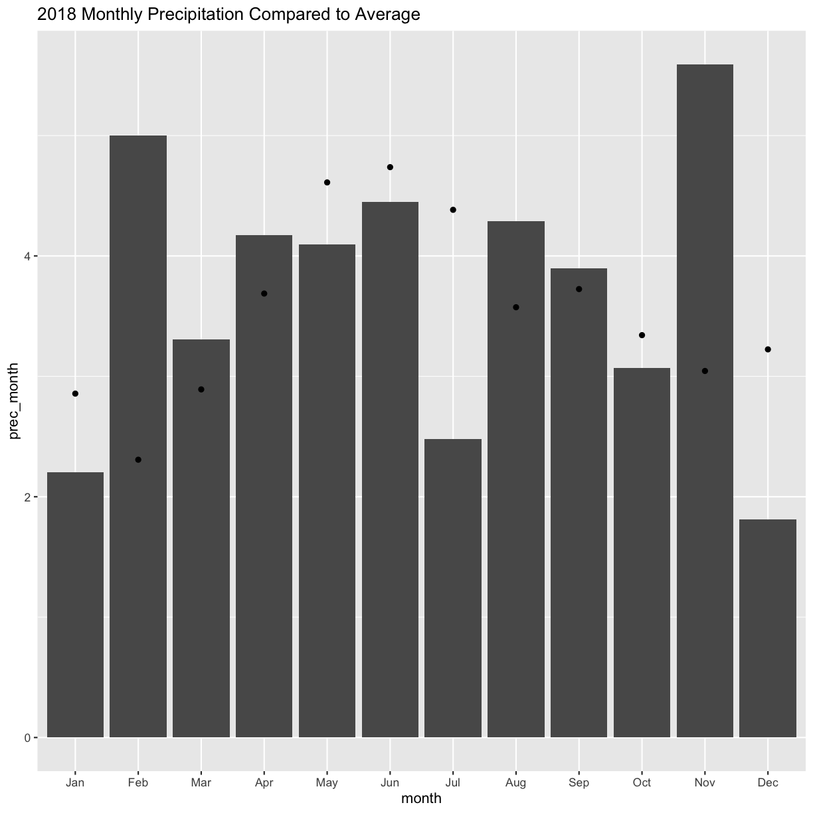

---
# Please do not edit this file directly; it is auto generated.
# Instead, please edit 02-WeatherData.md in _episodes_rmd/
title: "Weather Data"
include_overview: true
questions:
 - What are the common file types in agricultural data?
 - What publicly available datasets exist for my field?
objectives:
 - Describe the format of public weather and soil datasets
 - Import weather data from the internet, eg. daymetr
 - Access to elevation and ssurgo data with higher resolution
 - Derive topography data from elevation data
keypoints:
 - sf is preferable for data analysis; it is easier to access the dataframe
 - Projecting your data in utm is necessary for many of the geometric operations you perform (e.g. making trial grids and splitting plots into subplot data)
 - Compare different data formats, such as gpkg, shp(cpg,dbf,prj,sbn,sbx),geojson,tif
source: Rmd
---

> # Daymet Weather Data
> 
> The Oak Ridge National Laboratory produces a datset called Daymet which contains predicted
> weather observations on a one meter grid. These data come from weather station climate 
> observations in a climate model for prediction and include variables such as precipitation,
> snow water equivalent, temperature, day length, solar radians, and vapor pressure. 
> 
>There is a package in r `daymetr` that downloads the daymet weather data within the R environment.
> For a single point, you can use the command `download_daymet()`. If you want to download the data 
> for a set of points, there is also the command `download_daymet_batch()` which takes an argument 
> a .csv of the points in lat/long. If you want to use this approach, we can give you an example. 
> 
{: .callout}

> # Using daymetr to download weather
> We will use the mean latitude and longitude values from the bounding box as our point for the 
> weather data. The functions `cent_long()` and `cent_lat()` give the mean longitude and latitude points of the bounding box around the `sf` object that is supplied. This should be a point near the middle of the field. 
> 
> 
> ~~~
> boundary <- read_sf("data/boundary.gpkg")
> lon <- cent_long(boundary)
> lat <- cent_lat(boundary)
> ~~~
> {: .language-r}
>
> We also call the site `Field1`, but this can be the name of one of your fields if you use it in the future.
> We can choose the start and end years. If the data is not available for the year you request, an 
> error will be reported. We choose 2000 to 2018 for this example; later we will use the
> historical data for comparison. The final option `internal = TRUE` means that the daymet 
> data is brought into the R environment rather than saved in your working directory. We may want to change the names and units of variables, so we will wait to save the data in the working directory.
>
>
>~~~
> weather <- download_daymet(site = "Field1", lat = lat, lon = lon, start = 2000, end = 2018, internal = TRUE)
>~~~
>{: .language-r}
>
>
>
>~~~
>Downloading DAYMET data for: Field1 at 40.8430279883331/-82.8757922217347 latitude/longitude !
>~~~
>{: .output}
>
>
>
>~~~
>Done !
>~~~
>{: .output}
{: .callout}

> # Exploring the daymet data
> We can use `str()` as we did in the last lesson to explore the new daymetr object `weather`
> 
> ~~~
> str(weather)
> ~~~
> {: .language-r}
> 
> 
> 
> ~~~
> List of 7
>  $ site     : chr "Field1"
>  $ tile     : num 11749
>  $ latitude : num 40.8
>  $ longitude: num -82.9
>  $ altitude : num 310
>  $ tile     : num 11749
>  $ data     :'data.frame':	6935 obs. of  9 variables:
>   ..$ year         : num [1:6935] 2000 2000 2000 2000 2000 2000 2000 2000 2000 2000 ...
>   ..$ yday         : num [1:6935] 1 2 3 4 5 6 7 8 9 10 ...
>   ..$ dayl..s.     : num [1:6935] 32832 32832 32832 33178 33178 ...
>   ..$ prcp..mm.day.: num [1:6935] 0 0 8 27 0 0 0 0 0 2 ...
>   ..$ srad..W.m.2. : num [1:6935] 259 234 163 182 195 ...
>   ..$ swe..kg.m.2. : num [1:6935] 52 52 44 44 44 40 40 40 40 36 ...
>   ..$ tmax..deg.c. : num [1:6935] 8.5 14 14.5 12 3.5 1.5 4 3.5 6.5 9 ...
>   ..$ tmin..deg.c. : num [1:6935] -4.5 3 4.5 0.5 -4.5 -4.5 -4 -5.5 -1.5 3 ...
>   ..$ vp..Pa.      : num [1:6935] 440 760 840 640 440 440 440 400 560 760 ...
>  - attr(*, "class")= chr "daymetr"
> ~~~
> {: .output}
> The object `weather` is a list of 7 objects, the last of which is the data. In the next excerise we will explore what variables are in this dataframe. 
{: .callout}

> ## Exercise 1: Explore the weather data
>
>  1. Save the dataframe in `weather` with the name `weather_data`.
>  2. How is the date reported? 
>  3. What other variables exist?
>  4. What are the units for the different variables?
>  *Remember: Sometimes you need to use a search engine or help("functionname") to understand what objects
>  are created from a specific R function.
> 
> > ## Solution
> > 
> > 
> > ~~~
> > weather_data <- weather$data
> > str(weather_data)
> > ~~~
> > {: .language-r}
> > 
> > 
> > 
> > ~~~
> > 'data.frame':	6935 obs. of  9 variables:
> >  $ year         : num  2000 2000 2000 2000 2000 2000 2000 2000 2000 2000 ...
> >  $ yday         : num  1 2 3 4 5 6 7 8 9 10 ...
> >  $ dayl..s.     : num  32832 32832 32832 33178 33178 ...
> >  $ prcp..mm.day.: num  0 0 8 27 0 0 0 0 0 2 ...
> >  $ srad..W.m.2. : num  259 234 163 182 195 ...
> >  $ swe..kg.m.2. : num  52 52 44 44 44 40 40 40 40 36 ...
> >  $ tmax..deg.c. : num  8.5 14 14.5 12 3.5 1.5 4 3.5 6.5 9 ...
> >  $ tmin..deg.c. : num  -4.5 3 4.5 0.5 -4.5 -4.5 -4 -5.5 -1.5 3 ...
> >  $ vp..Pa.      : num  440 760 840 640 440 440 440 400 560 760 ...
> > ~~~
> > {: .output}
> > The date is reported as the year and day of the year. 
> > Other variables include day length, precipitation, solar radiation, snow water equivalent, maximum temperature, minimum temperature, and vapor pressure. 
> > The units for the variables are given after the variable name. For example, day length is in seconds and solar radiation is in watts per square meter. While precipitation and temperature have intuitive names, vapor pressure and snow water equivalent are not so apparent. 
> > Use the `daymetr` [vignette](https://cran.r-project.org/web/packages/daymetr/vignettes/daymetr-vignette.html) to understand the meaning of these variables. 
> > 
> {: .solution}
{: .challenge}

> # Dates in Dataframes 
> **DENA: What's the goal here? What are we going to be doing with the dates once we have them? A sentence or two about that would help with contextualizing it rather than jumping into the fact that R has it without telling us how we'll use it.**
> There are many operations we might do with dates, such as eliminating the dates outside of the growing season, but there is a class within R for dates. Once a column is of the `date` class, we can perform actions
> like ordering the data by time, finding the data in a certain time period, or calculating the days between two dates. 
> The function `as.Date()` converts a column to a date, but here if we try 
> the command `weather_data$date <- as.Date(weather_data$yday)`, we will receive an error 
> saying an origin must be supplied. 
>
> The function can see that the date is in days after some starting time or origin. The name
> `yday` means this is the day of the year, so the origin should be the last day of the 
> previous year. There are multiple years in our dataframe, so the origin should change 
> for each year. This is accomplished in the function as.Date.daymetr(). To see this code and understand how > it works go to the [functions script](https://github.com/data-carpentry-for-agriculture/trial-lesson/blob/gh-pages/_episodes_rmd/functions.R) in github. 
> 
> 
> ~~~
> weather_data$date <- as.Date.daymetr(weather_data)
> head(weather_data$date)
> ~~~
> {: .language-r}
> 
> 
> 
> ~~~
> [1] "2000-01-01" "2000-01-02" "2000-01-03" "2000-01-04" "2000-01-05"
> [6] "2000-01-06"
> ~~~
> {: .output}
> 
> 
> 
> ~~~
> class(weather_data$date)
> ~~~
> {: .language-r}
> 
> 
> 
> ~~~
> [1] "Date"
> ~~~
> {: .output}
{: .callout}

> # Unit Conversions
>
>Publicly available data are usually given in metric units as we saw in the weather data 
>above. We may want to have these data in imperial units as these are the units we are using
>to think about yield and other values in the United States. You may know the value of crop requirements and threshholds in imperial units rather than metric units. For example, a goal of 18 inches of rain during the corn season.
>
>The package `measurements` is used for converting different types of measurements from one unit to another. The 
> command `conv_unit()` converts the column from one stated unit to another unit.
> Another useful function in the package is `conv_unit_options` which gives the possible units for a specific kind of measure (e.g. length, area, weight, etc.). 
> 
> We have made simple functions for converting units using `conv_unit()` these are in `functions.R` and can be sourced within your code. For example, the function `mm_to_in()` can convert the daily precipitation from milimeters to inches. The following lines converts `prcp..mm.day.` to inches and creates a new column called `prec`.
> 
> 
> ~~~
> weather_data$prec <- mm_to_in(weather_data$prcp..mm.day.)
> ~~~
> {: .language-r}
{: .callout}

> ## Exercise 2: Unit Conversions
>
> 1. Convert the two temperature variables into fahrenheit from celsius using the function `c_to_f()` with the names `tmax` and `tmin`. 
> 2. What is the maximum and minimum temperature recorded?
>
> > ## Exercise 2 Solutions
> > 
> > 
> > ~~~
> > weather_data$tmax <- c_to_f(weather_data$tmax..deg.c.) 
> > weather_data$tmin <- c_to_f(weather_data$tmin..deg.c.)
> > head(weather_data$tmax)
> > ~~~
> > {: .language-r}
> > 
> > 
> > 
> > ~~~
> > [1] 47.3 57.2 58.1 53.6 38.3 34.7
> > ~~~
> > {: .output}
> > 
> > 
> > 
> > ~~~
> > max(weather_data$tmax)
> > ~~~
> > {: .language-r}
> > 
> > 
> > 
> > ~~~
> > [1] 97.7
> > ~~~
> > {: .output}
> > 
> > 
> > 
> > ~~~
> > min(weather_data$tmin)
> > ~~~
> > {: .language-r}
> > 
> > 
> > 
> > ~~~
> > [1] -16.6
> > ~~~
> > {: .output}
> > The maximum temperature during this time period was 94 degrees, and the minimum temperature was -13 degrees.
> {: .solution}
{: .challenge}

> # Precipitation Graph
>
> Perhaps you want to see what the weather this year was like compared to the typical year.
> We are going make a graph showing the total monthly precipitation from
> 2018 compared to the average precipitation from the years 2000 to 2017. This is a common way
> to look at seasonal rainfall and allows us to look at the rainfall during the critical months
> of July and August. First, we need to organize the data in a new dataset with the average total rainfall for each month.
{: .callout}

> # Adding a month variable
> 
> Currently, there is no month variable in our dataframe. Once you have a date object, there is a package called `lubridate`
> that facilitates additional time or date related calculations. Perhaps you want a new column with the day of the week or a measure of time lapsed between two observations. We use the command `month()` to add a 
> variable called `month` to the dataframe. The option `label = TRUE` creates a string with the 
> month name instead of a number. We use this option because the month name will look better on the graph than a number. 
> 
> 
> ~~~
> weather_data$month <- lubridate::month(weather_data$date, label = TRUE)
> head(weather_data$month)
> ~~~
> {: .language-r}
> 
> 
> 
> ~~~
> [1] Jan Jan Jan Jan Jan Jan
> 12 Levels: Jan < Feb < Mar < Apr < May < Jun < Jul < Aug < Sep < ... < Dec
> ~~~
> {: .output}
> 
> This is a good time to save the dataframe in a file in your working directory. The function `write.csv()` writes a dataframe (`weather_data`) to the working directory with a name you supply (weather_2000_2018.csv).
> 
> 
> ~~~
> write.csv(weather_data, "weather_2000_2018.csv") 
> ~~~
> {: .language-r}
{: .callout}

> # Taking sum or average by groups 
>
> Now, we need to sum the daily precipitation for each year and month combination. There is a 
> package called `dplyr` that helps with many kinds of data manipulation. A popular task is to 
> perform an action over a group, like taking the sum of something. To specify the grouping variables, you use `group_by()` then add the additional
> command `summarise()` which defines the action. For this exercise we wrote functions that use `dplyr` to make the task simpler for you. The functions `sumprec_by_monthyear()` and `avgprec_by_month()` are in `functions.R`. You can read these functions to make similar functions on your own. 
> 
> First we use the command to calculate the total precipitation for each month in each year.
> 
> ~~~
> by_month_year <- sumprec_by_monthyear(weather_data)
> head(by_month_year)
> ~~~
> {: .language-r}
> 
> 
> 
> ~~~
> # A tibble: 6 x 3
> # Groups:   month [1]
>   month  year prec_month
>   <ord> <dbl>      <dbl>
> 1 Jan    2000      2.44 
> 2 Jan    2001      0.984
> 3 Jan    2002      1.69 
> 4 Jan    2003      1.65 
> 5 Jan    2004      3.31 
> 6 Jan    2005      7.68 
> ~~~
> {: .output}
>
> Now we have a dataframe with the rainfall for each month of each year, where the first rows of the dataframe are for January. 
{: .callout}

> # Subsetting the data
>
> Now we want to separate the 2018 data from the rest of the years 
> before we take the average monthly precipitation. Separating part of the dataframe is called subsetting. A subset is a set of observations that are all present in an existing dataframe; generally, the subset will have some characteristic in common such as year, month, etc. The function `subset()` requires two inputs, the dataframe to be subsetted and the characteristics to subset on in the form of logical expressions. We will take the subset of `by_month_year` that is in 2018.
> 
> 
> ~~~
> monthprec_2018 <- subset(by_month_year, year == 2018) 
> ~~~
> {: .language-r}
{: .callout}

> ## Exercise 3: Subsetting
>
> Name the subset of `by_month_year` that is not in 2018  monthprec_hist, find the total precipitation in June of 2015.
> 
> > ## Exercise 3 Solution
> > 
> > ~~~
> > subset(by_month_year, year != 2018)
> > ~~~
> > {: .language-r}
> > 
> > 
> > 
> > ~~~
> > # A tibble: 216 x 3
> > # Groups:   month [12]
> >    month  year prec_month
> >    <ord> <dbl>      <dbl>
> >  1 Jan    2000      2.44 
> >  2 Jan    2001      0.984
> >  3 Jan    2002      1.69 
> >  4 Jan    2003      1.65 
> >  5 Jan    2004      3.31 
> >  6 Jan    2005      7.68 
> >  7 Jan    2006      3.07 
> >  8 Jan    2007      5.87 
> >  9 Jan    2008      2.64 
> > 10 Jan    2009      1.85 
> > # … with 206 more rows
> > ~~~
> > {: .output}
> > 
> > 
> > 
> > ~~~
> > subset(by_month_year, year == 2015)
> > ~~~
> > {: .language-r}
> > 
> > 
> > 
> > ~~~
> > # A tibble: 12 x 3
> > # Groups:   month [12]
> >    month  year prec_month
> >    <ord> <dbl>      <dbl>
> >  1 Jan    2015       2.28
> >  2 Feb    2015       1.57
> >  3 Mar    2015       2.52
> >  4 Apr    2015       3.74
> >  5 May    2015       3.58
> >  6 Jun    2015       7.24
> >  7 Jul    2015       3.70
> >  8 Aug    2015       4.25
> >  9 Sep    2015       2.13
> > 10 Oct    2015       2.83
> > 11 Nov    2015       2.36
> > 12 Dec    2015       3.86
> > ~~~
> > {: .output}
> > We see that the monthly rainfall in June was 7.91 inches. We could also find this by taking a subset with the year and month.
> > 
> > ~~~
> > subset(by_month_year, year == 2015 & month == "Jun")
> > ~~~
> > {: .language-r}
> > 
> > 
> > 
> > ~~~
> > # A tibble: 1 x 3
> > # Groups:   month [1]
> >   month  year prec_month
> >   <ord> <dbl>      <dbl>
> > 1 Jun    2015       7.24
> > ~~~
> > {: .output}
> >
> {: .solution}
{: .challenge}

> # Take the average of monthly rainfall
>
> 
> ~~~
> monthprec_hist <- avgprec_by_month(subset(by_month_year, year != 2018))
> ~~~
> {: .language-r}
{: .callout}

> # Merging
> 
> We now have two separate dataframes `by_month_2018` and `by_month`
> with the rainfall for each
> month. We can use the common variable `month` to merge them into
> one dataframe with the average
> monthly rainfall and the 2018 monthly rainfall using the `merge()`
> function.
>
> 
> ~~~
> prec_plot <- merge(monthprec_hist, monthprec_2018, by = "month")
> ~~~
> {: .language-r}
{: .callout}

> # Making the graph
>
> We will now use `ggplot` to create a graph with a bar representing
> the monthly precipitation 
> in 2018 and a point with the average rainfall from 2000 to 2017. In 
> the function `geom_bar()` `stat = identity` creates a bar graph 
> where the height of the bar is the value of the 
> variable rather than the count of the observations, the common use 
> of a bar chart. 
>
> 
> ~~~
> monthly_prec <- ggplot(prec_plot) + 
>   geom_bar(aes(x = month, y = prec_month), stat = 'identity') 
> monthly_prec + geom_point(aes(month, prec_avg), show.legend = TRUE) + ggtitle("2018 Monthly Precipitation Compared to Average")
> ~~~
> {: .language-r}
> 
> 
>
> The most notable feature of the weather graph is the below average rainfall in July, the most 
critical growing period for corn. To understand whether this affected yield on the field, we
woud also need to look at historic yield. But on your field, you will know those historic
average and be able to have a pretty clear idea of how weather impacted the average yield in
a growing season. 
> 
> There are many possible uses for this weather data. You can calculate cumulative rainfall when it rains for consecutive days or calculate the accumulated GDD. These are more complex operations, but we can help you with the code if you are interested.
{: .callout}

