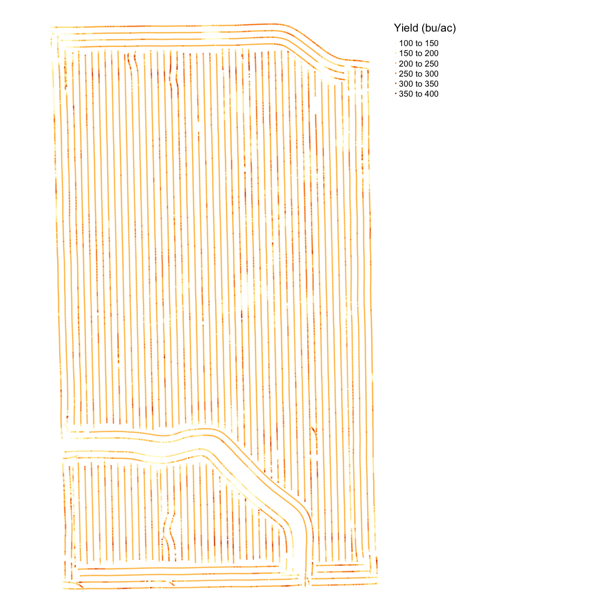

---
# Please do not edit this file directly; it is auto generated.
# Instead, please edit 03-Geospatial-Lesson.md in _episodes_rmd/
title: "Geospatial Data and SSURGO"
output: html_document
include_overview: true
source: Rmd
---

#### Motivating Questions:
- What are the common file types in agricultural data?
- What applications do I need to open these files?
- How can I make maps of my yield or application?

#### Objectives with Spatial Data:
- Determine whether data are stored in vector or raster format
- Identify the coordinate system for a dataset
- Talk about when data don't have a projection defined (missing .prj file)
- Determine UTM zone of a dataset
- Reproject the dataset into UTM
- Import geospatial files into your R environment
- Visualize geospatial data with R
- Create geospatial files from lat/long coordinates
- Create an ab-line

#### Keypoints:
- sf is prefereable for data analysis; it is easier to access the dataframe
- Projecting your data in utm is necessary for many of the geometric operations
you perform (e.g. making trial grids and splitting plots into subplot data)
- Different data formats that you are likely to encounter include gpkg, shp
(cpg, dbf, prj, sbn, sbx), geojson, and tif **Dena: We don't discuss most of these in the lesson - tweak description or add overview?**

<!-- Setup -->

### Introducing Spatial Data with SSURGO data

**Dena: This would be a good point for an "We're starting with a bunch of miscellanous files and by the end of this lesson here's
the things you'll be able to do with them" overview? Rough notes below, they just aren't pre-bolded...**

**Spatial data can be stored in many different ways, and an important part of using your farm's data will involve understanding
what format your data is already in and what format another program needs it to be in. During the course of this lesson, we'll learn:

* How to identify which coordinate reference system a data file is using
* How, when, and why to transform data from the WGS84 standard to the UTM standard (or vice versa)
* How to save the transformed data as a new file
* Some ways of creating visualizations from your data
* How to get key soil type data for your farm from the publicly available SSURGO database
**/end add?**

#### What is a CRS?

Geospatial data has a coordinate reference system (CRS) that reports how the map is projected and what point is used as a reference. A projection is a way of making the earth's curved surface fit into something you 
can represent on a flat computer screen. The point used for reference during projection is called a datum.

## Importance of Projections
To understand why projection matters, take a look
at the difference between [the Mercator projection](https://en.wikipedia.org/wiki/Mercator_projection#/media/File:Mercator_projection_Square.JPG) of the world and the 
[Boggs eumorphic projection](https://en.wikipedia.org/wiki/Boggs_eumorphic_projection#/media/File:Boggs_eumorphic_projection_SW.JPG)

In the Mercator projection, space that doesn't exist is created to make a "flat" map 
and Greenland and Antarctica disproportionately huge. In the Boggs projection, strategic 
slices are cut out of the ocean so that the sizes appear a bit closer to true, but Canada 
and Russia get pinched and Greenland gets bisected. There will always be some compromises 
made in a projection system that converts curved surfaces to flat ones for the same reason 
that it's difficult to make an orange peel lie flat. So the method you select will have an 
effect on your outcome.

#### Reading in the Boundary File

Before we can look at a CRS in R, we need to have a geospatial file in the R environment. We will bring in the field boundary. Use the function `read_sf()` to bring the dataset into your R environment.
**Dena's rewrite: Because we have already set the working directory for this file, we don't need to
give the whole path, just the data subdirectory that the gpkg file is stored within.** 

~~~
boundary <- read_sf("data/boundary.gpkg")
~~~
{: .language-r}

There are many functions for reading files into the
environment, but `read_sf()` creates an object of class **`sf`** or **simple feature.** This class
makes accessing spatial data much easier. Much like a data frame, you can access
variables within an `sf` object using the `$` operator. For this and other reasons like the number of spatial
calculations available for `sf` objects, this class is perferred in most situations.

#### Check the coordinate reference system

The function for retreiving the CRS of a simple feature is `st_crs().` Generally it is good practice to know the CRS of your files, but before combining files and performing operations on geospatial data, it is particularly important. Some commands will not work if the data is in the wrong CRS or if two dataframes are in different CRSs.

~~~
st_crs(boundary)
~~~
{: .language-r}

~~~
Coordinate Reference System:
  EPSG: 4326 
  proj4string: "+proj=longlat +datum=WGS84 +no_defs"
~~~
{: .output}
The boundary file is projected in longitude and latitude using the WGS84 datum. This will be the CRS of most of the data you see. 

Sometimes when looking at a shapefile, the .prj file can be lost. Then `st_crs()` will 
return empty, but `sf` objects contain a geometry column. We can see the geometric points 
for the vertices of each polygon or the points in the data.

~~~
head(boundary$geom)
~~~
{: .language-r}

~~~
Geometry set for 2 features 
geometry type:  MULTIPOLYGON
dimension:      XY
bbox:           xmin: -82.87853 ymin: 40.83945 xmax: -82.87306 ymax: 40.8466
epsg (SRID):    4326
proj4string:    +proj=longlat +datum=WGS84 +no_defs
~~~
{: .output}

~~~
MULTIPOLYGON (((-82.87319 40.84574, -82.87306 4...
~~~
{: .output}

~~~
MULTIPOLYGON (((-82.87803 40.83981, -82.87805 4...
~~~
{: .output}

The trial design is in lat/long using WGS84. 

## UTM Zones

Some coordinate reference systems, such as UTM zones, are measured in meters. 
Latitude and longitude represent a different type of CRS, defined in terms of angles 
across a sphere. If we want to create measures of distance, we need the trial design 
in UTM. But there are many UTM zones, so we must determine the zone of the trial area. 

The UTM system divides the surface of Earth between 80°S and 84°N latitude into
60 zones, each 6° of longitude in width. Zone 1 covers longitude 180° to 174° W;
zone numbering increases eastward to zone 60 that covers longitude 174 to 180
East. 

#### st_transform and ESPG Codes

For reprojecting spatial data, the function `st_transform()` uses an ESPG code 
to transform a simple feature to the new CRS. EPSG Geodetic Parameter Dataset is 
a public registry of spatial reference systems, Earth ellipsoids, coordinate 
transformations and related units of measurement. The ESPG is one way to assign 
or transform the CRS in R. 

The ESPG for UTM always begins with "326" and the last numbers are the number of the zone.
The ESPG for WGS84 is 4326. This is the projection your equipment reads, so any trial design 
files will need to be transformed back into WGS84 before you implement the trial. Also, all 
files from your machinery, such as yield, as-applied, and as-planted, will be reported in 
latitude and longitude with WGS84.

**Dena: I feel like this is a fantastic place to have an exercise with the name and/or first few lines of a file of each
type to ask them to look at them and identify which is which and describe what that means, to check understanding?**

#### Transforming

The function `st_transform_utm()` transforms a simple feature into a new CRS. This function is in the functions.R script, and is described there.

~~~
boundaryutm <- st_transform_utm(boundary)
st_crs(boundaryutm)
~~~
{: .language-r}

~~~
Coordinate Reference System:
  EPSG: 32617 
  proj4string: "+proj=utm +zone=17 +datum=WGS84 +units=m +no_defs"
~~~
{: .output}
**Dena: This exercise might run well as a talk-through -- ask the room to describe their understanding of how to do the thing -- followed by a type-along where you type what they tell you to do, and then explain what worked or what didn't?**

**Exercise**
1. Bring the file called "asplanted.gpkg" **Dena: add (from the data subdirectory of your WorkingDir) ?**
in your environment. Name the object `planting`. This file contains the planting information for 2017.
2. Identify the CRS of the object. 
3. Look at the geometry features. What kind of geometric features are in this dataset?
4. Transform the file to UTM or Lat/Long, depending on the current CRS.

**Solution**

~~~
planting <- read_sf("data/asplanted.gpkg")

st_crs(planting)
~~~
{: .language-r}

~~~
Coordinate Reference System:
  EPSG: 4326 
  proj4string: "+proj=longlat +datum=WGS84 +no_defs"
~~~
{: .output}

~~~
planting$geom
~~~
{: .language-r}

~~~
Geometry set for 6382 features 
geometry type:  POINT
dimension:      XY
bbox:           xmin: -82.87843 ymin: 40.83952 xmax: -82.87315 ymax: 40.84653
epsg (SRID):    4326
proj4string:    +proj=longlat +datum=WGS84 +no_defs
First 5 geometries:
~~~
{: .output}

~~~
POINT (-82.87829 40.83953)
~~~
{: .output}

~~~
POINT (-82.87828 40.83953)
POINT (-82.87828 40.83953)
~~~
{: .output}

~~~
POINT (-82.87827 40.83953)
~~~
{: .output}

~~~
POINT (-82.87825 40.83953)
~~~
{: .output}

~~~
plantingutm <- st_transform_utm(planting)

st_crs(plantingutm)
~~~
{: .language-r}

~~~
Coordinate Reference System:
  EPSG: 32617 
  proj4string: "+proj=utm +zone=17 +datum=WGS84 +units=m +no_defs"
~~~
{: .output}

The cleaned planting file was in WGS84 initially. When we look at the geometry features, they are 6382 points defined in xand y coordinates. Using `st_transform_utm()` we create a new file called `plantingutm` with the CRS of UTM zone 17.

#### Save the file 

Use `st_write()` to save an sf object. If you do not specify a directory, the working 
directory will be used. We include the object we are saving `boundaryutm` and the name 
we would like to give the saved file `"boundary_utm.gpkg"`. Additionally, we specify the
`layer_options` and `update` values to enable overwriting an existing file with the same name. 

You can save the file as a .gpkg or .shp file. The advantage of a .gpkg file is
that you only save one file rather than four files in a shapefile. Because
shapefiles contain multiple files, they can be corrupted if one piece is missing.
One example is a .prj file. In this case, the shapefile will have no CRS, and
you will need to determine the CRS of the object. You will often need to transform a 
file from UTM to lat/long and save the new file during trial design, so this is an important step.

~~~
st_write(boundaryutm, "boundary_utm.gpkg", layer_options = 'OVERWRITE=YES', update = TRUE)
~~~
{: .language-r}

~~~
Updating layer `boundary_utm' to data source `boundary_utm.gpkg' using driver `GPKG'
options:        OVERWRITE=YES 
Updating existing layer boundary_utm
Writing 2 features with 1 fields and geometry type Multi Polygon.
~~~
{: .output}

The new .gpkg file will be visible in your working directory. **Dena: (Check it out:
Browse to your working directory in Windows File Explorer or Mac Finder and see the
date and time on your new file.)**

One common problem with these files is that when you try to open a .gpkg file for the first time in
R, it might not work if you haven't opened it in QGIS before. **Dena: Is this something to 
mention here, or should it go in the section where we're opening things with QGIS?**

#### Visualizing the data

There are several ways to visualize spatial data. First, we can use `plot()` to look at the basic shape of the data. 

~~~
plot(boundary$geom)
~~~
{: .language-r}

We can also plot the data where the polygons change color based on the value of one of the variables. This can be done with a package `tmap()`. We will discuss this package more in the next lesson, but we provide the function `map_poly()` in the functions.R script for making a simple map with polygon features colored based on a given variable. The function requires a spatial object and a variable name in ''.

~~~
map_poly(boundary, 'Type', 'Part of Field')
~~~
{: .language-r}

**Dena: Is this their first detailed picture? Maybe pause to discuss what types of boundaries they might find useful and
the theory of how to do them?**

# SSURGO Soil Data

The SSURGO data is probably a dataset you are familiar with already. You can obtain a soil
description of your field on the Web Soil Survey website below. The SSURGO dataset has been
developed over a century of surveying land and analyzing soil samples across the United States.
While the website is one way to access the soil data, R also has a package called `FedData` 
that has a function `get_ssurgo()` for accessing the soil data in the R environment. 

https://websoilsurvey.sc.egov.usda.gov/App/WebSoilSurvey.aspx

The next line brings the SSURGO data into the R environment with the name `ssurgo` and the  object `boundary` from the geospatial lesson. Note here that the class of `boundary` needs  to be `spatial` rather than `sf`, so we transform the object with `as(boundary,"Spatial")`.

~~~
boundarynew <- read_sf("data/asplanted.gpkg")
boundary <- subset(boundary, Type == "Trial")
boundary.sp <- as(boundary, "Spatial")

# JPN: here is the mess: set redo=TRUE to force re-download
download_ssurgo <- function(name_of_field, boundary_sp_in, redo=FALSE){
  tryCatch(
    expr = {
      ssurgo <- get_ssurgo(boundary_sp_in, name_of_field, force.redo=redo)
      #message(log(x))
      message("Successfully downloaded SSURGO.")
      return(ssurgo)
    },
    error = function(e){
      message('Caught an error!  Lets try again after waiting 5 seconds...')
      print(e)
      Sys.sleep(5.0)
      download_ssurgo(name_of_field, boundary_sp_in)
    },
    warning = function(w){
      message('Caught an warning!')
      print(w)
    },
    finally = {
      message('All done!  Woohoo!')
    }
  )    
}

ssurgo <- download_ssurgo("samplefield", boundary.sp)
~~~
{: .language-r}

~~~
Successfully downloaded SSURGO.
~~~
{: .output}

~~~
All done!  Woohoo!
~~~
{: .output}

JPN: just a heads up that it looks like there can be errors in downloads for this data sometimes.  I'm wondering if its on the server-side, like too many requests or something.  Also, I had to delete the "EXTRACTIONS/samplefield" and re-run things which I'm wondering if this is because there are some file paths missing or something? We should test this on other folks computers.  If this is indeed the problem, we might want the code to force-delete these files before running. 

The downloaded `ssurgo` is a list with 2 objects, `spatial` and `tabular`. The `spatial` 
object contains the polygons of soil types for the field, and  `tabular` contains many 
dataframes with attributes collected for the soil and soil horizons. Note that these dataframes 
and their relationships with one another ar very complex. To use these data, you must carefully 
read the SSURGO documentation. Merging the dataframes to have one value of the attributes for 
each soil polygon requires reducing the dimension of the data, often by weighting the attributes
by horizon depth.

Let's make a map of the soil types on this field. First, we need to locate the part of
`tabular` with the soil names; these can be found in `muaggatt`.

~~~
names <- ssurgo$tabular$muaggatt 
~~~
{: .language-r}

*Exercise 4*: What are the soil types present on the field as seen in `names`? Are the soil 
defined by anything other than the soil type?

*Exercise 4 Solution*

~~~
names
~~~
{: .language-r}

~~~
# A tibble: 9 x 40
  musym muname mustatus slopegraddcp slopegradwta brockdepmin wtdepannmin
  <chr> <chr>  <lgl>           <dbl>        <dbl> <lgl>             <dbl>
1 BgB   Benni… NA                  4          3.9 NA                   22
2 Cr    Condi… NA                  1          1   NA                    7
3 HpE   Henne… NA                 30         30   NA                  153
4 Lo    Lobde… NA                  1          1   NA                   69
5 Pm    Pewam… NA                  1          1   NA                   15
6 Sh    Shoal… NA                  1          1   NA                   31
7 BeA   Benni… NA                  1          1.2 NA                   22
8 Crd1… Cardi… NA                  3          2.8 NA                   46
9 Crd1… Cardi… NA                  9          8.4 NA                   46
# … with 33 more variables: wtdepaprjunmin <dbl>, flodfreqdcd <chr>,
#   flodfreqmax <chr>, pondfreqprs <dbl>, aws025wta <dbl>, aws050wta <dbl>,
#   aws0100wta <dbl>, aws0150wta <dbl>, drclassdcd <chr>, drclasswettest <chr>,
#   hydgrpdcd <chr>, iccdcd <lgl>, iccdcdpct <dbl>, niccdcd <dbl>,
#   niccdcdpct <dbl>, engdwobdcd <chr>, engdwbdcd <chr>, engdwbll <chr>,
#   engdwbml <chr>, engstafdcd <chr>, engstafll <chr>, engstafml <chr>,
#   engsldcd <chr>, engsldcp <chr>, englrsdcd <chr>, engcmssdcd <chr>,
#   engcmssmp <chr>, urbrecptdcd <chr>, urbrecptwta <dbl>, forpehrtdcp <chr>,
#   hydclprs <dbl>, awmmfpwwta <dbl>, mukey <dbl>
~~~
{: .output}

Looking at `names` we can see there are eight types of soil on the field, and the dataframe 
reports areas with different slopes with different names. We often know the slope of the field, 
and so we may want to combine areas of the field with the same soil type and different slopes.

We need one dataframe with both the soil name and spatial data. We will merge the soil data 
and the spatial data by the `musym`. Note that in one of the dataframes the variable is 
capitalized and not in the other. We must rename the variable for consistency using `rename()` from `dplyr`.

~~~
spatial <- as(ssurgo$spatial, "sf")
spatial <- dplyr::rename(spatial, musym = MUSYM)
spatial <- merge(spatial, names, by = "musym")
head(spatial$muname)
~~~
{: .language-r}

~~~
[1] "Bennington silt loam, 0 to 2 percent slopes"
[2] "Bennington silt loam, 0 to 2 percent slopes"
[3] "Bennington silt loam, 0 to 2 percent slopes"
[4] "Bennington silt loam, 2 to 6 percent slopes"
[5] "Bennington silt loam, 2 to 6 percent slopes"
[6] "Condit-Bennington silt loams"               
~~~
{: .output}

*Exercise 5*: Create the Soil Map

Use `map_poly()` to make a map where the polygon color is informed by the soil names in
`muname`. 

*Exercise 5 Solution*

~~~
map_soil <- map_poly(spatial, 'muname', "Soil Type")
map_soil
~~~
{: .language-r}

~~~
Some legend labels were too wide. These labels have been resized to 0.63, 0.63, 0.63, 0.52, 0.48, 0.42, 0.47. Increase legend.width (argument of tm_layout) to make the legend wider and therefore the labels larger.
~~~
{: .output}

The map shows that there are quite a few soil types on the field, and several show up
in different sections of the field. However, most of the soils are silt loam. It might 
be difficult to understand the different soils without more information about soil weathering 
and texture. This is also provided within SSURGO and is likely something you know about in 
your own field. 

# Example with your own field

Here we are going to download the SSURGO maps for your own field using your boundary file if you have one. Then, we are going to make a table of the clay, silt, and sand content as well as the water content of the different soil types. There is a function `c_s_s_soil()` in `functions.R` that uses the soil depth to take an average of the soil measures for each soil type. The only parameter that needs to be 

~~~
soil_content <- c_s_s_soil(ssurgo = ssurgo)
~~~
{: .language-r}

~~~

  |                                                                            
  |                                                                      |   0%
  |                                                                            
  |===                                                                   |   4%
  |                                                                            
  |=====                                                                 |   7%
  |                                                                            
  |========                                                              |  11%
  |                                                                            
  |==========                                                            |  15%
  |                                                                            
  |=============                                                         |  19%
  |                                                                            
  |================                                                      |  22%
  |                                                                            
  |==================                                                    |  26%
  |                                                                            
  |=====================                                                 |  30%
  |                                                                            
  |=======================                                               |  33%
  |                                                                            
  |==========================                                            |  37%
  |                                                                            
  |=============================                                         |  41%
  |                                                                            
  |===============================                                       |  44%
  |                                                                            
  |==================================                                    |  48%
  |                                                                            
  |====================================                                  |  52%
  |                                                                            
  |=======================================                               |  56%
  |                                                                            
  |=========================================                             |  59%
  |                                                                            
  |============================================                          |  63%
  |                                                                            
  |===============================================                       |  67%
  |                                                                            
  |=================================================                     |  70%
  |                                                                            
  |====================================================                  |  74%
  |                                                                            
  |======================================================                |  78%
  |                                                                            
  |=========================================================             |  81%
  |                                                                            
  |============================================================          |  85%
  |                                                                            
  |==============================================================        |  89%
  |                                                                            
  |=================================================================     |  93%
  |                                                                            
  |===================================================================   |  96%
  |                                                                            
  |======================================================================| 100%

  |                                                                            
  |                                                                      |   0%
  |                                                                            
  |========                                                              |  11%
  |                                                                            
  |================                                                      |  22%
  |                                                                            
  |=======================                                               |  33%
  |                                                                            
  |===============================                                       |  44%
  |                                                                            
  |=======================================                               |  56%
  |                                                                            
  |===============================================                       |  67%
  |                                                                            
  |======================================================                |  78%
  |                                                                            
  |==============================================================        |  89%
  |                                                                            
  |======================================================================| 100%
~~~
{: .output}

~~~
soil_content
~~~
{: .language-r}

~~~
    mukey AREASYMBOL SPATIALVER  MUSYM     clay     silt     sand water_storage
1 1019357      OH033         10    BeA 30.88180 49.35860 19.75960      24.93720
2  168539      OH033         10    BgB 31.09245 48.94345 19.96410      24.72030
3  168557      OH033         10     Cr 33.80601 45.40116 20.79283      21.87375
4  168570      OH033         10    HpE 28.17274 37.20299 34.62427      21.24000
5  168578      OH033         10     Lo 23.32787 49.29454 27.37760      27.86000
6  168588      OH033         10     Pm 34.08070 46.99515 18.92415      25.82340
7  168591      OH033         10     Sh 21.67045 44.65005 33.67950      31.86120
8 2996476      OH033         10 Crd1B1 30.17855 46.96980 22.85165      24.72070
9 2996690      OH033         10 Crd1C2 29.92200 45.94210 24.13590      23.14610
~~~
{: .output}
