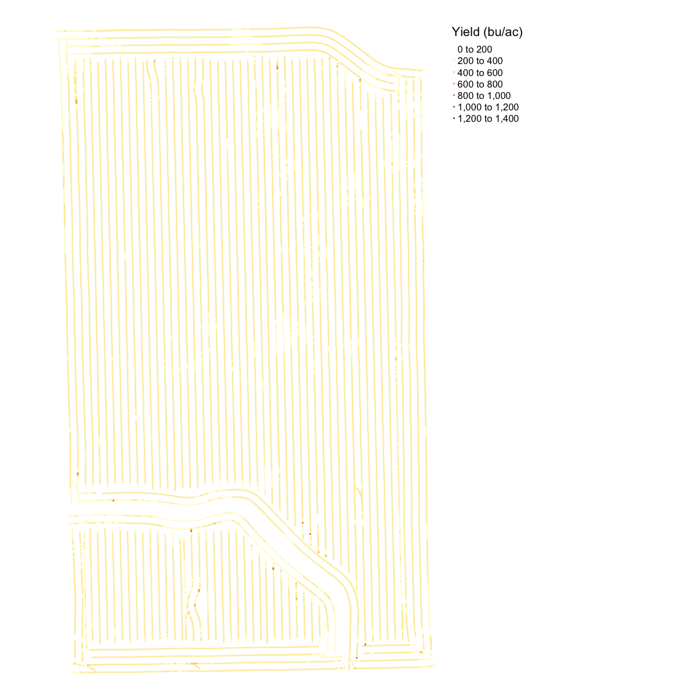
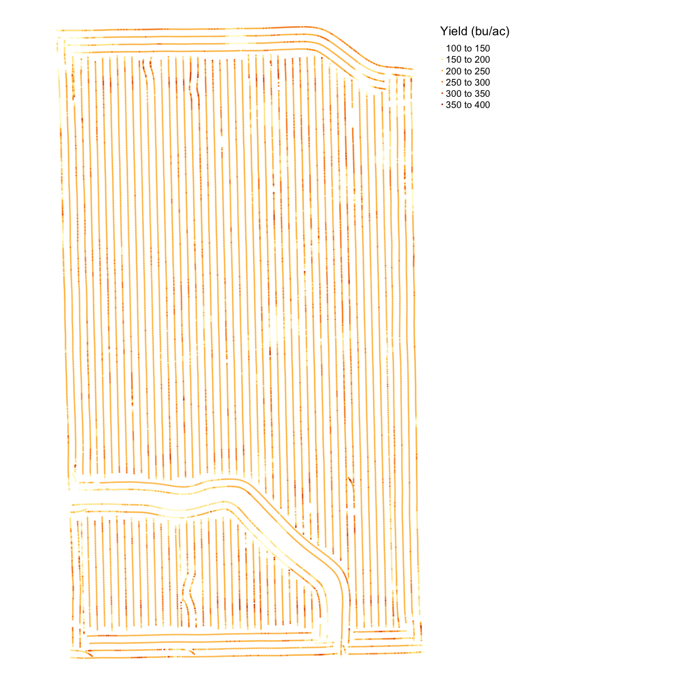
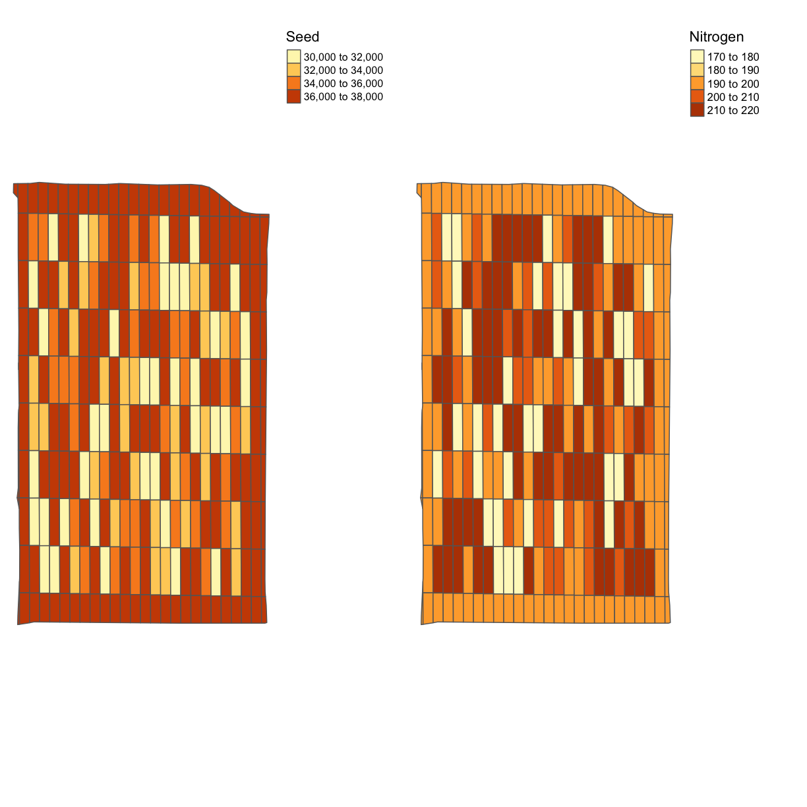
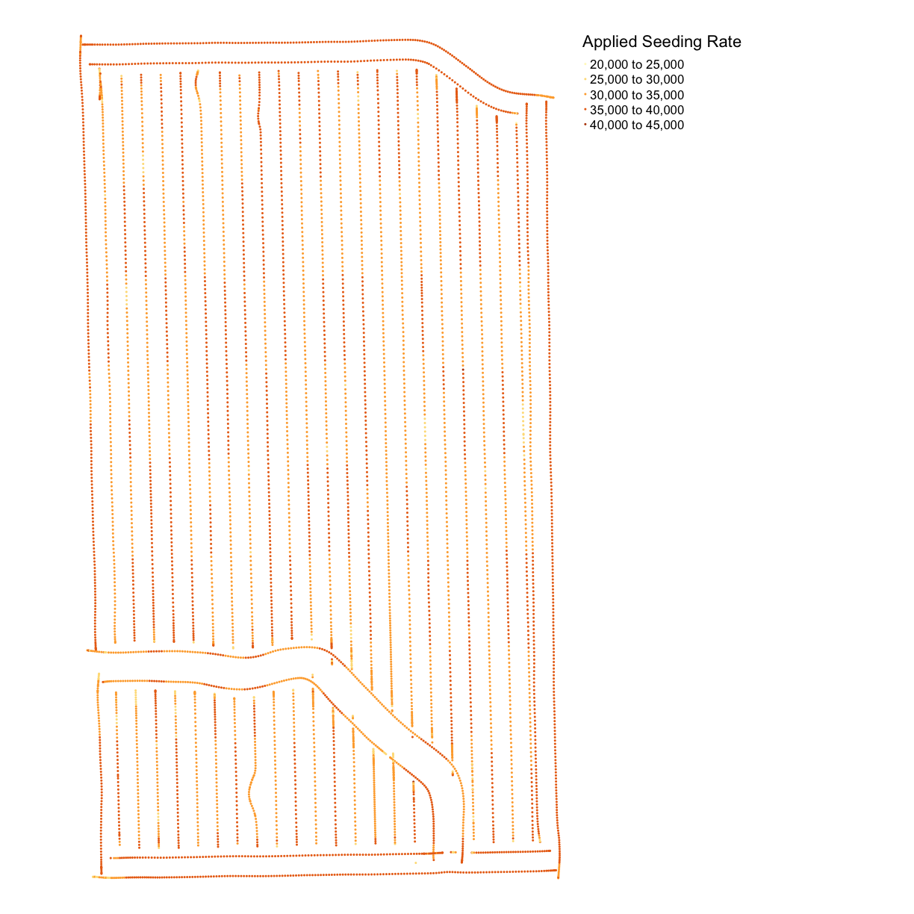
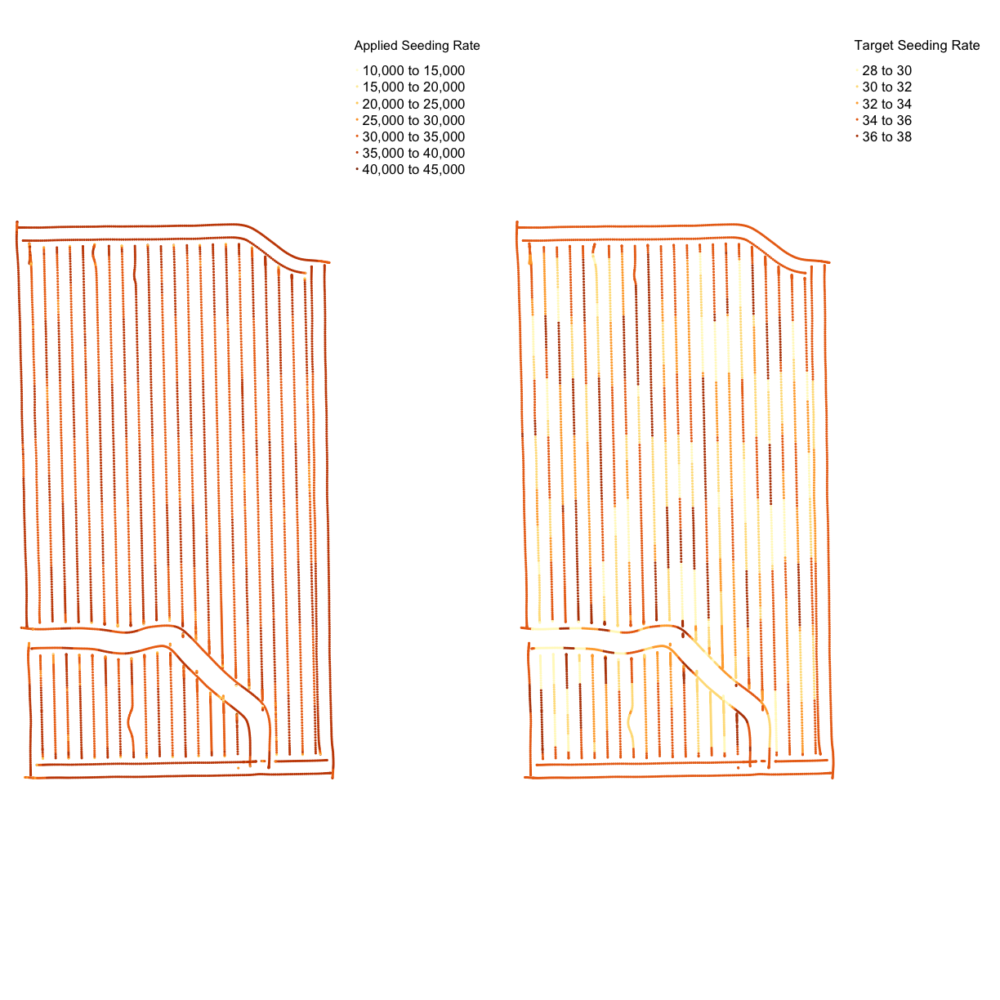
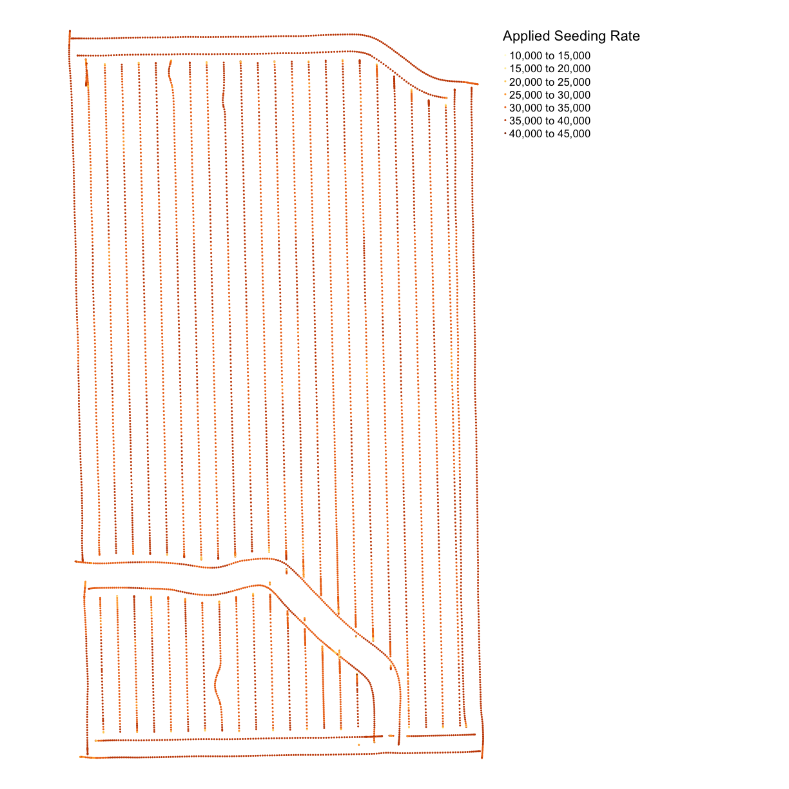
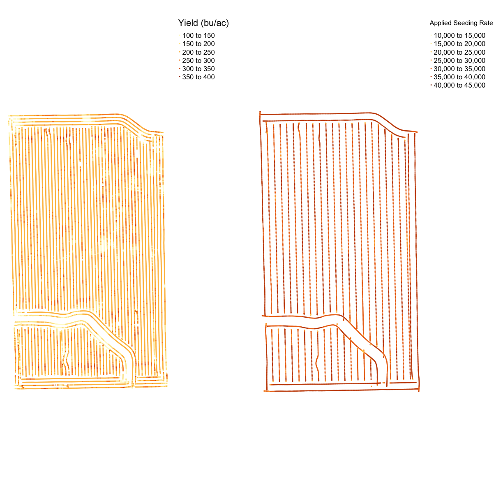

---
# Please do not edit this file directly; it is auto generated.
# Instead, please edit 03-Trial-Data.md in _episodes_rmd/
title: "Ag Carpentry - Trial Data"
author: "Brittani"
date: "2019-10-19"
include_overview: true
source: Rmd
---

####Motivating Questions:
- What are the common file types in agricultural data?

####Objectives with Agricultural Data Types
- Import agricultural datasets into R
- Describe the contents of files generated during planting, fertilization, and harvest
- Describe the contents of files used to control seeding and fertilization rate
- Assess the accuracy of machinery in applying the target rates

####Keypoints:
- sf is prefereable for data analysis; it is easier to access the dataframe
- Projecting your data in utm is necessary for many of the geometric operations you perform (e.g. making trial grids and splitting plots into subplot data)
- Compare different data formats, such as gpkg, shp(cpg,dbf,prj,sbn,sbx),geojson,tif

# Lesson Overview 

In this lesson we will explore the files that are generated during a trial season. These data include yield, as-applied, as-planted, and sometimes electricalconductivity. While you are likely using your yield maps every year to asses productivity, you might not be looking at your application maps if you normally use uniform rates. But if you use variable rate applications or have completed an agricutlural trial, your application map contains information about how well the machine applied the target rates. 

###Reading the Files

In the next exercise we will bring these data into the R environment. We've already looked at the asplanted data in the geospatial lesson. Now let's see what variables are contained in the other files. 

*Exercise 1*
Read the yield, as-planted, and as-applied files and explore the variables.
For each file, identify what variables might we be interested in and why?

~~~
planting <- read_sf("data/asplanted_transformed.gpkg")
nitrogen <- read_sf("data/asapplied_transformed.gpkg")
yield <- read_sf("data/yield_transformed.gpkg")
trial <- read_sf("data/trial_transformed.gpkg")
~~~
{: .language-r}

*Solutions and Discussion*

~~~
names(nitrogen)
~~~
{: .language-r}

~~~
 [1] "Product"      "Obj__Id"      "Track_deg_"   "Swth_Wdth_"   "Distance_f"  
 [6] "Duration_s"   "Elevation_"   "Area_Count"   "Diff_Statu"   "Time"        
[11] "Y_Offset_f"   "X_Offset_f"   "Rt_Apd_Ms_"   "Pass_Num"     "Speed_mph_"  
[16] "Prod_ac_hr"   "Date"         "Rate_Appli"   "Rate_Appli.1" "geom"        
~~~
{: .output}

####As-Applied File

The nitrogen file contains 22 variables. The nitrogen type of is reported in `Product`, and this field used NH3. We have columns with the applied rate in both gallons (`Rt_Ap_1`) and pounds (`Rt_Appl`). We typically use pounds in order to compare across different nitrogen types.

There is not a clear column with the target rate. This is not a problem as we will later merge the trial map and the application map, so we can compare the rate applied to the intended rate.

We can also see the automatic-section control reacting when the applicator is off of the guidance line, with the swatch width changing in `Swth_W_`. 

####Yield File

`yield` contains 32 variables. Many of the variables are similar to those we in the nitrogen data: time, date, elevation, and product. 

The main variables in the harvest files are `Yld_Vol_Dr` and `Yld_Mass_D`. We also use speed (`Speed_mph_`) to eliminate the points collected when the machine was slowing down or speeding up as this effects the accuracy of the yield monitor. 

~~~
names(yield)
~~~
{: .language-r}

~~~
 [1] "Product"    "Obj__Id"    "Distance_f" "Track_deg_" "Duration_s"
 [6] "Elevation_" "Time"       "Area_Count" "Swth_Wdth_" "Y_Offset_f"
[11] "Crop_Flw_M" "Moisture__" "Yld_Mass_W" "Yld_Vol_We" "Yld_Mass_D"
[16] "Yld_Vol_Dr" "Humidity__" "Air_Temp__" "Wind_Speed" "Soil_Temp_"
[21] "Wind_Dir"   "Sky_Cond"   "Pass_Num"   "Speed_mph_" "Prod_ac_h_"
[26] "Crop_Flw_V" "Date"       "Yield__Dry" "geom"      
~~~
{: .output}

####As-Planted File

~~~
names(planting)
~~~
{: .language-r}

~~~
 [1] "Product"      "Obj__Id"      "Distance_f"   "Track_deg_"   "Duration_s"  
 [6] "Elevation_"   "Time"         "Area_Count"   "Swth_Wdth_"   "Seed_Cnt__"  
[11] "Plant_Pop_"   "Rt_Apd_Ct_"   "SeedFlow_k"   "Tgt_Rate_k"   "Y_Offset_f"  
[16] "DF_Margin_"   "Humidity__"   "Air_Temp__"   "Wind_Speed"   "Soil_Temp_"  
[21] "Pass_Num"     "Speed_mph_"   "Prod_ac_h_"   "Prdt_Amt"     "Date"        
[26] "Population"   "Rate__Coun"   "Target_Rat"   "Population.1" "Date___Tim"  
[31] "geom"        
~~~
{: .output}

We see that the planting file has 33 variables, several of which appear to be identical. The main variables of interest are the planting rate (`Rt_A_C_`) and the target rate (`Tgt_Rt_`). These columns do appear under different names. We will discuss how to handle this below.

There are several other variables that could be useful. First, the hybrid is located in the `Product` column; we want to keep this in our records if we want to compare across years. We may also want to know things like the swath width (`Swth_W_`) or elevation (`Elevtn`), swath width for cleaning and aggregating which will be discussed later and elevation for considering its impact on yield.

####Visualizing the Trial Data

In the next section, we will have exercises to visually explore the trial data. We will look at the importance of data cleaning visually with the yield maps. We will make application maps and compare the application to the target application rates and the yield.

**Exercise**
Make a map of the yield from the `yield` file using `map_points()`. 
Do you notice anything about the yield map?

**Solution**

~~~
names(yield)
~~~
{: .language-r}

~~~
 [1] "Product"    "Obj__Id"    "Distance_f" "Track_deg_" "Duration_s"
 [6] "Elevation_" "Time"       "Area_Count" "Swth_Wdth_" "Y_Offset_f"
[11] "Crop_Flw_M" "Moisture__" "Yld_Mass_W" "Yld_Vol_We" "Yld_Mass_D"
[16] "Yld_Vol_Dr" "Humidity__" "Air_Temp__" "Wind_Speed" "Soil_Temp_"
[21] "Wind_Dir"   "Sky_Cond"   "Pass_Num"   "Speed_mph_" "Prod_ac_h_"
[26] "Crop_Flw_V" "Date"       "Yield__Dry" "geom"      
~~~
{: .output}

#####Yield Map

Now let's look at the yield map for this field. Using `tmap` we can graph the yield in bushels per acre.

~~~
map_points(yield, 'Yld_Vol_Dr', 'Yield (bu/ac)')
~~~
{: .language-r}

Looking at the map we can see there are many extreme values, making the map look homogeneous. We will do an initial cleaning to remove these points. 

~~~
yield <- subset(yield, yield$Yld_Vol_Dr >= mean(yield$Yld_Vol_Dr) - 3*sd(yield$Yld_Vol_Dr) & yield$Yld_Vol_Dr <= mean(yield$Yld_Vol_Dr) + 3*sd(yield$Yld_Vol_Dr))
~~~
{: .language-r}

~~~
map_points(yield, 'Yld_Vol_Dr', 'Yield (bu/ac)')
~~~
{: .language-r}

####Side-by-Side Maps

Some kinds of maps you want to see close together. For example, perhaps we want to asses how well the as-applied rates lined up with the target rates for seed and nitrogen. We can use `tmap_arrange()` to make a grid of `tmap` objects. We define `ncol` and `nrow`, and the command will arrange the objects given into the grid. In this case, we have two objects we want to see next to each other, so we have two columns and one row. 

In `trialutm` there are 11 variables, but the variables we might want to map are
`NRATE` and `SEEDRATE`. The following map is created with functions from a package 
called `tmap`. We are using `tm_polygon()`
fill the polygons with a color based on the variable `NRATE` inside the object
`trialutm `. For a different kind of geospatial data such as points, we need to use
`tm_dots()` or `tm_squares()`. `tmap` provides many options for displaying data, 
including text markers on the map. Text labels might be good for making a map of 
several land parcels with their names as the label. We use other arguments in the
code below to choose the position of the map
legend, title of the variable, size of text, and width of legend.

~~~
tgts <- map_poly(trial, 'SEEDRATE', 'Seed') 
tgtn <- map_poly(trial, 'NRATE', 'Nitrogen')
tmap_arrange(tgts, tgtn, ncol = 2, nrow = 1)
~~~
{: .language-r}

We see many names in the planting file. It appears that `Rt_A_C_` is the applied rate and `Tgt_Rt_` is the target rate. We also know from when we loaded this file into the environment that it contains SpatialPoints not polygons. Thus, we cannot use `tm_polygons()`; instead we use `tm_dots()` to map the points with a colored dot for the level of applied seed.  

~~~
map_points(planting, 'Rt_Apd_Ct_', "Applied Seeding Rate")
~~~
{: .language-r}

~~~
map_applieds <- map_points(planting, 'Rt_Apd_Ct_', "Applied Seeding Rate")
map_tgts <- map_points(planting, 'Tgt_Rate_k', "Target Seeding Rate")
tmap_arrange(map_applieds, map_tgts, ncol = 2, nrow = 1)
~~~
{: .language-r}

From the applied and target seeding rate maps, we can see that this trial had a very accurate application of the designed seeding rates. This is a common result for seed, which has more accurate application than nitrogen. However, we still have maximum and minimum applied rates that are much higher than the designed rates. 

####Yield and Application Map

Now that we know how to make side-by-side maps, we can do a visual comparison of yield and seed. While often the spatial patterns from soil content are more visible than the trial rates, sometimes one can see the affect of the seed or nitrogen rates on yield. 

*Exercise* 
Make a map like in the previous example but with yield in bushels and the seeding rate. 
Report what you see in the map?

~~~
map_applieds
~~~
{: .language-r}

~~~
map_yield <- map_points(yield, 'Yld_Vol_Dr', 'Yield (bu/ac)')
tmap_arrange(map_yield, map_applieds, ncol = 2, nrow = 1)
~~~
{: .language-r}

From the map, it is difficult to see any sign of yield response. This highlights the importance of doing statistical rather than visual analysis of harvest data. 

Now we will look at the nitrogen application map. First, we will remove outliers in the data as we did for the yield map. We can see that the nitrogen application is not as precise as the planting; we commonly see this due to the technology used. 

~~~
nitrogen <- subset(nitrogen, nitrogen$Rate_Appli >= mean(nitrogen$Rate_Appli) - 3*sd(nitrogen$Rate_Appli) & nitrogen$Rate_Appli <= mean(nitrogen$Rate_Appli) + 3*sd(nitrogen$Rate_Appli))

map_nitrogen <- map_points(nitrogen, 'Rate_Appli', 'Nitrogen')
map_nitrogen
~~~
{: .language-r}

