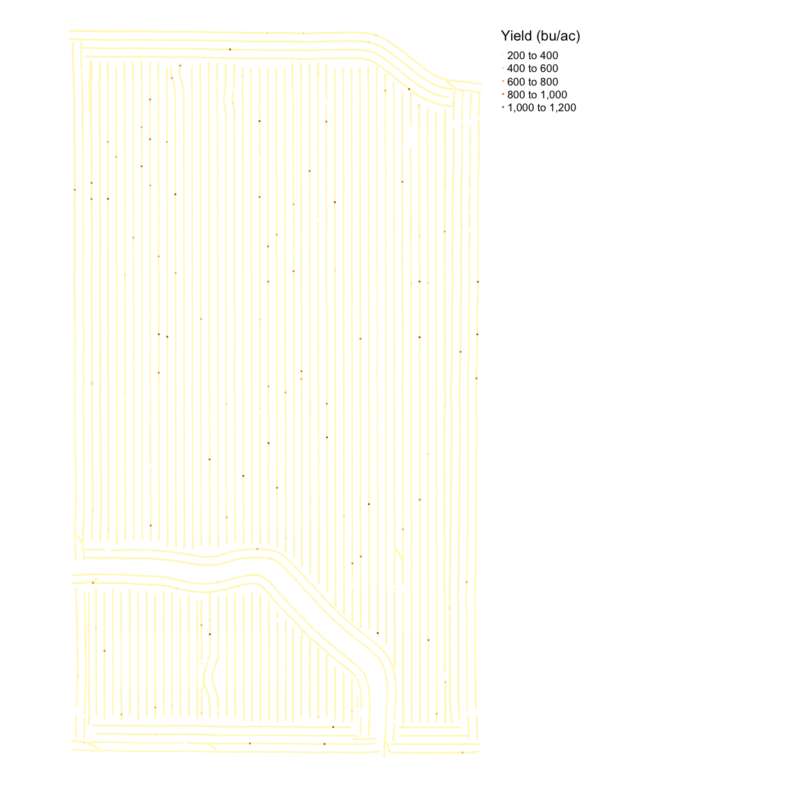

---
# Please do not edit this file directly; it is auto generated.
# Instead, please edit 03-Trial-Data.md in _episodes_rmd/
title: "Trial Data"
questions:
 - What are the common file types in agricultural data?
objectives:
 - Import agricultural datasets into R
 - Describe the contents of files generated during planting, fertilization, and harvest
 - Describe the contents of files used to control seeding and fertilization rate
 - Assess the accuracy of machinery in applying the target rates
keypoints:
 - sf is prefereable for data analysis; it is easier to access the dataframe
 - Projecting your data in utm is necessary for many of the geometric operations you perform (e.g. making trial grids and splitting plots into subplot data)
 - Compare different data formats, such as gpkg, shp(cpg,dbf,prj,sbn,sbx),geojson,tif
include_overview: yes
source: Rmd
---

> ## Lesson Overview 
> 
> In this lesson we will explore the files that are generated during a trial season. These data include yield, as-applied, as-planted, and sometimes electricalconductivity. While you are likely using your yield maps every year to asses productivity, you might not be looking at your application maps if you normally use uniform rates. But if you use variable rate applications or have completed an agricutlural trial, your application map contains information about how well the machine applied the target rates. 
> 
{: .callout}

> ## Reading the Files
> 
> In the next exercise we will bring these data into the R environment. We've already looked at the asplanted data in the geospatial lesson. Now let's see what variables are contained in the other files. 
> 
{: .callout}

> ## Exercise: Exploring Trial Data
> Read the yield, as-planted, and as-applied files and explore the variables. For each file, identify what variables might we be interested in and why?
> 
> > ## Solution
> > 
> > ~~~
> > planting <- read_sf("data/asplanted.gpkg")
> > nitrogen <- read_sf("data/asapplied.gpkg")
> > yield <- read_sf("data/yield.gpkg")
> > trial <- read_sf("data/trial.gpkg")
> > names(nitrogen)
> > ~~~
> > {: .language-r}
> > 
> > 
> > 
> > ~~~
> >  [1] "Product"      "Obj__Id"      "Track_deg_"   "Swth_Wdth_"   "Distance_f"  
> >  [6] "Duration_s"   "Elevation_"   "Area_Count"   "Diff_Statu"   "Time"        
> > [11] "Y_Offset_f"   "X_Offset_f"   "Rt_Apd_Ms_"   "Pass_Num"     "Speed_mph_"  
> > [16] "Prod_ac_hr"   "Date"         "Rate_Appli"   "Rate_Appli.1" "geom"        
> > ~~~
> > {: .output}
> > 
> {: .solution}
{: .challenge}

# # Exercise Discussion
> 
> ~~~
> names(nitrogen)
> ~~~
> {: .language-r}
> 
> 
> 
> ~~~
>  [1] "Product"      "Obj__Id"      "Track_deg_"   "Swth_Wdth_"   "Distance_f"  
>  [6] "Duration_s"   "Elevation_"   "Area_Count"   "Diff_Statu"   "Time"        
> [11] "Y_Offset_f"   "X_Offset_f"   "Rt_Apd_Ms_"   "Pass_Num"     "Speed_mph_"  
> [16] "Prod_ac_hr"   "Date"         "Rate_Appli"   "Rate_Appli.1" "geom"        
> ~~~
> {: .output}
> 
> ## As-Applied File
> 
> The nitrogen file contains 22 variables. The nitrogen type of is reported in `Product`, and this field used NH3. We have columns with the applied rate in both gallons (`Rt_Ap_1`) and pounds (`Rt_Appl`). We typically use pounds in order to compare across different nitrogen types.
> 
> There is not a clear column with the target rate. This is not a problem as we will later merge the trial map and the application map, so we can compare the rate applied to the intended rate.
> 
> We can also see the automatic-section control reacting when the applicator is off of the guidance line, with the swatch width changing in `Swth_W_`. 
> 
> 
{: .callout}

> ## Yield File
> 
> `yield` contains 32 variables. Many of the variables are similar to those we in the nitrogen data: time, date, elevation, and product. 
> 
> The main variables in the harvest files are `Yld_Vol_Dr` and `Yld_Mass_D`. We also use speed (`Speed_mph_`) to eliminate the points collected when the machine was slowing down or speeding up as this effects the accuracy of the yield monitor. 
> 
> 
> ~~~
> names(yield)
> ~~~
> {: .language-r}
> 
> 
> 
> ~~~
>  [1] "Product"    "Obj__Id"    "Distance_f" "Track_deg_" "Duration_s"
>  [6] "Elevation_" "Time"       "Area_Count" "Swth_Wdth_" "Y_Offset_f"
> [11] "Crop_Flw_M" "Moisture__" "Yld_Mass_W" "Yld_Vol_We" "Yld_Mass_D"
> [16] "Yld_Vol_Dr" "Humidity__" "Air_Temp__" "Wind_Speed" "Soil_Temp_"
> [21] "Wind_Dir"   "Sky_Cond"   "Pass_Num"   "Speed_mph_" "Prod_ac_h_"
> [26] "Crop_Flw_V" "Date"       "Yield__Dry" "geom"      
> ~~~
> {: .output}
> 
> 
{: .callout}

> ## As-Planted File
> 
> 
> ~~~
> names(planting)
> ~~~
> {: .language-r}
> 
> 
> 
> ~~~
>  [1] "Product"      "Obj__Id"      "Distance_f"   "Track_deg_"   "Duration_s"  
>  [6] "Elevation_"   "Time"         "Area_Count"   "Swth_Wdth_"   "Seed_Cnt__"  
> [11] "Plant_Pop_"   "Rt_Apd_Ct_"   "SeedFlow_k"   "Tgt_Rate_k"   "Y_Offset_f"  
> [16] "DF_Margin_"   "Humidity__"   "Air_Temp__"   "Wind_Speed"   "Soil_Temp_"  
> [21] "Pass_Num"     "Speed_mph_"   "Prod_ac_h_"   "Prdt_Amt"     "Date"        
> [26] "Population"   "Rate__Coun"   "Target_Rat"   "Population.1" "Date___Tim"  
> [31] "geom"        
> ~~~
> {: .output}
> 
> We see that the planting file has 33 variables, several of which appear to be identical. The main variables of interest are the planting rate (`Rt_A_C_`) and the target rate (`Tgt_Rt_`). These columns do appear under different names. We will discuss how to handle this below.
> 
> There are several other variables that could be useful. First, the hybrid is located in the `Product` column; we want to keep this in our records if we want to compare across years. We may also want to know things like the swath width (`Swth_W_`) or elevation (`Elevtn`), swath width for cleaning and aggregating which will be discussed later and elevation for considering its impact on yield.
> 
{: .callout}

> ## Visualizing the Trial Data
> 
> In the next section, we will have exercises to visually explore the trial data. We will look at the importance of data cleaning with a yield map visualization. We will compare the application rate to the target rates and the yield levels.
> 
{: .callout}

> ## Exercise: Yield Map
Make a map of the yield in bushels per acre from the `yield` file using `map_points()`. Do you notice anything about the yield map?
> 
> > ##Solution
> > 
> > ~~~
> > names(yield)
> > ~~~
> > {: .language-r}
> > 
> > 
> > 
> > ~~~
> >  [1] "Product"    "Obj__Id"    "Distance_f" "Track_deg_" "Duration_s"
> >  [6] "Elevation_" "Time"       "Area_Count" "Swth_Wdth_" "Y_Offset_f"
> > [11] "Crop_Flw_M" "Moisture__" "Yld_Mass_W" "Yld_Vol_We" "Yld_Mass_D"
> > [16] "Yld_Vol_Dr" "Humidity__" "Air_Temp__" "Wind_Speed" "Soil_Temp_"
> > [21] "Wind_Dir"   "Sky_Cond"   "Pass_Num"   "Speed_mph_" "Prod_ac_h_"
> > [26] "Crop_Flw_V" "Date"       "Yield__Dry" "geom"      
> > ~~~
> > {: .output}
> > 
> > 
> > 
> > ~~~
> > map_yieldog <- map_points(yield, 'Yld_Vol_Dr', 'Yield (bu/ac)')
> > map_yieldog
> > ~~~
> > {: .language-r}
> > 
> > 
> >  
> {: .solution} 
{: .challenge}

> ## Outliers
> Looking at the map we can see there are many extreme values, making the map look homogeneous. We will do an initial cleaning to remove these points. There is a function in `functions.R` called `clean_sd()` that deletes observations in the dataset that are beyond three standard deviations from the mean value. The inputs are the dataset and the column for cleaning.
> 
> 
> ~~~
> yield <- clean_sd(yield, yield$Yld_Vol_Dr)
> ~~~
> {: .language-r}
> 
{: .callout}

> # Map after Cleaning
> 
> 
> ~~~
> map_yieldcl <- map_points(yield, 'Yld_Vol_Dr', 'Yield (bu/ac)')
> map_yieldcl
> ~~~
> {: .language-r}
> 
> 
> 
{: .callout}

> ## Side-by-Side Maps
> 
> Some kinds of maps you want to see close together. For example, perhaps we want to asses how close the asapplied rates were to the target rates for seed and nitrogen. We can use `tmap_arrange()` to make a grid of `tmap` objects, which we can see in the R environment that the results of `map_poly()` and `map_points()` are Large tmap objects. 
> 
> To use `tmap_arrange()` we define `ncol` and `nrow`, and the command will arrange the objects given into the grid. Let's compare the yield map before and after cleaning. In this case, we want two columns and one row. 
> 
> 
> ~~~
> map_yield_comp <- tmap_arrange(map_yieldog, map_yieldcl, ncol = 2, nrow = 1)
> map_yield_comp
> ~~~
> {: .language-r}
> 
> 
> 
> The map shows that the data cleaning removed some very high data values at the headlands of the field. We can see the clean map is relatively homogeneous with some patches of lower or higher yield. 
> 
{: .callout}

> ## Exercise: Trial Design Map
> 
> Look at the data `trial` and make a comparison of the nitrogen and seed designs in one map. 
> > ## Solution
> > 
> > ~~~
> > tgts <- map_poly(trial, 'SEEDRATE', 'Seed') 
> > tgtn <- map_poly(trial, 'NRATE', 'Nitrogen')
> > trial_map <- tmap_arrange(tgts, tgtn, ncol = 2, nrow = 1)
> > trial_map
> > ~~~
> > {: .language-r}
> > 
> > 
> >  
> {: .solution} 
{: .challenge}

> ## Planting files
> 
> Now that we've seen the trial designs let's look at the application files. We will make a map of the applied seeing rate and compare it with the target rate. 
> 
> Looking at the names in the planting file, there are quite a few columns that look similar. But it appears that `Rt_A_C_` is the applied rate and `Tgt_Rt_` is the target rate. We also know from when we loaded this file into the environment that it contains SpatialPoints not polygons, so we will use `map_points()`.  
> 
> 
> ~~~
> planting <- clean_sd(planting,planting$Rt_Apd_Ct_)
> map_asplanted <- map_points(planting, 'Rt_Apd_Ct_', "Applied Seeding Rate")
> map_planting_comp <- tmap_arrange(map_asplanted, tgts, ncol = 2, nrow = 1)
> map_planting_comp
> ~~~
> {: .language-r}
> 
> 
> 
> From the map, we can see that this trial had a very accurate application of the designed seeding rates. This is a common result for seed, which has more accurate application than nitrogen. However, we still have maximum and minimum applied rates that are much higher than the designed rates. 
> 
{: .callout}

> ## Nitrogen Application 
> 
> Now we will look at the nitrogen application map. First, we will remove outliers in the data as we did for the yield map. Then we make a map called `map_nitrogen` with the application and compare it to the map we made earlier `tgtn`.
> 
> 
> ~~~
> nitrogen <- clean_sd(nitrogen, nitrogen$Rate_Appli)
> map_nitrogen <- map_points(nitrogen, 'Rate_Appli', 'Nitrogen')
> map_nitrogen
> ~~~
> {: .language-r}
> 
> 
> 
> ~~~
> map_nitrogen_comp <- tmap_arrange(map_nitrogen, tgtn, ncol = 2, nrow = 1)
> map_nitrogen_comp
> ~~~
> {: .language-r}
> 
> 
> 
{: .callout}
> 
> We can see that the nitrogen application is not as precise as the planting, but this is expected due to the machinery capabilities. 
> 
{: .callout}

> ## Yield and Application Map
> 
> We can also do a visual comparison of yield and seed. While often the spatial patterns from soil content are more visible than the trial rates, sometimes one can see the affect of the seed or nitrogen rates on yield. 
> 
{: .callout}

> ## Exercise: Yield and Application
> Make a map like in the previous example but with yield in bushels and the seeding rate. 
Report what you see in the map?
> > ## Solution
> > 
> > ~~~
> > map_yield_asplanted <- tmap_arrange(map_yieldcl, map_asplanted, ncol = 2, nrow = 1)
> > map_yield_asplanted
> > ~~~
> > {: .language-r}
> > 
> > 
> >  
> {: .solution} 
{: .challenge}

> ## Exercise Discussion
> 
> From the map, it is difficult to see any sign of yield response. This highlights the importance of doing statistical rather than visual analysis of harvest data. 
> 
{: .callout}
