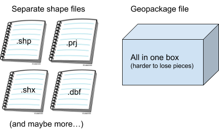
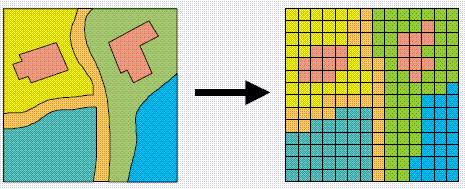

---
# Please do not edit this file directly; it is auto generated.
# Instead, please edit 04-Geospatial-Lesson.md in _episodes_rmd/
title: "Geospatial data and boundaries"
output: html_document
include_overview: true
questions:
 - How do I read shape files into R?
 - What is a coordinate reference system (CRS)?
 - What is my shape file's coordinate reference system?
objectives:
 - Import geospatial files into your R environment
 - Identify the coordinate system for a dataset
 - Talk about when data don't have a projection defined (missing .prj file)
 - Determine UTM zone of a dataset
 - Reproject the dataset into UTM
 - Visualize geospatial data with R
keypoints:
 - sf is prefereable for data analysis; it is easier to access the dataframe
 - Projecting your data in utm is necessary for many of the geometric operations you perform (e.g. making trial grids and splitting plots into subplot data)
 - Different data formats that you are likely to encounter include gpkg, shp (cpg, dbf, prj, sbn, sbx), geojson, and tif 
source: Rmd
---
<!-- Dena: We don't discuss most of those data formats - add info or tweak description? -->

> ## Introducing Spatial Data 
>
> Spatial data can be stored in many different ways, and an important part of using your farm’s data will involve understanding what format your data is already in and what format another program needs it to be in. During the course of this lesson, we’ll learn:
> 
> * How to identify which coordinate reference system (CRS) a data file is using
> * How, when, and why to transform data from the WGS84 standard to the UTM standard (or vice versa)
> * How to save the transformed data as a new file
> * Some ways of creating visualizations from your data
> 
{: .textchunk}

> ## What is a CRS?
> 
> Geospatial data has a coordinate reference system (CRS) that reports how the map is projected and what point is used as a reference. A projection is a way of making the earth’s curved surface fit into something you can represent on a flat computer screen. The point used for reference during projection is called a datum.
> 
{: .textchunk}

> ## Importance of Projections
> To understand why projection matters, take a look at the difference between [the Mercator projection](https://en.wikipedia.org/wiki/Mercator_projection#/media/File:Mercator_projection_Square.JPG) of the world and the [Boggs eumorphic projection](https://en.wikipedia.org/wiki/Boggs_eumorphic_projection#/media/File:Boggs_eumorphic_projection_SW.JPG).
> 
> Mercator | Boggs eumorphic projection
> :---------:|:----------------------:
>  | 
> 
> In the Mercator projection, space that doesn’t exist is created to make a “flat” map and Greenland and Antarctica disproportionately huge. In the Boggs projection, strategic slices are cut out of the ocean so that the sizes appear a bit closer to true, but Canada and Russia get pinched and Greenland gets bisected. There will always be some compromises made in a projection system that converts curved surfaces to flat ones for the same reason that it’s difficult to make an orange peel lie flat. So the method you select will have an effect on your outcome.
> 
{: .textchunk}

> ## Understanding file types and CRS types
>
> Geospatial data files have several potential variations, including:
> * **Vector or raster data**: Whether the information is stored as lines and curves (vector) or as individual dots (raster or bitmap).
> * **File types**: Several different shape files or one unified geopackage file
> * **Coordinate reference systems (CRSes)**: Latitude/longitude (WGS84, measured in degrees) or UTM (measured as a distance from a fixed point in meters)
>
> Any of this information can come in any combination -- you can have vector or raster data in any CRS in either a geopackage file or a collection of shape files. 
> 
>
> The image on the left below is a vector-based representation of GIS data, with lines and curves; the image on the right is a raster-based representation, with individual values assigned to particular locations in a grid.
> 
>
> In order to make data from different sources work together, you’ll need to be able to identify what type of data in what CRS you have and how to convert them to the same type of thing -- making sure you’re comparing apples to apples.
>
> For example:
>   * The data coming from your equipment will probably be in separate **shape files**. This allows the steering system to work with one file, the planting system to track rates in another file, and so forth. It’s like giving a group of reporters their own notebooks, instead of asking them all to share the same notebook at the same time.
>   * However, once the data has been collected, it’s easier for us to combine those reporters' notebooks into one **geopackage** file so that the data is all in one place for us to work with at the same time.
>   * Data coming from your equipment will also likely be reported in a CRS based on **latitude/longitude (WGS84)**, but in order to do calculations based on distance within a field, we’ll want to convert to UTM.
>   * Because each equipment manufacturer has their own standards, there may be some additional manipulation needed to get from the manufacturer’s possibly proprietary standard to something that you can use yourself. (This is one reason it’s helpful to provide us with data before class begins, so that we can help work out the pattern for decoding your equipment manufacturer’s data before the workshop starts.)
>
{: .textchunk}

> ## Reading in the Boundary File
> 
> Before we can look at a CRS in R, we need to have a geospatial file in the R environment. We will bring in the field boundary. Use the function `read_sf()` to bring the dataset into your R environment. Because we have already set the working directory for this file, we don't need to give the whole path, just the folder data that the gpkg file is stored within. 
> 
> 
> ~~~
> boundary <- read_sf("data/boundary.gpkg")
> ~~~
> {: .language-r}
> 
> There are many functions for reading files into the environment, but `read_sf()` creates an object of class **`sf`** or **simple feature.** This class makes accessing spatial data much easier. Much like a data frame, you can access variables within an `sf` object using the `$` operator. For this and other reasons like the number of spatial calculations available for `sf` objects, this class is perferred in most situations.
> 
{: .textchunk}

> ## Check the coordinate reference system
> 
> The function for retreiving the CRS of a simple feature is `st_crs().` Generally it is good practice to know the CRS of your files, but before combining files and performing operations on geospatial data, it is particularly important. Some commands will not work if the data is in the wrong CRS or if two dataframes are in different CRSs.
> 
> 
> ~~~
> st_crs(boundary)
> ~~~
> {: .language-r}
> 
> 
> 
> ~~~
> Coordinate Reference System:
>   EPSG: 4326 
>   proj4string: "+proj=longlat +datum=WGS84 +no_defs"
> ~~~
> {: .output}
> 
> The boundary file is projected in longitude and latitude using the WGS84 datum. This will be the CRS of most of the data you see. 
> 
{: .textchunk}

> ## Lost .prj files
> Sometimes when looking at a shapefile, the .prj file can be lost. Then `st_crs()` will return empty, but `sf` objects contain a geometry column. We can see the geometric points for the vertices of each polygon or the points in the data.
>
> 
> ~~~
> head(boundary$geom)
> ~~~
> {: .language-r}
> 
> 
> 
> ~~~
> Geometry set for 1 feature 
> geometry type:  POLYGON
> dimension:      XY
> bbox:           xmin: -82.87853 ymin: 40.83945 xmax: -82.87306 ymax: 40.8466
> epsg (SRID):    4326
> proj4string:    +proj=longlat +datum=WGS84 +no_defs
> ~~~
> {: .output}
> 
> 
> 
> ~~~
> POLYGON ((-82.87319 40.84574, -82.87306 40.8398...
> ~~~
> {: .output}
> 
{: .callout}

> ## UTM Zones
> 
> Some coordinate reference systems, such as UTM zones, are measured in meters. Latitude and longitude represent a different type of CRS, defined in terms of angles across a sphere. If we want to create measures of distance, we need the trial design in UTM. But there are many UTM zones, so we must determine the zone of the trial area. 
> 
> The UTM system divides the surface of Earth between 80°S and 84°N latitude into 60 zones, each 6° of longitude in width. Zone 1 covers longitude 180° to 174° W; zone numbering increases eastward to zone 60 that covers longitude 174 to 180 East. 
> 
{: .textchunk}

> ### st_transform and ESPG Codes
> 
For reprojecting spatial data, the function `st_transform()` uses an ESPG code to transform a simple feature to the new CRS. EPSG Geodetic Parameter Dataset is a public registry of spatial reference systems, Earth ellipsoids, coordinate transformations and related units of measurement. The ESPG is one way to assign or transform the CRS in R. 
> 
> The ESPG for UTM always begins with "326" and the last numbers are the number of the zone. The ESPG for WGS84 is 4326. This is the projection your equipment reads, so any trial design files will need to be transformed back into WGS84 before you implement the trial. Also, all files from your machinery, such as yield, as-applied, and as-planted, will be reported in latitude and longitude with WGS84.
> 
{: .textchunk}

<!-- **Dena: I feel like this is a fantastic place to have an exercise with the name and/or first few lines of a file of each
type to ask them to look at them and identify which is which and describe what that means, to check understanding?** -->

> ## Transforming
> 
> The function `st_transform_utm()` transforms a simple feature that is in lat/long into UTM. This function is in the functions.R script, and is described there in more detail. Make sure that you have run `source("functions.R")` or you will not have the function in your global environment.
> 
> ~~~
> boundaryutm <- st_transform_utm(boundary)
> st_crs(boundaryutm)
> ~~~
> {: .language-r}
> 
> 
> 
> ~~~
> Coordinate Reference System:
>   EPSG: 32617 
>   proj4string: "+proj=utm +zone=17 +datum=WGS84 +units=m +no_defs"
> ~~~
> {: .output}
> 
{: .textchunk}
<!-- **Dena: This exercise might run well as a talk-through -- ask the room to describe their understanding of how to do the thing -- followed by a type-along where you type what they tell you to do, and then explain what worked or what didn't?** -->

> ## Exercise: Exploring Geospatial Files
> 1. Bring the file called "asplanted.gpkg" (from the data subdirectory of your WorkingDir) in your environment. Name the object `planting`. This file contains the planting information for 2017.
> 2. Identify the CRS of the object. 
> 3. Look at the geometry features. What kind of geometric features are in this dataset?
> 4. Transform the file to UTM or Lat/Long, depending on the current CRS.
> 
> > ## Solution 
> > 
> > 
> > ~~~
> > planting <- read_sf("data/asplanted.gpkg")
> > st_crs(planting)
> > ~~~
> > {: .language-r}
> > 
> > 
> > 
> > ~~~
> > Coordinate Reference System:
> >   EPSG: 4326 
> >   proj4string: "+proj=longlat +datum=WGS84 +no_defs"
> > ~~~
> > {: .output}
> > 
> > 
> > 
> > ~~~
> > planting$geom
> > ~~~
> > {: .language-r}
> > 
> > 
> > 
> > ~~~
> > Geometry set for 6382 features 
> > geometry type:  POINT
> > dimension:      XY
> > bbox:           xmin: -82.87843 ymin: 40.83952 xmax: -82.87315 ymax: 40.84653
> > epsg (SRID):    4326
> > proj4string:    +proj=longlat +datum=WGS84 +no_defs
> > First 5 geometries:
> > ~~~
> > {: .output}
> > 
> > 
> > 
> > ~~~
> > POINT (-82.87829 40.83953)
> > ~~~
> > {: .output}
> > 
> > 
> > 
> > ~~~
> > POINT (-82.87828 40.83953)
> > POINT (-82.87828 40.83953)
> > ~~~
> > {: .output}
> > 
> > 
> > 
> > ~~~
> > POINT (-82.87827 40.83953)
> > ~~~
> > {: .output}
> > 
> > 
> > 
> > ~~~
> > POINT (-82.87825 40.83953)
> > ~~~
> > {: .output}
> > 
> > 
> > 
> > ~~~
> > plantingutm <- st_transform_utm(planting)
> > st_crs(plantingutm)
> > ~~~
> > {: .language-r}
> > 
> > 
> > 
> > ~~~
> > Coordinate Reference System:
> >   EPSG: 32617 
> >   proj4string: "+proj=utm +zone=17 +datum=WGS84 +units=m +no_defs"
> > ~~~
> > {: .output}
> > 
> {: .solution} 
{: .challenge} 

> ### Exercise Discussion
>
> The cleaned planting file was in WGS84 initially. When we look at the geometry features, they are 6382 points defined in xand y coordinates. Using `st_transform_utm()` we create a new file called `plantingutm` with the CRS of UTM zone 17.
> 
{: .textchunk} 

> ## Save the file 
> 
> Use `st_write()` to save an sf object. If you do not specify a directory, the working directory will be used. We include the object we are saving `boundaryutm` and the name we would like to give the saved file `"boundary_utm.gpkg"`. Additionally, we specify the `layer_options` and `update` values to enable overwriting an existing file with the same name. 
> 
> 
> ~~~
> st_write(boundaryutm, "boundary_utm.gpkg", layer_options = 'OVERWRITE=YES', update = TRUE)
> ~~~
> {: .language-r}
> 
> 
> 
> ~~~
> Updating layer `boundary_utm' to data source `boundary_utm.gpkg' using driver `GPKG'
> options:        OVERWRITE=YES 
> Updating existing layer boundary_utm
> Writing 1 features with 0 fields and geometry type Polygon.
> ~~~
> {: .output}
> 
> 
> 
> ~~~
> Warning in CPL_write_ogr(obj, dsn, layer, driver,
> as.character(dataset_options), : GDAL Message 1: A geometry of type POLYGON is
> inserted into layer boundary_utm of geometry type MULTIPOLYGON, which is not
> normally allowed by the GeoPackage specification, but the driver will however do
> it. To create a conformant GeoPackage, if using ogr2ogr, the -nlt option can be
> used to override the layer geometry type. This warning will no longer be emitted
> for this combination of layer and feature geometry type.
> ~~~
> {: .warning}
> 
> The new .gpkg file will be visible in your working directory. (Check it out: Browse to your working directory in Windows File Explorer or Mac Finder and see the date and time on your new file.)
> 
{: .textchunk} 

> ## .gpkg vs. .shp files
> You can save the file as a .gpkg or .shp file. The advantage of a .gpkg file is that you only save one file rather than four files in a shapefile. Because shapefiles contain multiple files, they can be corrupted if one piece is missing. One example is a .prj file. If the .prj file is missing, the shapefile will have no CRS, and you will need to determine the CRS of the object. You will often need to transform a file from UTM to lat/long and save the new file during trial design, so this is an important step. One common problem with these files is that when you try to open a .gpkg file for the first time in R, it might not work if you haven’t opened it in QGIS before.
> 
{: .callout} 

> ## Visualizing the data
> 
> There are several ways to visualize spatial data. First, we can use `plot()` to look at the basic shape of the data. 
> 
> 
> ~~~
> plot(boundary$geom)
> ~~~
> {: .language-r}
> 
> 
> 
{: .textchunk}
