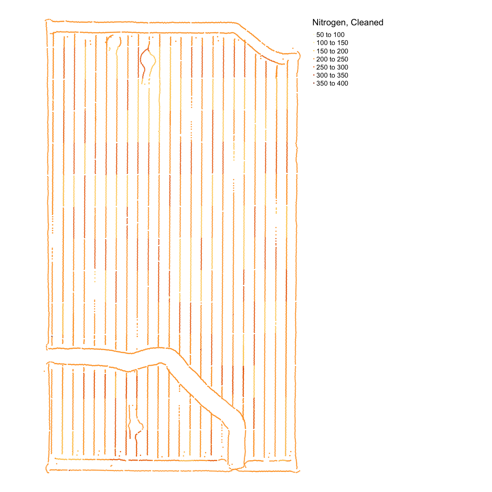
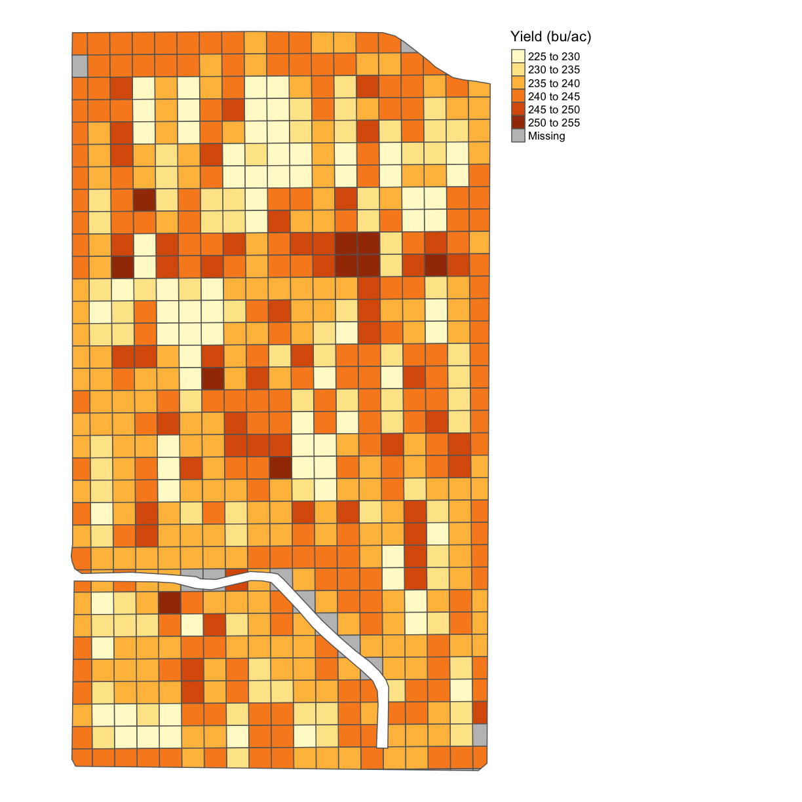
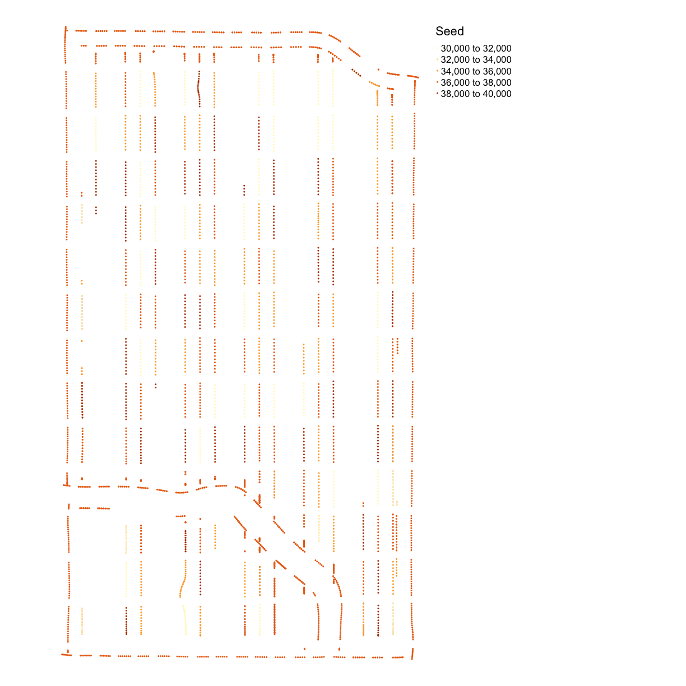

---
# Please do not edit this file directly; it is auto generated.
# Instead, please edit 05-Data-Cleaning-and-Aggregation.md in _episodes_rmd/
title: "Ag Carpentry - Data Cleaning and Aggregation"
author: "Aolin Gong"
date: "11/4/2019"
output: html_document
include_overview: true
questions:
 - Why is it important to clean the data before proceeding with analysis?
 - How can I quickly and efficiently identify problems with my data?
 - How can identify and remove incorrect values from my dataset?
objectives:
 - Confirm that data are formatted correctly
 - Enumerate common problems encountered with data formatting.
 - Visualize the distribution of recorded values
 - Identify and remove outliers in a dataset using R and QGIS
 - Correct other issues specific to how data were collected
keypoints:
 - Comparison operators such as `>`, `<`, and `==` can be used to identify values that exceed or equal certain values.
 - All the cleaning in the arcgis/qgis can be done by r, but we need to check the updated shapefile in Arcgis/qgis. Including removing observations that has greater than 2sd harvester speed, certain headlands, or being too close to the plot borders
 - The `filter` function in `dplyr` removes rows from a data frame based on values in one or more columns.
source: Rmd
---

 NOTE: `clean_sd` gets called in the previous lecture so we should talk about data cleaning then or move it to here

## Data cleaning and aggregation in the DIFM project

After harvesting, we collect all the data needed for analysis, and in advance of
running analysis, we clean and organize the data in order to remove machinary
error and such. The common data that we collect for analysis includes yield
(dry), seeding rate as-planted, nitrogen rate as-applied, electronic
conductivity (EC), SSURGO, soil test, weather, etc. In particular, we need to
clean yield data, as-planted data, as-applied data, and sometimes EC data. For
public data, we simply import them into our aggregated data set
without cleaning, since they have already been cleaned before being released to
the public.

## Introduction to data cleaning

Data cleaning is the process of removing or correcting errors in a dataset, and
is very important to do before any sort of analysis.  For example, say you were
manually entering yield values into a spreadsheet, and then wanted to take the
average of all values entered.  If you accidentally typed an extra zero into
some of the cells, the average that you calculate is going to be much higher
than the true average.

~~~
real_data <- c(900, 450, 200, 320)
error_data <- c(900, 4500, 200, 320)
mean(real_data)
~~~
{: .language-r}

~~~
[1] 467.5
~~~
{: .output}

~~~
mean(error_data)
~~~
{: .language-r}

~~~
[1] 1480
~~~
{: .output}

Therefore, we want to check for values like this before we do anything else.  If
the values were manually entered and the intended value is obvious, they can be
manually corrected.  For larger scale datasets, however, it is often most
practical to discard problematic data.

For example, we can plot our `error_data` and look for values that may look off:

~~~
plot(error_data) # use plot function on error rate
~~~
{: .language-r}

By eye we can see the 2nd measurement (at `index = 2`) looks a little fishy.  In this case
we might want to apply a cut-off in our data so that we ignore all measurements above a
certain threshold when we do calculations like taking the mean of our data.

One way to do this is by setting any "weird" values to `NA`:

~~~
error_data[error_data > 2000] <- NA # set any values bigger than 2000 to the NA tag
error_data
~~~
{: .language-r}

~~~
[1] 900  NA 200 320
~~~
{: .output}

Now we can take a mean, with removing `NA`'s as we do it and recover a mean that is closer to the correct value:

~~~
mean(error_data, na.rm=TRUE)
~~~
{: .language-r}

~~~
[1] 473.3333
~~~
{: .output}

Data cleaning is a major reason why there needs to be good communication between
data scientists and end users, in agriculture or any other discipline.  As the person
who generates the data, you know best where the likely sources of error might be.
Those sources of error might be something that someone who sits behind a computer
all day would never think of.  You also know best what values are reasonable,
and what values are suspiciously high or low.

For different types of data, we have different ways to clean them. Here are the
main concerns of the original data for the major variables:

Yield, as-planted, and as-applied data:

* We remove observations where the harvester/planter/applicator is moving too slow or too fast.
* We remove observations on the edges of the plot.
* We remove observations that are below or above three standard deviations from the mean.
* We then aggregate them onto our units of observation. Do they know what these units are? I don't have a frame of refrence for this terminology

This comes up in the 03 or 04 but we need to define what a standard devation is
 
*For aggregation, we need to generate subplots (units of observation) of the
original trial design, and then aggregate the cleaned datasets for different
variables onto the subplots.  Once we have one value per variable per subplot,
we can begin examining the relationships between the variables.*

Have steps listed somewhere before we start

## Step 1: Importing and transforming our shapefile datasets

<!-- Let's apply this data-cleaning thinking to measurements of yields.  First, we will aggregate our yields into a grid overlayed on top of our boundary shapefile and look for measurements on this grid that seem too low or to high, and flag these as "outliers" of our dataset in our data-cleaning process. -->

The first step is to read in our boundary and abline shape files and transform them to UTM for later use.  Let's do this step-by-step, starting with reading in the boundary shapefile and projecting it:

~~~
boundary <- read_sf("data/boundary.gpkg")
~~~
{: .language-r}
What is the current coordinate reference system of this object?

~~~
st_crs(boundary)
~~~
{: .language-r}

~~~
Coordinate Reference System:
  EPSG: 4326 
  proj4string: "+proj=longlat +datum=WGS84 +no_defs"
~~~
{: .output}
Let's transform it to the UTM projection & check out its new coordinate reference system:

~~~
boundary_utm <- st_transform_utm(boundary)
st_crs(boundary_utm)
~~~
{: .language-r}

~~~
Coordinate Reference System:
  EPSG: 32617 
  proj4string: "+proj=utm +zone=17 +datum=WGS84 +units=m +no_defs"
~~~
{: .output}
Now we can see that the `+proj=longlat` has changed to `+proj=utm` and gives us that we are in UTM zone #17.

In the last episode, we also imported our trial design, which we will do again here:

~~~
trial <- read_sf("data/trial.gpkg")
~~~
{: .language-r}

Let's look at the coordinate reference system here as well:

~~~
st_crs(trial)
~~~
{: .language-r}

~~~
Coordinate Reference System:
  EPSG: 32617 
  proj4string: "+proj=utm +zone=17 +datum=WGS84 +units=m +no_defs"
~~~
{: .output}
Do we have a figure showing lat/long to UTM coversion somewhere?  I can add this

Our file is already in the UTM projection, but if we have one that is not we can convert this as well with `trial_utm <- st_transform_utm(trial)`.  For the sake of naming, we'll rename it as `trial_utm`:

~~~
trial_utm <- trial
~~~
{: .language-r}

> ## Exercise: Transform the yield data
> Read in the yield shape file, look at its current CRS and transform it into the UTM projection.  Call this new, transformed variable `yield_utm`.
>
> > ## Solution
> > First, load the data:
> > 
> > ~~~
> > yield <- read_sf("data/yield.gpkg")
> > ~~~
> > {: .language-r}
> > Then take a look at the coordinate system:
> > 
> > ~~~
> > st_crs(yield)
> > ~~~
> > {: .language-r}
> > 
> > 
> > 
> > ~~~
> > Coordinate Reference System:
> >   EPSG: 4326 
> >   proj4string: "+proj=longlat +datum=WGS84 +no_defs"
> > ~~~
> > {: .output}
> > And finally transform into UTM:
> > 
> > ~~~
> > yield_utm <- st_transform_utm(yield)
> > ~~~
> > {: .language-r}
> >
> {: .solution}
{: .challenge}

Finally, let's transform our abline file.  We read in the file:

~~~
abline = st_read("data/abline.gpkg")
~~~
{: .language-r}

~~~
Reading layer `abline' from data source `/Users/jillnaiman/trial-lesson_ag/_episodes_rmd/data/abline.gpkg' using driver `GPKG'
Simple feature collection with 1 feature and 1 field
geometry type:  LINESTRING
dimension:      XY
bbox:           xmin: -82.87334 ymin: 40.84301 xmax: -82.87322 ymax: 40.84611
epsg (SRID):    4326
proj4string:    +proj=longlat +datum=WGS84 +no_defs
~~~
{: .output}
Check out its current coordinate reference system:

~~~
st_crs(abline)
~~~
{: .language-r}

~~~
Coordinate Reference System:
  EPSG: 4326 
  proj4string: "+proj=longlat +datum=WGS84 +no_defs"
~~~
{: .output}
And transform it to UTM:

~~~
abline_utm = st_transform_utm(abline)
~~~
{: .language-r}

## Step 2: Clean the yield data

Now that we have our shapefiles in the same UTM coordinate system reference frame, we will apply some of our knowledget of data cleaning to take out weird observations. We know we have "weird" measurements by looking at a histogram of our yield data:

~~~
hist(yield_utm$Yld_Vol_Dr)
~~~
{: .language-r}

The fact that this histogram has a large tail where we see a few measurements far beyond the majority around 250 means we know we have some weird data points.

We will take out these weird observations in two steps:
  1. First, we will take out observations we *know* will be weird because they are taken from the edges of our plot.
  1. Second, we will take out observations that are too far away from where the majority of the other yield measurements lie.

Let's go through these one by one.

### Data cleaning #1: Taking out border observations

We need to remove the yield observations that are on the border of the plots,
and also at the end of the plots.  The reason for this is that along the edge
of a plot, the harvester is likely to measure a mixture of two plots,
and therefore the data won't be accurate for either plot.  Additionally,
plants growing at the edge of the field are likely to suffer from wind and other
effects, lowering their yields.  We will use the `trial_utm` shapefile to help us clean.

We add a 15 meter?? border.

~~~
yield_clean_border <- clean_buffer(trial_utm, 15, yield_utm)
~~~
{: .language-r}

Let's use our side-by-side plotting we did in the previous episode to compare our original and border-yield cleaned yield maps:

~~~
yield_plot_orig <- map_points(yield_utm, "Yld_Vol_Dr", "Yield, Orig")
yield_plot_border_cleaned <- map_points(yield_clean_border, "Yld_Vol_Dr", "Yield, No Borders")
yield_plot_comp <- tmap_arrange(yield_plot_orig, yield_plot_border_cleaned, ncol = 2, nrow = 1)
yield_plot_comp
~~~
{: .language-r}

Here again, we also check the distribution of cleaned yield by making a histogram.

~~~
hist(yield_clean_border$Yld_Vol_Dr)
~~~
{: .language-r}

Looking at both this histogram and the several very red dots in our de-bordered yield map we see that there are still a lot of very high observations so we need to proceed to step two which will clean our observations based on how far they are from the mean of the observations.

### Data cleaning #2: Taking out outliers far from the mean

Even if we don't know the source of error, we can tell that some observations
are incorrect just because they are far too small or too large.  How can we
remove these in an objective, automatic way?  For yield and our other variables,
we will calculate the [standard deviation](https://en.wikipedia.org/wiki/Standard_deviation)
to get an idea of how much the observations tend to be different from the mean.
Then, we will remove observations that are three standard deviations higher or
lower than the mean.  If the data followed a normal distribution (i.e a bell
curve), this would eliminate about one in 1000 data points.  In a real dataset,
we can be fairly certain that those points are errors.  Our cutoff of three
standard deviations is arbitrary, which is why we have looked at histograms of
the data to help confirm that our cutoff makes sense.

In the next few steps, we use `sd` and `mean` to calculate the standard
deviation and mean of the yield distribution, respectively. Then we remove the
yield observations that are greater than mean + 3\*sd or less than mean - 3\*sd.  We use
the `clean_sd` from our `functions.R`:

~~~
yield_clean <- clean_sd(yield_clean_border, yield_clean_border$Yld_Vol_Dr)
~~~
{: .language-r}

Here again, we check the distribution of cleaned yield after taking out the
yield observations that are outside the range of three standard deviations from
the mean.

~~~
hist(yield_clean$Yld_Vol_Dr)
~~~
{: .language-r}

<!-- 
This looks a lot more sensible!  We can double check by comparing all the stages of our data cleaning on a map:

~~~
yield_plot_orig <- map_points(yield_utm, "Yld_Vol_Dr", "Yield, Orig")
yield_plot_border_cleaned <- map_points(yield_clean_border, "Yld_Vol_Dr", "Yield, No Borders")
yield_plot_clean <- map_points(yield_clean, "Yld_Vol_Dr", "Yield, Cleaned")
yield_plot_comp_final <- tmap_arrange(yield_plot_orig, yield_plot_border_cleaned, yield_plot_clean, ncol = 3, nrow = 1)
yield_plot_comp_final
~~~
{: .language-r}

~~~
Some legend labels were too wide. These labels have been resized to 0.62, 0.54, 0.54. Increase legend.width (argument of tm_layout) to make the legend wider and therefore the labels larger.
~~~
{: .output}

~~~
Some legend labels were too wide. These labels have been resized to 0.62, 0.54. Increase legend.width (argument of tm_layout) to make the legend wider and therefore the labels larger.
~~~
{: .output}

-->

This looks a lot more sensible!  We can double check by looking at our final, cleaned yield map:

~~~
yield_plot_clean <- map_points(yield_clean, "Yld_Vol_Dr", "Yield, Cleaned")
yield_plot_clean
~~~
{: .language-r}

> ## Discussion
> What do you think could have caused these outliers (extreme values)?  If you
were working with yield data from your own fields, what other sources of error
might you want to look for?
>
{: .callout}

> ## Exercise: Cleaning Nitrogen from asapplied
> 
> Import the `asapplied.gpkg` shapefile for and clean the nitrogen application data.
> 1. Remove observations from the
buffer zone, JPN: probably we need a different buffer length for this since I'm getting plots that have taken too much out in the boundary-removal process
> 2. as well as observations more then three standard deviations from
the mean.
>
> > ## Solution
> > Load the data
> > 
> > ~~~
> > nitrogen <- read_sf("data/asapplied.gpkg")
> > ~~~
> > {: .language-r}
> > Check CRS
> > 
> > ~~~
> > st_crs(nitrogen)
> > ~~~
> > {: .language-r}
> > 
> > 
> > 
> > ~~~
> > Coordinate Reference System:
> >   EPSG: 4326 
> >   proj4string: "+proj=longlat +datum=WGS84 +no_defs"
> > ~~~
> > {: .output}
> > Since its in Lat/Long we have to transform it:
> > 
> > ~~~
> > nitrogen_utm = st_transform_utm(nitrogen)
> > ~~~
> > {: .language-r}
> > Clean border:
> > 
> > ~~~
> > nitrogen_clean_border <- clean_buffer(trial_utm, 15, nitrogen_utm)
> > ~~~
> > {: .language-r}
> > Check out our progress with a plot:
> > 
> > ~~~
> > nitrogen_plot_orig <- map_points(nitrogen_utm, "Rate_Appli", "Nitrogen, Orig")
> > nitrogen_plot_border_cleaned <- map_points(nitrogen_clean_border, "Rate_Appli", "Nitrogen, No Borders")
> > nitrogen_plot_comp <- tmap_arrange(nitrogen_plot_orig, nitrogen_plot_border_cleaned, ncol = 2, nrow = 1)
> > nitrogen_plot_comp
> > ~~~
> > {: .language-r}
> > 
> > 
> > Clean by standard deviation:
> > 
> > ~~~
> > nitrogen_clean <- clean_sd(nitrogen_clean_border, nitrogen_clean_border$Rate_Appli)
> > ~~~
> > {: .language-r}
> > Plot our final result on a map:
> > 
> > ~~~
> > nitrogen_plot_clean <- map_points(nitrogen_clean, "Rate_Appli", "Nitrogen, Cleaned")
> > nitrogen_plot_clean
> > ~~~
> > {: .language-r}
> > 
> > 
> > And as a histogram:
> > 
> > ~~~
> > hist(nitrogen_clean$Rate_Appli)
> > ~~~
> > {: .language-r}
> > 
> > 
> >
> {: .solution}
{: .challenge}

# Designing Trials: Generating Grids and Aggregating

Now that we have cleaned data we will go through the steps to aggregate this data on subplots of our shapefile of our farm.  This happens in a few steps.

## Step 1: Creating the subplots

After we read in the trial design file, we use a function to generate the
subplots for this trial. Because the code for generating the subplots is
somewhat complex, we have included it as the `make_grids` function in `functions.R`.

To start, we only want to look at data in the `Trial` portion of our plot, so we take a subset of this:

~~~
boundary_grid_utm = subset(boundary_utm, Type == "Trial")
plot(boundary_grid_utm$geom)
~~~
{: .language-r}

Now we will make subplots that are 24 meters wide:

~~~
width = m_to_ft(24) # convert from meters to feet
~~~
{: .language-r}

Now we use `make_grids` to calculate subplots for our shapefile more words are needed here about these parameters

~~~
design_grids_utm = make_grids(boundary_grid_utm,
                              abline_utm, long_in = 'NS', short_in = 'EW',
			      length_ft = width, width_ft = width)
~~~
{: .language-r}

We need to make sure the coordinate system for both our grids and our original boundary file match up:

~~~
st_crs(design_grids_utm) = st_crs(boundary_grid_utm)
~~~
{: .language-r}

Let's plot what these grids will look like  we need to talk about what tm_shape is here or before

~~~
tm_shape(design_grids_utm) + tm_borders(col='blue')
~~~
{: .language-r}

Now the last step is that we want to make sure this grid overlaps *only* with our boundary file, so we take the intersection of this rectangular grid with our boundary file's Trial data outline:

~~~
trial_grid_utm = st_intersection(boundary_grid_utm, design_grids_utm)
~~~
{: .language-r}

~~~
Warning: attribute variables are assumed to be spatially constant throughout all
geometries
~~~
{: .error}

~~~
tm_shape(trial_grid_utm) + tm_borders(col='blue')
~~~
{: .language-r}

 there is an error here that we should fix or mention

## Step 2: Interpolation/Aggregation on our subplots

We will now aggregate our yield data over our subplots.

Interpolation is the estimation of a value at a point that we didn't measure
that is between two or more points that we did measure.  Aggregation is the
combining of multiple data points into a single data point.  What we'll do here
is a combination of interpolation and aggregation, where we will use multiple
measurements across each subplot to generate one value for the subplot. In this
case we will take the median value within each subplot.  Typically when the data
are not normally-distributed or when there are errors, the median is more
representative of the data than the mean is.  Here we will interpolate and
aggregate yield as an example.  The other variables can be processed in the same
way.

**Question from Lindsay: Why do we need to covert class here?  Please provide an
explanation.** not sure what "covert" means here, leaving this question for others

<!-- JPN: no work

~~~
grid_sp = trial_grid_utm
merge <- sp::over(trial_grid_utm, yield_clean[,"Yld_Vol_Dr"], fn = median)
~~~
{: .language-r}

~~~
Error in (function (classes, fdef, mtable) : unable to find an inherited method for function 'over' for signature '"sf", "sf"'
~~~
{: .error}

~~~
grid_sp@data <- cbind(merge, grid_sp@data)
~~~
{: .language-r}

~~~
Error in cbind(merge, grid_sp@data): trying to get slot "data" from an object (class "sf") that is not an S4 object 
~~~
{: .error}

~~~
subplots_data <- st_as_sf(grid_sp) 
map_poly(subplots_data, 'Yld_Vol_Dr', "Yield (bu/ac)")
~~~
{: .language-r}

~~~
Error: Fill argument neither colors nor valid variable name(s)
~~~
{: .error}
-->

One final step we have to do before aggregating is to explicitly tell R that our data is "Spatial" data.  This is a little quirk of R that we have to think about for both our trial grid and yield data:

I would personally vote for function-izing the spatial conversion stuff since its new and also then we have to explain the [,] stuff since before we've only called columns with $

~~~
trial_grid_spatial <- as(trial_grid_utm, "Spatial")
yield_clean_spatial <- as(yield_clean[,"Yld_Vol_Dr"], "Spatial")
~~~
{: .language-r}
Let's deposit on our grid using a function `deposit_on_grid` from `functions.R`:

~~~
subplots_data <- deposit_on_grid(trial_grid_spatial, yield_clean_spatial, fn=median)
~~~
{: .language-r}
And let's finally take a look!

~~~
map_poly(subplots_data, 'Yld_Vol_Dr', "Yield (bu/ac)")
~~~
{: .language-r}

<!-- JPN: took out a lot

~~~
grid_sp <- as(trial_grid_utm, "Spatial")
crs(grid_sp)
~~~
{: .language-r}

~~~
CRS arguments:
 +proj=utm +zone=17 +datum=WGS84 +units=m +no_defs +ellps=WGS84
+towgs84=0,0,0 
~~~
{: .output}

**Explain more of what is happening in this code below**
**Why is one line commented out?**

~~~
merge <- sp::over(grid_sp, as(yield_clean[,"Yld_Vol_Dr"], "Spatial"), fn = median)
grid_sp@data <- cbind(merge, grid_sp@data)

subplots_data <- st_as_sf(grid_sp) 
map_poly(subplots_data, 'Yld_Vol_Dr', "Yield (bu/ac)")
~~~
{: .language-r}

-->
