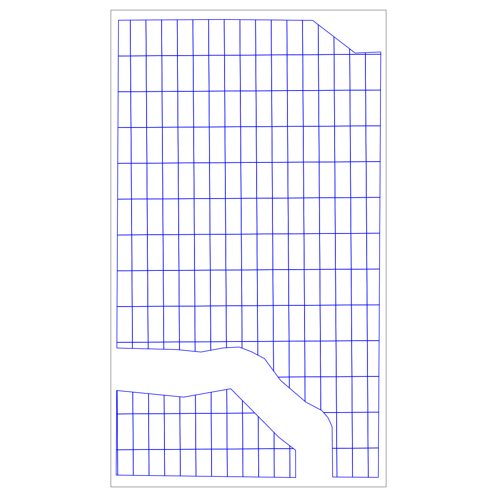
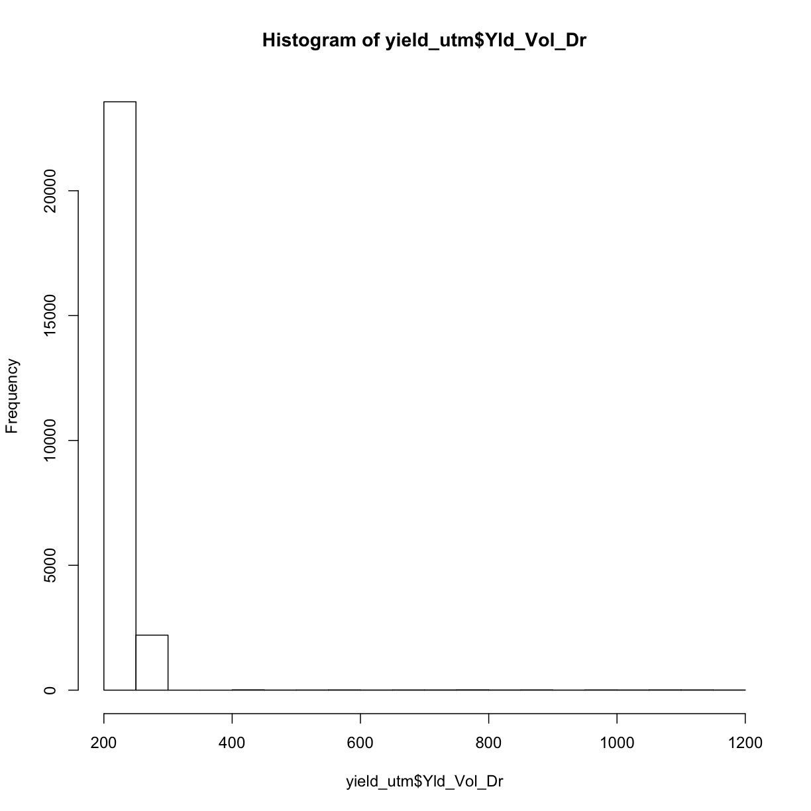

---
# Please do not edit this file directly; it is auto generated.
# Instead, please edit 06-Experimental-Design.md in _episodes_rmd/
title: "Experimental Design"
include_overview: true
output: html_document
questions:
 - What kind of on-farm experiments do we do?
 - How do we design these experiments efficiently?
objectives:
 - Know different types of common on-farm experiments
 - Import boundary file and AB line file
 - Create AB line file with code
 - utilize the functions to create simple trial designs
keypoints:
 - Most of the code in this part would be using the functions, therefore understanding what different functions can be quite important
 - In designing the trials, the most important thing is to know how to design the experimental rates,and the tech part can be done by someone else
source: Rmd
---

Now we will design our own experiments to do on our plots.  
The only files we need for the trial design are the boundary file, and ab line.

<!-- JPN: add in if we have time: In addition, as long as we know the actual direction the machines
will be driven on the field, we can create our own AB line with a function. -->

## Read and transform shape files

We will start by reading in the shape files we need like we've been doing for the last few episodes:

~~~
boundary <- st_read("data/boundary.gpkg") # read in boundary
~~~
{: .language-r}

~~~
Reading layer `boundary' from data source `/Users/jillnaiman/trial-lesson_ag/_episodes_rmd/data/boundary.gpkg' using driver `GPKG'
Simple feature collection with 2 features and 1 field
geometry type:  MULTIPOLYGON
dimension:      XY
bbox:           xmin: -82.87853 ymin: 40.83945 xmax: -82.87306 ymax: 40.8466
epsg (SRID):    4326
proj4string:    +proj=longlat +datum=WGS84 +no_defs
~~~
{: .output}

~~~
abline <- st_read("data/abline.gpkg") # read in AB line
~~~
{: .language-r}

~~~
Reading layer `abline' from data source `/Users/jillnaiman/trial-lesson_ag/_episodes_rmd/data/abline.gpkg' using driver `GPKG'
Simple feature collection with 1 feature and 1 field
geometry type:  LINESTRING
dimension:      XY
bbox:           xmin: -82.87334 ymin: 40.84301 xmax: -82.87322 ymax: 40.84611
epsg (SRID):    4326
proj4string:    +proj=longlat +datum=WGS84 +no_defs
~~~
{: .output}

<!-- JPN: here is where we can have a popout "what if no abline file" -->
<!-- JPN: add if time
### make our own AB line if you do not already have one
ABline stuff creation here if we can figure it out
-->

Now let's check the coordinate references of our two files:

~~~
st_crs(boundary)
~~~
{: .language-r}

~~~
Coordinate Reference System:
  EPSG: 4326 
  proj4string: "+proj=longlat +datum=WGS84 +no_defs"
~~~
{: .output}

~~~
st_crs(abline)
~~~
{: .language-r}

~~~
Coordinate Reference System:
  EPSG: 4326 
  proj4string: "+proj=longlat +datum=WGS84 +no_defs"
~~~
{: .output}

Since both of these are in lat/long and we want them in UTM, we'll transform them:

~~~
boundary_utm <- st_transform_utm(boundary)
~~~
{: .language-r}

~~~
abline_utm <- st_transform_utm(abline)
~~~
{: .language-r}

## Designing trials

We need decide on the experiment design before we get into any of the code.  Relative parameters we need for the trial design includes:
 * plot dimension
 * number of treatments
 * types of treatments, and
 * treatment range.

In the following code, we are simply going to assign values to all
the parameters that might be involved in the trial design. In this way, if we ever want to change any parameters, we can do it here, and need not
to worry about the consistency for the whole code.

First, we want to make sure we don't plan any trials on the "Headlands", so let's make sure we only take the "Trial" portion of our shapefile:

~~~
trialarea <- subset(boundary_utm, Type == "Trial")
~~~
{: .language-r}

Now let's design our grid with the following parameters:

~~~
width_in_meters = 24 # width of grids is 24 meters
long_direction = 'NS' # direction of grid that will be long
short_direction = 'EW' # direction of grid that will be short
length_in_ft = 180 # length of grids in feet
~~~
{: .language-r}

We'll use our `make_grids` again function to generate this trial's grid:

~~~
width <- m_to_ft(24) # convert meters to feet
design_grids_utm <- make_grids(trialarea, abline_utm,
                               long_in = long_direction,
			       short_in = short_direction,
			       length_ft = length_in_ft,
			       width_ft = width)
~~~
{: .language-r}
Next we want to make sure the coordinate reference frame of our `trialarea` is the same as our `design_grids_utm` grids and then take the intersection of these grids with our trial area as we did previously:

~~~
st_crs(design_grids_utm) <- st_crs(trialarea)
trial_grid <- st_intersection(trialarea, design_grids_utm)
~~~
{: .language-r}

~~~
Warning: attribute variables are assumed to be spatially constant throughout all
geometries
~~~
{: .error}

Let's check out what our trial subplots look like:

~~~
tm_shape(trial_grid) + tm_borders(col='blue')
~~~
{: .language-r}

### determine treatment types
Now that we have the trial design plots, we need to assign different treatments to each plot.

~~~
whole_plot <- treat_assign(trialarea, trial_grid, head_buffer_ft = width, seed_treat_rates = c(31000, 34000, 37000, 40000), nitrogen_treat_rates = c(160,200,225,250), seed_quo = 37000, nitrogen_quo = 225)
map_poly(whole_plot, "NRATE", "Nitrogen Treatment")
~~~
{: .language-r}

~~~
head(whole_plot)
~~~
{: .language-r}

~~~
Simple feature collection with 6 features and 4 fields
geometry type:  POLYGON
dimension:      XY
bbox:           xmin: 342027 ymin: 4523153 xmax: 342050.3 ymax: 4523297
epsg (SRID):    32617
proj4string:    +proj=utm +zone=17 +datum=WGS84 +units=m +no_defs
   id treat_type NRATE SEEDRATE                           geom
1 ID1          9   225    31000 POLYGON ((342050.1 4523262,...
2 ID2          6   200    34000 POLYGON ((342050.1 4523262,...
3 ID3         16   250    40000 POLYGON ((342049.8 4523208,...
4 ID4          8   200    40000 POLYGON ((342049.8 4523208,...
5 ID5          3   160    37000 POLYGON ((342049.5 4523153,...
6 ID6         15   250    37000 POLYGON ((342049.5 4523153,...
~~~
{: .output}

~~~
# infield <- st_buffer(boundary.utm, -plot_width_meter)
# outfield <- st_difference(boundary.utm, infield)
# 
# infield$dummy <- 1
# outfield$dummy <- 0
# bothfields <- rbind(infield, outfield)
# newfield <- subset(bothfields, dummy == 1)
~~~
{: .language-r}

###eg plot

~~~
ggplot(data = whole_plot, aes(x=long,y=lat,group=group)) +
  geom_polygon(aes(fill=factor(NRATE))) +
  scale_fill_brewer(palette = 'Greens') 
~~~
{: .language-r}

~~~
Error in FUN(X[[i]], ...): object 'long' not found
~~~
{: .error}

