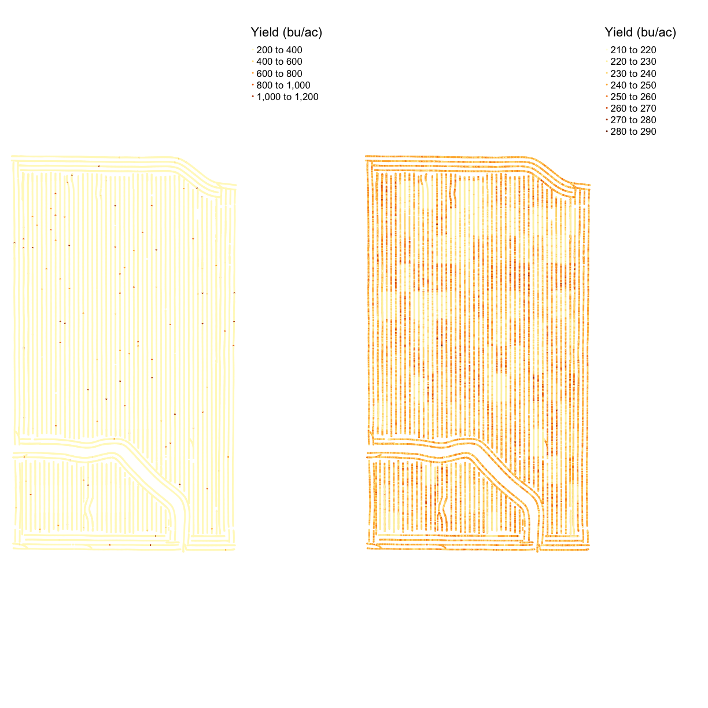
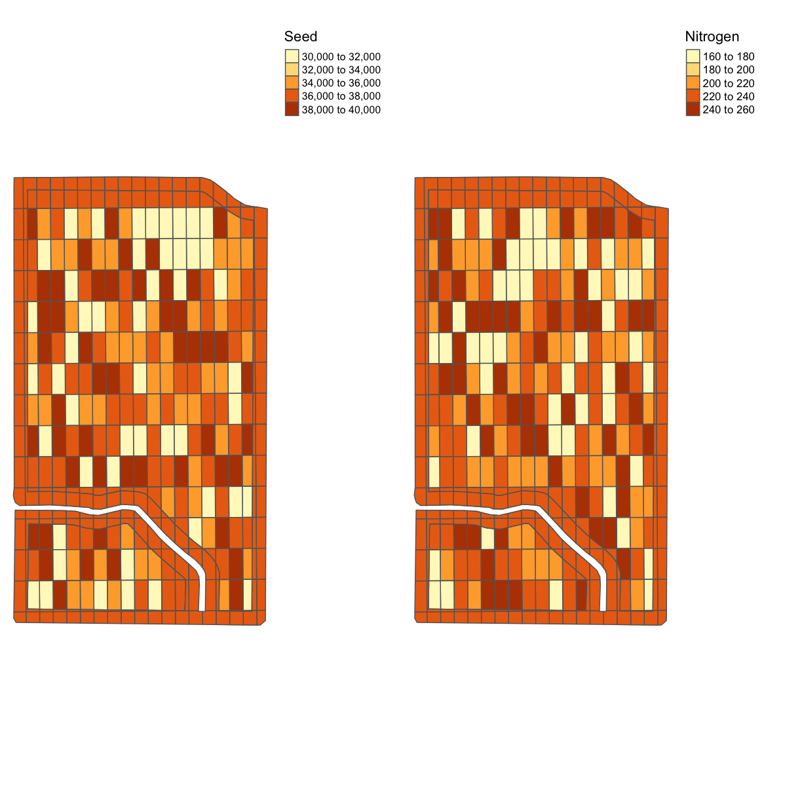
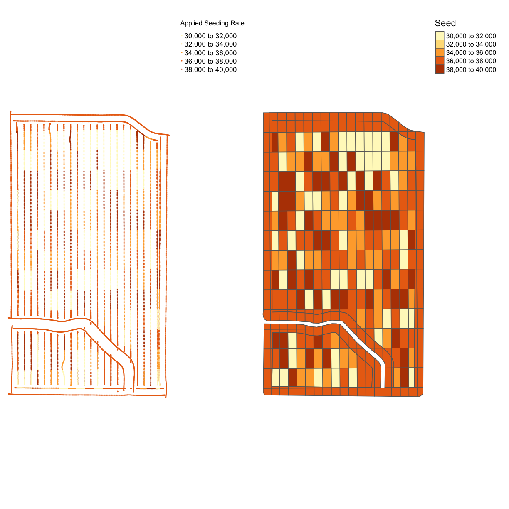
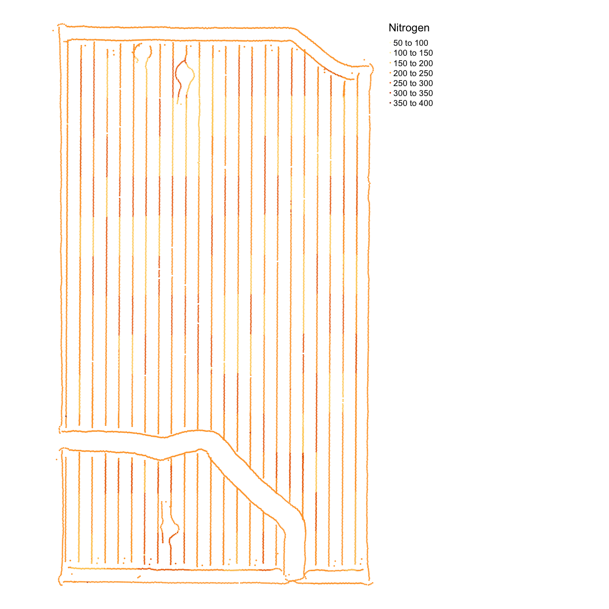

---
# Please do not edit this file directly; it is auto generated.
# Instead, please edit 06-Trial-Data.md in _episodes_rmd/
title: "Trial Data"
questions:
 - What are the common file types in agricultural data?
objectives:
 - Import agricultural datasets into R
 - Describe the contents of files generated during planting, fertilization, and harvest
 - Describe the contents of files used to control seeding and fertilization rate
 - Assess the accuracy of machinery in applying the target rates
keypoints:
 - sf is prefereable for data analysis; it is easier to access the dataframe
 - Projecting your data in utm is necessary for many of the geometric operations you perform (e.g. making trial grids and splitting plots into subplot data)
 - Compare different data formats, such as gpkg, shp(cpg,dbf,prj,sbn,sbx),geojson,tif
include_overview: yes
source: Rmd
---

## Lesson Overview

In this lesson we will explore the files that are generated during a trial season. These data include yield, as-applied, as-planted, and sometimes electrical conductivity. While you are likely using your yield maps every year to assess productivity, you might not be looking at your application maps if you normally use uniform rates. But if you use variable rate applications or have completed an agricultural trial, your application map contains information about how well the machine applied the target rates.

> ## Simulating yields
>
> Because you are generating your trial design "on the fly" in this workshop you will have different nitrogen and seed application rates than for the original dataset which measured the yields from a "real" trial.  In practice, whatever yield, asplanted, asapplied, and trial measurements you have stored can be used for this exercise, however **for this workshop only** have *simulated* the yields we'd expect to get out from your trial design.  These are the data files with the `_new` in their titles which we will read in now.
>
> For example, reading in the asplanted file will now look like:
>
> 
> ~~~
> planting <- read_sf("data/asplanted_new.gpkg")
> ~~~
> {: .language-r}
{: .callout}

### Reading the Files

In the next exercise we will bring these data into the R environment. We've already looked at the asplanted data in the geospatial lesson (and have read it in again here). Now let's see what variables are contained in the other files.

> ## Exercise: Exploring Trial Data
>
> Read the yield, trial, and as-applied files and explore the variables. For each file, identify what variables might we be interested in and why?
>
> > ## Solution
> >
> > 
> > ~~~
> > nitrogen <- read_sf("data/asapplied_new.gpkg")
> > yield <- read_sf("data/yield_new.gpkg")
> > trial <- read_sf("data/trial_new.gpkg")
> > names(nitrogen)
> > ~~~
> > {: .language-r}
> > 
> > 
> > 
> > ~~~
> >  [1] "Product"      "Obj__Id"      "Track_deg_"   "Swth_Wdth_"   "Distance_f"  
> >  [6] "Duration_s"   "Elevation_"   "Area_Count"   "Diff_Statu"   "Time"        
> > [11] "Y_Offset_f"   "X_Offset_f"   "Rt_Apd_Ms_"   "Pass_Num"     "Speed_mph_"  
> > [16] "Prod_ac_hr"   "Date"         "Rate_Appli"   "Rate_Appli.1" "geom"        
> > ~~~
> > {: .output}
> {: .solution}
{: .challenge}

### As-Applied File

The nitrogen file contains 22 variables. The nitrogen type of is reported in `Product`, and this field used NH3. The column with the applied rate is `Rate_Appli`.

There is not a clear column with the target rate. This is not a problem as we will later merge the trial map and the application map, so we can compare the rate applied to the intended rate.

We can also see the automatic-section control reacting when the applicator is off of the guidance line, with the swatch width changing in `Swth_W_`.

### Yield File

`yield` contains 32 variables. Many of the variables are similar to those we in the nitrogen data: time, date, elevation, and product.

The main variables in the harvest files are `Yld_Vol_Dr` and `Yld_Mass_D`. We also use speed (`Speed_mph_`) to eliminate the points collected when the machine was slowing down or speeding up as this effects the accuracy of the yield monitor.

~~~
names(yield)
~~~
{: .language-r}

~~~
 [1] "Product"    "Obj__Id"    "Distance_f" "Track_deg_" "Duration_s"
 [6] "Elevation_" "Time"       "Area_Count" "Swth_Wdth_" "Y_Offset_f"
[11] "Crop_Flw_M" "Moisture__" "Yld_Mass_W" "Yld_Vol_We" "Yld_Mass_D"
[16] "Yld_Vol_Dr" "Humidity__" "Air_Temp__" "Wind_Speed" "Soil_Temp_"
[21] "Wind_Dir"   "Sky_Cond"   "Pass_Num"   "Speed_mph_" "Prod_ac_h_"
[26] "Crop_Flw_V" "Date"       "Yield__Dry" "geom"      
~~~
{: .output}

### As-Planted File

~~~
names(planting)
~~~
{: .language-r}

~~~
 [1] "Product"      "Obj__Id"      "Distance_f"   "Track_deg_"   "Duration_s"  
 [6] "Elevation_"   "Time"         "Area_Count"   "Swth_Wdth_"   "Seed_Cnt__"  
[11] "Plant_Pop_"   "Rt_Apd_Ct_"   "SeedFlow_k"   "Tgt_Rate_k"   "Y_Offset_f"  
[16] "DF_Margin_"   "Humidity__"   "Air_Temp__"   "Wind_Speed"   "Soil_Temp_"  
[21] "Pass_Num"     "Speed_mph_"   "Prod_ac_h_"   "Prdt_Amt"     "Date"        
[26] "Population"   "Rate__Coun"   "Target_Rat"   "Population.1" "Date___Tim"  
[31] "geom"        
~~~
{: .output}

We see that the planting file has 33 variables, several of which appear to be identical. The main variables of interest are the planting rate (`Rt_A_C_`) and the target rate (`Tgt_Rt_`). These columns do appear under different names. We will discuss how to handle this below.

There are several other variables that could be useful. First, the hybrid is located in the `Product` column; we want to keep this in our records if we want to compare across years. We may also want to know things like the swath width (`Swth_W_`) or elevation (`Elevtn`), swath width for cleaning and aggregating which will be discussed later and elevation for considering its impact on yield.

## Visualizing the Trial Data

In the next section, we will have exercises to visually explore the trial data. We will look at the importance of data cleaning with a yield map visualization. We will compare the application rate to the target rates and the yield levels.

> ## Exercise: Yield Map
>
> Make a map of the yield in bushels per acre from the `yield` file using `map_points()`. This is a new function to us, but it has the same inputs as `map_poly()` where you supply the data, column name to determine the color, and displayed name. Do you notice anything about the yield map?
>
> > ## Solution
> >
> > 
> > ~~~
> > names(yield)
> > ~~~
> > {: .language-r}
> > 
> > 
> > 
> > ~~~
> >  [1] "Product"    "Obj__Id"    "Distance_f" "Track_deg_" "Duration_s"
> >  [6] "Elevation_" "Time"       "Area_Count" "Swth_Wdth_" "Y_Offset_f"
> > [11] "Crop_Flw_M" "Moisture__" "Yld_Mass_W" "Yld_Vol_We" "Yld_Mass_D"
> > [16] "Yld_Vol_Dr" "Humidity__" "Air_Temp__" "Wind_Speed" "Soil_Temp_"
> > [21] "Wind_Dir"   "Sky_Cond"   "Pass_Num"   "Speed_mph_" "Prod_ac_h_"
> > [26] "Crop_Flw_V" "Date"       "Yield__Dry" "geom"      
> > ~~~
> > {: .output}
> > 
> > 
> > 
> > ~~~
> > map_yieldog <- map_points(yield, 'Yld_Vol_Dr', 'Yield (bu/ac)')
> > map_yieldog
> > ~~~
> > {: .language-r}
> > 
> > 
> {: .solution}
{: .challenge}

> ## Exercise Discussion and Outliers
>
> Looking at the map we can see there are many extreme values, making the map look homogeneous.
>
{: .callout}

## Introduction to data cleaning

Data cleaning is the process of removing or correcting errors in a dataset, and is very important to do before any sort of analysis.  For example, say you were manually entering yield values into a spreadsheet, and then wanted to take the average of all values entered.  If you accidentally typed an extra zero into some of the cells, the average that you calculate is going to be much higher than the true average.

~~~
real_data <- c(900, 450, 200, 320)
error_data <- c(900, 4500, 200, 320) # the 2nd entry has an incorrect entry
mean(real_data)
~~~
{: .language-r}

~~~
[1] 467.5
~~~
{: .output}

~~~
mean(error_data)
~~~
{: .language-r}

~~~
[1] 1480
~~~
{: .output}

> ## Lists of elements in R
>
> You'll see this definition of a list of numbers (or text) in R with a `c()`. This is just a special way of saying all the elements in this list "belong" together, like with all of the numbers in a column of a spreadsheet "belonging" together.
{: .callout}

Therefore, we want to check for values like this before we do anything else.  If the values were manually entered and the intended value is obvious, they can be manually corrected.  For larger scale datasets, however, it is often most practical to discard problematic data.

For example, we can plot our `error_data` and look for values that may look off:

~~~
plot(error_data) # use plot function on error rate
~~~
{: .language-r}

By eye we can see the 2nd measurement (at `index = 2`) looks a little fishy.  In this case we might want to apply a cut-off in our data so that we ignore all measurements above a certain threshold when we do calculations like taking the mean of our data.

One way to do this is by setting any "weird" values to `NA`:

~~~
error_data[error_data > 2000] <- NA # set any values bigger than 2000 to the NA tag
error_data
~~~
{: .language-r}

~~~
[1] 900  NA 200 320
~~~
{: .output}

Now we can take a mean, with removing `NA`'s as we do it and recover a mean that is closer to the correct value:

~~~
mean(error_data, na.rm=TRUE)
~~~
{: .language-r}

~~~
[1] 473.3333
~~~
{: .output}

Data cleaning is a major reason why there needs to be good communication between data scientists and end users, in agriculture or any other discipline.  As the person who generates the data, you know best where the likely sources of error might be.  Those sources of error might be something that someone who sits behind a computer all day would never think of. You also know best what values are reasonable, and what values are suspiciously high or low.

We will do an initial cleaning to remove these points. We calculate the [standard deviation](https://en.wikipedia.org/wiki/Standard_deviation) to get an idea of how much the observations tend to be different from the mean. If the data followed a normal distribution (i.e a bell curve), removing points three standard deviations from the mean would eliminate about one in 1000 data points. In a real dataset, we can be fairly certain that those points are errors.

There is a function in `functions.R` called `clean_sd()` that deletes observations in the dataset that are beyond three standard deviations from the mean value. The inputs are the dataset and the column for cleaning.

~~~
yield <- clean_sd(yield, yield$Yld_Vol_Dr, sd_no=3)
~~~
{: .language-r}

## Maps after Cleaning

~~~
map_yieldcl <- map_points(yield, 'Yld_Vol_Dr', 'Yield (bu/ac)')
map_yieldcl
~~~
{: .language-r}

## Side-by-Side Maps

Some kinds of maps you want to see close together. For example, perhaps we want to asses how close the asapplied rates were to the target rates for seed and nitrogen. We can use `tmap_arrange()` to make a grid of `tmap` objects, which we can see in the R environment that the results of `map_poly()` and `map_points()` are Large tmap objects.

To use `tmap_arrange()` we define `ncol` and `nrow`, and the command will arrange the objects given into the grid. Let's compare the yield map before and after cleaning. In this case, we want two columns and one row.

~~~
map_yield_comp <- tmap_arrange(map_yieldog, map_yieldcl, ncol = 2, nrow = 1)
map_yield_comp
~~~
{: .language-r}

The map shows that the data cleaning removed some very high data values at the headlands of the field. We can see the clean map is relatively homogeneous with some patches of lower or higher yield.

> ## Exercise: Trial Design Map
>
> Look at the data `trial` and make a comparison of the nitrogen and seed designs in one map.
>
> > ## Solution
> >
> > 
> > ~~~
> > tgts <- map_poly(trial, 'SEEDRATE', 'Seed')
> > tgtn <- map_poly(trial, 'NRATE', 'Nitrogen')
> > trial_map <- tmap_arrange(tgts, tgtn, ncol = 2, nrow = 1)
> > trial_map
> > ~~~
> > {: .language-r}
> > 
> > 
> {: .solution}
{: .challenge}

## Planting files

Now that we've seen the trial designs let's look at the application files. We will make a map of the applied seeding rate and compare it with the target rate.

Looking at the names in the planting file, there are quite a few columns that look similar. But it appears that `Rt_A_C_` is the applied rate and `Tgt_Rt_` is the target rate. We also know from when we loaded this file into the environment that it contains SpatialPoints not polygons, so we will use `map_points()`.  

~~~
planting <- clean_sd(planting,planting$Rt_Apd_Ct_, sd_no=3)
map_asplanted <- map_points(planting, 'Rt_Apd_Ct_', "Applied Seeding Rate")
map_planting_comp <- tmap_arrange(map_asplanted, tgts, ncol = 2, nrow = 1)
map_planting_comp
~~~
{: .language-r}

From the map, we can see that this trial had a very accurate application of the designed seeding rates. This is a common result for seed, which has more accurate application than nitrogen. However, we still have maximum and minimum applied rates that are much higher than the designed rates.

## Nitrogen Application

Now we will look at the nitrogen application map. First, we will remove outliers in the data as we did for the yield map. Then we make a map called `map_nitrogen` with the application and compare it to the map we made earlier `tgtn`.

~~~
nitrogen <- clean_sd(nitrogen, nitrogen$Rate_Appli, sd_no=3)
map_nitrogen <- map_points(nitrogen, 'Rate_Appli', 'Nitrogen')
map_nitrogen
~~~
{: .language-r}

~~~
map_nitrogen_comp <- tmap_arrange(map_nitrogen, tgtn, ncol = 2, nrow = 1)
map_nitrogen_comp
~~~
{: .language-r}

We can see that the nitrogen application is not as precise as the planting, but this is expected due to the machinery capabilities.

## Yield and Application Map

We can also do a visual comparison of yield and seed. While often the spatial patterns from soil content are more visible than the trial rates, sometimes one can see the effect of the seed or nitrogen rates on yield.

> ## Exercise: Yield and Application
>
> Make a map like in the previous example but with yield in bushels and the seeding rate.
>
> Report: what you see in the map?
>
> > ## Solution
> >
> > 
> > ~~~
> > map_yield_asplanted <- tmap_arrange(map_yieldcl, map_asplanted, ncol = 2, nrow = 1)
> > map_yield_asplanted
> > ~~~
> > {: .language-r}
> > 
> > 
> {: .solution}
{: .challenge}

> ## Exercise Discussion
>
> From the map, it is difficult to see any sign of yield response. This highlights the importance of doing statistical rather than visual analysis of harvest data.
{: .callout}

<!-- TODO Dena asks: Do we add in a financial data exercise here? -->

> ## Joint Exercise: Costs per Grid
>
> With the seeding rate and the nitrogen application rate, we can calculate the cost per grid.  We will use the USDA's [Recent Costs and Returns](https://www.ers.usda.gov/data-products/commodity-costs-and-returns/commodity-costs-and-returns/#Recent%20Cost%20and%20Returns) database for corn, and the USDA's [Fertilizer Use and Price](https://www.ers.usda.gov/data-products/fertilizer-use-and-price/) database for the cost of nitrogen application.
>
> The database indicates that our seed cost per acre of corn for 2019 averaged $615.49 per acre, and that fertilizers and chemicals together come to $1,091.89 per acre.  For this exercise, we are going to simplify the model and omit equipment fuel and maintenance costs, irrigation water, and the like, and focus only on seed cost and "nitrogen".  We assume that the baseline seed rate is 37,000 seeds per acre (`seed_quo`) (although compare [this article](https://www.agry.purdue.edu/ext/corn/news/timeless/SeedingRateThoughts.html) which posits 33,000).  We assume that the baseline nitrogen application rate is 172 lbs of nitrogen per acre (without specifying the source, urea or ammonia) as the 2018 baseline.
>
> We apply these base prices to our trial model to obtain a "seed rate" price of $615.49/37,000 = $0.0166 per seed and a "nitrogen rate" price of $1,091.89/172 = $6.35 per lb of nitrogen.
>
> Using this information, produce a map like in the previous example with the cost indicated.
>
> > ## Solution
> >
> > 
> > ~~~
> > trial$COST = 0.0166*trial$SEEDRATE + 6.35*trial$NRATE
> > map_cost = map_poly(trial, 'COST', 'Cost in US$')
> > map_cost
> > ~~~
> > {: .language-r}
> > 
> > 
> {: .solution}
{: .challenge}

> ## Solo Exercise: Gross Profit per Grid
>
> The USDA database indicates $4,407.75 as the baseline gross value of production for corn per acre in 2019.  Assume that *EVERY* subplot of the `trial` dataframe produces a yield of 1,124 bushels per acre with a price per bushel of $3.91 and produce a map with the gross profit per acre indicated.
>
> (This is of course inaccurate.  Different combinations of nitrogen and seeding rates will result in different yields -- this is the entire reason we want to make trial plots in the first place!  For now, just "go with" this inaccuracy and we'll revisit this idea in the next lesson.)
>
> > ## Solution
> >
> > 
> > ~~~
> > trial$GROSS_PROFIT = 1124*3.91
> > map_gross <-  map_poly(trial, 'GROSS_PROFIT', 'Gross Profit in US$')
> > map_gross
> > ~~~
> > {: .language-r}
> > 
> > 
> >
> > As we can see, this is a single color map and that is because we have assumed a single yield rate for each subplot.  Of course, yield is something we can measure after we have designed and planted the trial subplots and we will revisit this idea in the next lesson.
> {: .solution}
{: .challenge}

> ## Solo Exercise: Net Profit per Grid
>
> Calculate the difference between the cost in each grid square and the gross profit in each grid square in this trial plot, thus the net profit, and produce a map with the net profit per acre indicated.  Again, assume you can use the uniform gross profit calculated in the previous example, even though we know this is not 100% accurate.
>
> > ## Solution
> >
> > 
> > ~~~
> > trial$NET_PROFIT = trial$GROSS_PROFIT - trial$COST
> > map_net <- map_poly(trial, 'NET_PROFIT', 'Net Profit in US$')
> > map_net
> > ~~~
> > {: .language-r}
> > 
> > 
> >
> > Even though we know that the gross profits will in actuality vary for our different combinations of nitrogen and seeding rates, we can see already some difference in the net profits for each of our subplots due to the difference in costs associated with these different nitrogen and seeding rates.
> {: .solution}
{: .challenge}
