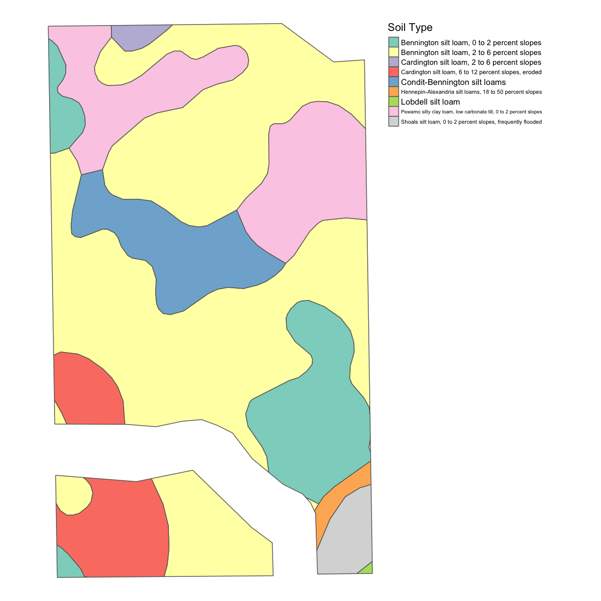

---
# Please do not edit this file directly; it is auto generated.
# Instead, please edit 08-SSURGO.md in _episodes_rmd/
title: "SSURGO & Weather Data"
include_overview: true
questions:
 - What are the common file types in agricultural data?
 - What publicly available datasets exist for my field?
objectives:
 - How to get key soil type data for your farm from the publicly available SSURGO database
 - Describe the format of public weather and soil datasets
 - Import weather data from the internet, eg. daymetr
 - Access to elevation and ssurgo data with higher resolution
 - Derive topography data from elevation data
keypoints:
 - sf is preferable for data analysis; it is easier to access the dataframe
 - Projecting your data in utm is necessary for many of the geometric operations you perform (e.g. making trial grids and splitting plots into subplot data)
 - Compare different data formats, such as gpkg, shp(cpg,dbf,prj,sbn,sbx),geojson,tif
source: Rmd
---

## SSURGO Soil Data

The SSURGO data is probably a dataset you are familiar with already. You can obtain a soil description of your field on the Web Soil Survey website below. The SSURGO dataset has been developed over a century of surveying land and analyzing soil samples across the United States. While the website is one way to access the soil data, R also has a package called `FedData` with the function `get_ssurgo()` for accessing the soil data in the R environment.

[The SSURGO site contains further details about their project.](https://websoilsurvey.sc.egov.usda.gov/App/WebSoilSurvey.aspx)

### SSURGO Download

The next line brings the SSURGO data into the R environment with the name `ssurgo` and the  object `boundary` from the geospatial lesson. Note here that the class of `boundary` needs  to be `spatial` rather than `sf`, so we transform the object with `as(boundary,"Spatial")`.

~~~
boundary <- read_sf("data/boundary.gpkg")
boundary.sp <- as(boundary, "Spatial")
ssurgo <- download_ssurgo("samplefield", boundary.sp)
~~~
{: .language-r}

~~~
Successfully downloaded SSURGO.
~~~
{: .output}

### SSURGO Data

The downloaded `ssurgo` is a list with 2 objects, `spatial` and `tabular`. The `spatial` object contains the polygons of soil types for the field, and  `tabular` contains many dataframes with attributes collected for the soil and soil horizons.

Note that these dataframes and their relationships with one another are very complex. To use these data, you must carefully read the SSURGO documentation. [The SSURGO Metadata Table Columns Desription document is available online](https://data.nal.usda.gov/system/files/SSURGO_Metadata_-_Table_Column_Descriptions.pdf), and some of the segments we're going to use are found around page 81.

Merging the dataframes to have one value of the attributes for each soil polygon requires reducing the dimension of the data, often by weighting the attributes by horizon depth.

Let's make a map of the soil types on this field. First, we need to locate the part of
`tabular` with the soil names; these can be found in `muaggatt`. (From the Metadata Table Column Desriptions document linked in above, we can learn that 'muaggatt' stands for 'Map Unit Aggregated Attributes.')

~~~
names <- ssurgo$tabular$muaggatt
~~~
{: .language-r}

> ## Exercise: Soil Names
>
> What are the soil types present on the field as seen in `names`? Are the soil defined by anything other than the soil type?
>
> > ## Solution
> > 
> > ~~~
> > names
> > ~~~
> > {: .language-r}
> > 
> > 
> > 
> > ~~~
> > # A tibble: 9 x 40
> >   musym muname mustatus slopegraddcp slopegradwta brockdepmin wtdepannmin
> >   <chr> <chr>  <lgl>           <dbl>        <dbl> <lgl>             <dbl>
> > 1 BgB   Benni… NA                  4          3.9 NA                   22
> > 2 Cr    Condi… NA                  1          1   NA                    7
> > 3 HpE   Henne… NA                 30         30   NA                  153
> > 4 Lo    Lobde… NA                  1          1   NA                   69
> > 5 Pm    Pewam… NA                  1          1   NA                   15
> > 6 Sh    Shoal… NA                  1          1   NA                   31
> > 7 BeA   Benni… NA                  1          1.2 NA                   22
> > 8 Crd1… Cardi… NA                  3          2.8 NA                   46
> > 9 Crd1… Cardi… NA                  9          8.4 NA                   46
> > # … with 33 more variables: wtdepaprjunmin <dbl>, flodfreqdcd <chr>,
> > #   flodfreqmax <chr>, pondfreqprs <dbl>, aws025wta <dbl>, aws050wta <dbl>,
> > #   aws0100wta <dbl>, aws0150wta <dbl>, drclassdcd <chr>, drclasswettest <chr>,
> > #   hydgrpdcd <chr>, iccdcd <lgl>, iccdcdpct <dbl>, niccdcd <dbl>,
> > #   niccdcdpct <dbl>, engdwobdcd <chr>, engdwbdcd <chr>, engdwbll <chr>,
> > #   engdwbml <chr>, engstafdcd <chr>, engstafll <chr>, engstafml <chr>,
> > #   engsldcd <chr>, engsldcp <chr>, englrsdcd <chr>, engcmssdcd <chr>,
> > #   engcmssmp <chr>, urbrecptdcd <chr>, urbrecptwta <dbl>, forpehrtdcp <chr>,
> > #   hydclprs <dbl>, awmmfpwwta <dbl>, mukey <dbl>
> > ~~~
> > {: .output}
> {: .solution}
{: .challenge}

> ## Exercise Discussion
>
> Looking at `names` we can see there are eight types of soil on the field, and the dataframe reports areas with different slopes with different names. We often know the slope of the field, and so we may want to combine areas of the field with the same soil type and different slopes.
{: .callout}

### Merging Dataframes

We need one dataframe with both the soil name and spatial data. We will merge the soil data and the spatial data by the `musym`. Note that in one of the dataframes the variable is capitalized and not in the other. We must rename the variable for consistency using `rename()` from `dplyr`.  We also have to do this with the `mukey` variable as well.

~~~
spatial <- as(ssurgo$spatial, "sf")
~~~
{: .language-r}

~~~
spatial <- dplyr::rename(spatial, musym = MUSYM)
spatial <- dplyr::rename(spatial, mukey = MUKEY)
~~~
{: .language-r}

~~~
spatial <- merge(spatial, names, by = "musym")
~~~
{: .language-r}

~~~
head(spatial$muname)
~~~
{: .language-r}

~~~
[1] "Bennington silt loam, 0 to 2 percent slopes"
[2] "Bennington silt loam, 0 to 2 percent slopes"
[3] "Bennington silt loam, 0 to 2 percent slopes"
[4] "Bennington silt loam, 2 to 6 percent slopes"
[5] "Bennington silt loam, 2 to 6 percent slopes"
[6] "Condit-Bennington silt loams"               
~~~
{: .output}

~~~
st_write(spatial, "data/ssurgo.gpkg", layer_options = 'OVERWRITE=YES', append=FALSE)
~~~
{: .language-r}

~~~
Error in st_write.sf(spatial, "data/ssurgo.gpkg", layer_options = "OVERWRITE=YES", : unrecognized argument(s) append 
~~~
{: .error}

> ## Exercise: Create the Soil Map
>
> Use `map_poly()` to make a map where the polygon color is informed by the soil names in `muname`.
>
> > ## Solution
> >
> >
> >~~~
> > map_soil <- map_poly(spatial, 'muname', "Soil Type")
> > map_soil
> >~~~
> >{: .language-r}
> >
> >
> >
> >~~~
> >Some legend labels were too wide. These labels have been resized to 0.63, 0.63, 0.63, 0.52, 0.48, 0.42, 0.47. Increase legend.width (argument of tm_layout) to make the legend wider and therefore the labels larger.
> >~~~
> >{: .output}
> >
> >
> {: .solution}
{: .challenge}

> ## Exercise Discussion
>
> The map shows that there are quite a few soil types on the field, and several show up in different sections of the field. However, most of the soils are silt loam. It might be difficult to understand the different soils without more information about soil weathering and texture. This is also provided within SSURGO and is likely something you know about in your own field.
{: .callout}

> ## Example with your own field
>
> Here we are going to download the SSURGO maps for your own field using your boundary file if you have one. Then, we are going to make a table of the clay, silt, and sand content as well as the water content of the different soil types. There is a function `c_s_s_soil()` in `functions.R` that uses the soil depth to take an average of the soil measures for each soil type. The only parameter that needs to be set is as follows:
>
> 
> ~~~
> soil_content <- c_s_s_soil(ssurgo = ssurgo)
> ~~~
> {: .language-r}
> 
> 
> 
> ~~~
> 
  |                                                                            
  |                                                                      |   0%
  |                                                                            
  |===                                                                   |   4%
  |                                                                            
  |=====                                                                 |   7%
  |                                                                            
  |========                                                              |  11%
  |                                                                            
  |==========                                                            |  15%
  |                                                                            
  |=============                                                         |  19%
  |                                                                            
  |================                                                      |  22%
  |                                                                            
  |==================                                                    |  26%
  |                                                                            
  |=====================                                                 |  30%
  |                                                                            
  |=======================                                               |  33%
  |                                                                            
  |==========================                                            |  37%
  |                                                                            
  |=============================                                         |  41%
  |                                                                            
  |===============================                                       |  44%
  |                                                                            
  |==================================                                    |  48%
  |                                                                            
  |====================================                                  |  52%
  |                                                                            
  |=======================================                               |  56%
  |                                                                            
  |=========================================                             |  59%
  |                                                                            
  |============================================                          |  63%
  |                                                                            
  |===============================================                       |  67%
  |                                                                            
  |=================================================                     |  70%
  |                                                                            
  |====================================================                  |  74%
  |                                                                            
  |======================================================                |  78%
  |                                                                            
  |=========================================================             |  81%
  |                                                                            
  |============================================================          |  85%
  |                                                                            
  |==============================================================        |  89%
  |                                                                            
  |=================================================================     |  93%
  |                                                                            
  |===================================================================   |  96%
  |                                                                            
  |======================================================================| 100%
> 
  |                                                                            
  |                                                                      |   0%
  |                                                                            
  |========                                                              |  11%
  |                                                                            
  |================                                                      |  22%
  |                                                                            
  |=======================                                               |  33%
  |                                                                            
  |===============================                                       |  44%
  |                                                                            
  |=======================================                               |  56%
  |                                                                            
  |===============================================                       |  67%
  |                                                                            
  |======================================================                |  78%
  |                                                                            
  |==============================================================        |  89%
  |                                                                            
  |======================================================================| 100%
> ~~~
> {: .output}
> 
> 
> 
> ~~~
> soil_content
> ~~~
> {: .language-r}
> 
> 
> 
> ~~~
>     mukey AREASYMBOL SPATIALVER  MUSYM     clay     silt     sand water_storage
> 1 1019357      OH033         10    BeA 30.88180 49.35860 19.75960      24.93720
> 2  168539      OH033         10    BgB 31.09245 48.94345 19.96410      24.72030
> 3  168557      OH033         10     Cr 33.80601 45.40116 20.79283      21.87375
> 4  168570      OH033         10    HpE 28.17274 37.20299 34.62427      21.24000
> 5  168578      OH033         10     Lo 23.32787 49.29454 27.37760      27.86000
> 6  168588      OH033         10     Pm 34.08070 46.99515 18.92415      25.82340
> 7  168591      OH033         10     Sh 21.67045 44.65005 33.67950      31.86120
> 8 2996476      OH033         10 Crd1B1 30.17855 46.96980 22.85165      24.72070
> 9 2996690      OH033         10 Crd1C2 29.92200 45.94210 24.13590      23.14610
> ~~~
> {: .output}
{: .challenge}
