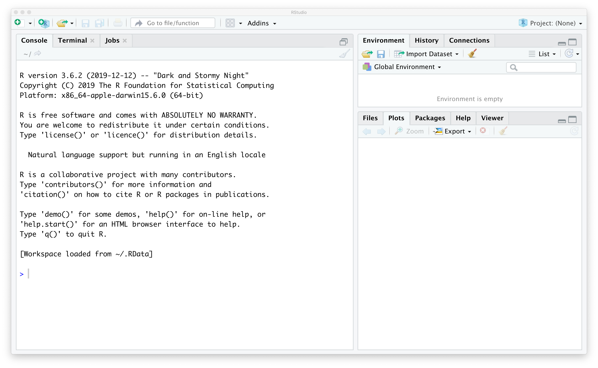
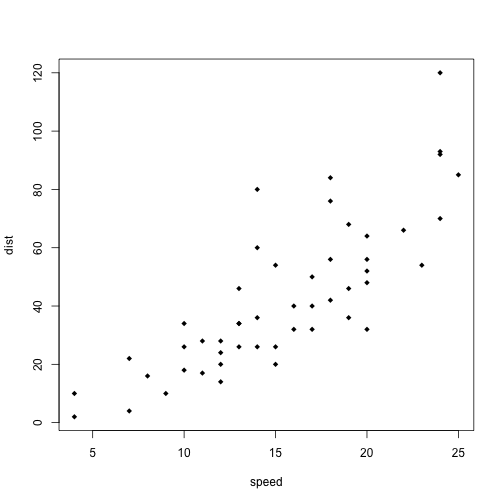
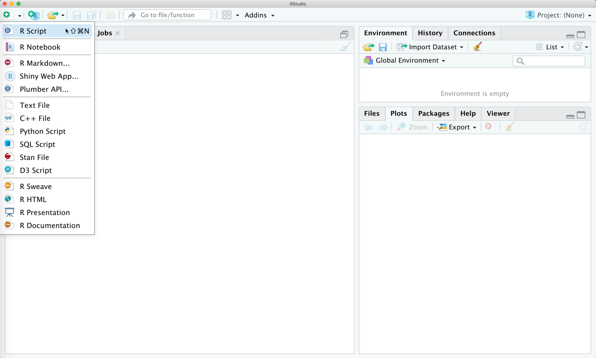
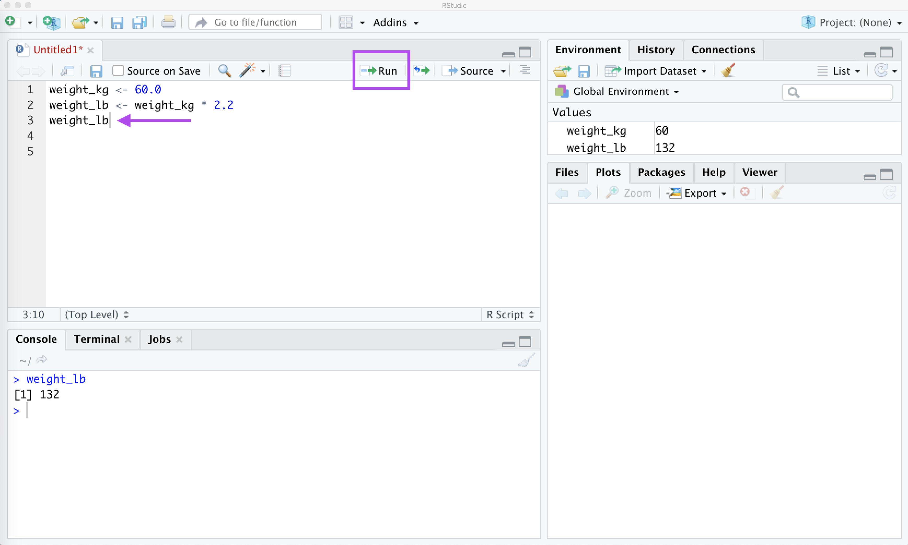
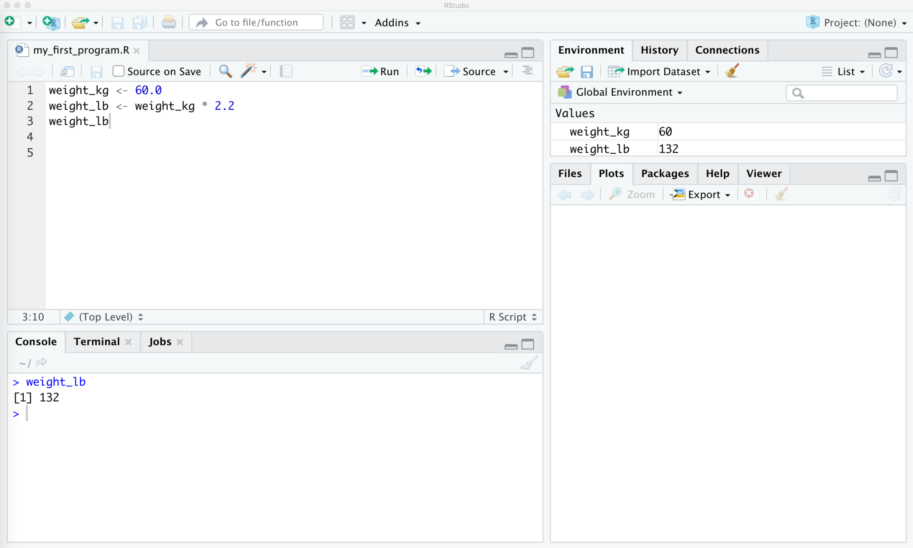

---
# Please do not edit this file directly; it is auto generated.
# Instead, please edit 09-R-RStudio-Jill.md in _episodes_rmd/
title: "JILLS: Introduction to R and RStudio"
questions:
- <font color="magenta">THESE ARE NOT UPDATED -- WE CAN DO THIS LAST</font>
- "How can I work with a spreadsheet in a more advanced and reproducible manner than using MS Excel?"
- "How can I keep my data and analysis organized?"
- "How can I visualize my data with graphs?"
- "Why would basic programming skills be useful to me for these tasks?"
objectives:
- "Describe the purpose of each pane in the RStudio IDE"
- "Create a project to manage scripts and data"
- "Assign a value to a variable"
- "Perform arithmetic"
- "Use a function"
- "View the help page for a function"
- "Create a new function"
- "Import data from spreadsheet software"
- "Install packages"
- "Make a scatter plot using ggplot2"
source: Rmd
---


<!-- JPN: updated fig path here manually for plots to show -->


## <font color="magenta">Assumptions -- FOR DEBUGGING</font>

 1. <font color="magenta">Everybody has installed R and R studio</font>
 1. <font color="magenta">They have been able to run the install script we sent them and have all packages installed</font>
 1. <font color="magenta">They *do* need an intro to the layout of RStudio, and what everything does.</font>

## Getting to know R and RStudio

<font color="magenta">A good bit of this might be more suitable to the Setup section as it's got a lot about the setup and running of Rstudio.</font>

### <font color="magenta">Outline for this section</font>
 1. <font color="magenta">Let's open RStudio </font>
 1. <font color="magenta">Where is the console? (screen shot) Vocab: *console*</font>
 1. <font color="magenta">Let's use RStudio as a calculator by putting numbers into the console</font>


In this episode we’ll cover the basics of using R, which is a programming language for statistics, data analysis, and data visualization. In the past decade or so, R has become very popular in both science and business, largely because (1) it is free, and (2) thousands of people have written new code extending its functionality, and that code is also free. If you perform an analysis in R, you can share that analysis so that anyone in the world can reproduce it without having to purchase proprietary software.

If you’re already proficient with Excel, you will probably already know how to accomplish a lot of what we are doing in this episode using Excel instead of R. One reason why we are teaching you this material, however, is to get you comfortable with R since we will be using R for geospatial analysis (which is not so easy in Excel). 

In this lesson, we will be making use of another software called "RStudio" as a way to interact with the programming language R.  RStudio makes writing our programs more user-friendly.  **Some sort of analogy here would be grand**

We launch RStudio by double clicking on it's icon, as we would with other software on our computers.  If this is the first time you have opened it, the entire left pane will be taken up by something called the `Console` that you can see as the left hand panel in the figure below:




<font color="magenta">Do we want a screen shot of this instead of the R code?  Or will this be enough of a "following along" type of thing that that sort of thing isn't necessary?</font>

This has a prompt where commands can be entered.


```r
5 + 7
```

```
## [1] 12
```

<!-- JPN: here is a test plot you can uncomment if you wanna try it
I'm gonna trya thing


```r
plot(c(1,2,3), c(4,5,6))
```


-->


<!-- JPN: this is just a test to see if I get what is going on here

```r
data = read.csv('data/fertilizer_use.csv')
print(head(data))
```

```
##   Year Crop Nitrogen Phosphate Potash
## 1 1964 Corn     1623      1053    829
## 2 1965 Corn     2151      1336   1204
## 3 1966 Corn     2596      1626   1513
## 4 1967 Corn     3044      1857   1750
## 5 1968 Corn     3116      1855   1778
## 6 1969 Corn     3287      1789   1765
```
-->

After you hit enter, you will see the result of the command.  Let's try a few others:


```r
# Performing arithmetic
6 + 2
```

```
## [1] 8
```

Whoa!  What did I do just there with this `#`?  This is called "leaving a comment in your code" and everything following the `#`
symbol is called a *comment*. A
comment is a line, or part of a line, that is ignored by R.  This means you can
use comments to explain what is happening in the code or why you did something
a certain way.  Comments start with the `#` character, and can take up the
whole line or just the end of a line.  As we go through this workshop, I
encourage you to put lots of comments in your code. Think of them as a way to
take notes!  Here is an example of a comment at the end of a line while we are doing some arithematic:


```r
2 ^ 3 # this raises two to the third power
```

```
## [1] 8
```


## Variables in R

### <font color="magenta">Outline of this Section</font>

 1. <font color="magenta">what is a variable? Vocab: *variable*</font>
 1. <font color="magenta">how do we assign a variable? Vocab: *assign*</font>
 1. <font color="magenta">What can we do with this variable? -> Generic manipulations (addition, multiplication, etc)</font>
     * <font color="magenta">for this, use a "real world" thing that farmers might be into... something something nitrogen levels?</font>
 1. <font color="magenta">Talk about how this variable now shows up in the data area and have a screen shot of where that is</font>


<font color="magenta">I stole this bit from the Python Fundementals Episode, not sure if that is groovy or not.  I *think* its ok if we follow the rules of their license but we should double check. I also stole a few things from the R-fundementals workshop and so we need to credit them as well.</font>

<font color="magenta">Also I've left in the links to glossary references that may or may not be there - for example if you click on the "assign" link, it goes nowhere right now.</font>

<font color="magenta">Also, we should change this whole `weight_kg` thing into something that is more agri-centric?  I think?</font>

This is great but not very interesting.
To do anything useful with data, we need to assign its value to a _variable_.
In R, we can [assign]({{ page.root }}/reference/#assign) a value to a
[variable]({{ page.root }}/reference/#variable), by typing a little left arrow sign `<-`.
For example, to assign value `60` to a variable `weight_kg`, we would execute:


```r
weight_kg <- 60
```

From now on, whenever we use `weight_kg`, R will substitute the value we assigned to
it. In layman's terms, **a variable is a name for a value**.

In R, variable names:

 - can include letters, digits, and underscores
 - cannot start with a digit
 - are [case sensitive]({{ page.root }}/reference/#case-sensitive).

This means that, for example:
 - `weight0` is a valid variable name, whereas `0weight` is not
 - `weight` and `Weight` are different variables

<font color="magenta">Also from the R-programming workshop, possibly said another way:</font>

> ## Variable Naming Conventions
>
> Historically, R programmers have used a variety of conventions for naming variables. The `.` character
> in R can be a valid part of a variable name; thus the above assignment could have easily been `weight.kg <- 57.5`.
> This is often confusing to R newcomers who have programmed in languages where `.` has a more significant meaning.
> Today, most R programmers 1) start variable names with lower case letters, 2) separate words in variable names with
> underscores, and 3) use only lowercase letters, underscores, and numbers in variable names. The book *R Packages* includes
> a [chapter](http://r-pkgs.had.co.nz/style.html) on this and other style considerations.
{: .callout}

### Types of data

<font color="magenta">Do we need to get into datatypes here?  Or can we just skip it and get into it when we look at an actual dataset that has columns of different datatypes?</font>

R knows various types of data. The ones you are likely to come across are:

* integer numbers (whole numbers)
* floating point numbers (numbers with decimals), and
* names or words that sort data into "categories" <font color="magenta">(maybe something better here?)  Save types of data until we get into the columns stuff?</font>

In the example above, variable `weight_kg` has an integer value of `60`.
To create a variable with a floating point value, we can execute:


```r
weight_kg <- 60.0
```

<font color="magenta">Here I don't know if we should get into the print function right now like they do in the Python lesson or not</font>

<font color="magenta">I also don't know if we want to use "<-" all the time or the "=" sign.  I *feel* like "=" is more intiuative but I'm not 100% sure on that one, could be my Python bias showing :)</font>

We can do arithematic with variables like we did with numbers before:


```r
# Performing arithmetic with our variable: multiply it by a factor of 2.2
weight_kg * 2.2
```

```
## [1] 132
```
<!-- weight in lbs = 2.2 x weight in kg -->


The above command, however, did not change the value of `weight_kg`:


```r
weight_kg
```

```
## [1] 60
```

To change the value of the `weight_kg` variable, we have to
**assign** `weight_kg` a new value using the equals `<-` sign:


```r
weight_kg <- 60.0 * 2.2
weight_kg
```

```
## [1] 132
```


> ## Variables as Sticky Notes
>
> A variable is analogous to a sticky note with a name written on it:
> assigning a value to a variable is like putting that sticky note on a particular value.
>
> 
>
> This means that assigning a value to one variable does **not** change
> values of other variables.
> For example, let's store the subject's weight in pounds in its own variable:
>
> 
> ```r
> # There are 2.2 pounds per kilogram
> weight_lb <- 2.2 * weight_kg
> weight_kg
> ```
> 
> ```
> ## [1] 132
> ```
> 
> ```r
> weight_lb
> ```
> 
> ```
> ## [1] 290.4
> ```
>
>
> 
>
> Let's now change `weight_kg`:
>
> 
> ```r
> weight_kg <- 100.0
> weight_kg
> ```
> 
> ```
> ## [1] 100
> ```
> 
> ```r
> weight_lb
> ```
> 
> ```
> ## [1] 290.4
> ```
> We can see that even though we updated `weight_kg`, the variable `weight_lb` was not changed.
>
> 
>
> Since `weight_lb` doesn't "remember" where its value comes from,
> it is not updated when we change `weight_kg`.
{: .callout}


<font color="magenta">Note: there is another way of explaining this in the R lesson:</font> [http://swcarpentry.github.io/r-novice-inflammation/01-starting-with-data/index.html](http://swcarpentry.github.io/r-novice-inflammation/01-starting-with-data/index.html)

<font color="magenta">Do we want to have this example for them too or just get right into scripts and whatnot?</font>

> ## Assigning Values to Variables
>
> Draw diagrams showing what variables refer to what values after each statement in the following program:
>
> ~~~
> mass <- 47.5
> age <- 122
> mass <- mass * 2.0
> age <- age - 20
> ~~~
> {: .language-r}
>
> > ## Solution
> >
> > ~~~
> > mass <- 47.5
> > age <- 122
> > ~~~
> > {: .language-r}
> > 
> > 
> >
> > ~~~
> > mass <- mass * 2.0
> > age <- age - 20
> > ~~~
> > {: .language-r}
> > 
> > 
> > 
> {: .solution}
{: .challenge}


## Writing and Savings R Scripts

<font color="magenta">NOTE: I'm wondering if we want to push this section to later -- i.e. if we want to just go right to "getting your data into R" and do some examples just using the console and then start worrying about saving files later in the day once they have some cool plots that they made with R that they might want to reproduce.</font>


### <font color="magenta">Outline of this section</font>
 1. <font color="magenta">Analogy - scripting is like writing a set of instructions, a letter, something. Vocab: *scripts/scripting* </font>
 1. <font color="magenta">Where do we write scripts in RStudio - screen shot of window, a screen shot of what to do if there is only the console and no script - how do you open a script interface </font>
 1. <font color="magenta">Redo stuff with variable in script (nitrogen levels calculation), but call it something different</font>
 1. <font color="magenta">How to run a script - Run vs. Source -> they are in the same place!  Screenshot of this. Vocab: *running a script*</font>
 1. <font color="magenta">Point out that it shows up in the data-listing place</font>
 1. ~~<font color="magenta">How do we find out the value of our new variable that we wrote in a script?</font>~~
    1. ~~<font color="magenta">Using the console like before - because in RStudio the console and scripting interface are linked! (this is not true in other things like PyCharm... this is slightly an aside though so use an aside thing)</font>~~
    1. ~~<font color="magenta">Using a print statement - emphasize that you *have* to use print in the script to see the variable!</font>~~
 1. <font color="magenta">How to save our script -> where does it save to?</font>
 1. <font color="magenta">Closing and re-opening a script to re-run.</font>


Now that we have some idea of what kinds of calculations we want to do in R, we might want to know how to save our work.  We do this in something called a _script_ which is essentially a list of instructions that will tell R what to do, in the order we give them.

We can open up a _script file_ where we will type in all our instructions by going to the little green plus at the top left of RStudio and selecting "R Script" from the dropdown menu <font color="magenta">(this was for a Mac, not sure if its different for windows)</font>:



In our new scripting window, we can type the commands that we had worked through before into this script and then tell R to do the calculation by putting our cursor on the last line (end of line 3) and pressing the "Run" button in the upper right corner of the scripting window:



<font color="magenta">Do we want to teach them about Source vs. Run at this point? </font>

You can see that these variable names have now popped up in the _Global Environment_ window at the upper left -- this is a way we can keep track of our variables as we run our scripts.

Finally, we want to be able to save all of our hard work!  We can do this like we would save any file on our computer, but make sure you put it in a place were you'll remember on your computer. <font color="magenta">(do we need screen shots?  I assume everybody knows how to save a file and how to choose where to save it but maybe this isn't 100% correct?)</font>

You'll note now that the little upper tab on the left of the scripting window has the file name I chose, but with the extension `.R`.  This is the extension of an R-script and it means that its in a format that R can execute.



If you close this file and want to re-open it, you can use `File -> Open File...` to open it up in R. <font color="magenta">(This could be different on a Windows, also not sure how much detail we want here and if we want a screen shot or not)</font>


## OPTIONAL: What is a function?

<font color="magenta">Not 100% sure we want to go into this much detail, but we could do a thing here where we put everything we just did with our variable into a function.  I think this might be too much at this point, and maybe if we get them into writing their own functions we can circle back around to this.</font>

## Getting your data into R

### <font color="magenta">Outline of this Section</font>
 1. <font color="magenta">Let's talk about the dataset we are going to use here -- facts about this dataset</font>
 1. <font color="magenta">This is what this dataset looks like (show snapshot of csv)</font>
 1. <font color="magenta">To get this data into R where we can do math to it like we did with our variable above we have to do something called "reading in our data".  To do this, we'll use something called a *function* to assign a variable the value of this table -- i.e. we want a variable that will store all the rows and columns of our dataset</font>
     * <font color="magenta">Talk a bit about what a function is here -- omelets? Vocab: *function*</font>
     * <font color="magenta">we also have to talk about the fact that we give the file name as a parameter to this function. Vocab: *function parameter*</font>

As an example of a dataset in spreadsheet form that we can use to demonstrate
the R language, we are using the [USDA - Economic Research Service's fertilizer
use and price dataset](https://www.ers.usda.gov/data-products/fertilizer-use-and-price.aspx).
Of the various tables of data on this website, will be looking at Table 2 called "Estimated U.S. plant nutrient use by selected crops"
which shows 1,000 nutrient short tons of nitrogen,
phosphorus, and potash used on corn, soy, cotton, wheat, and other crops in the
US from 1964-2016.

This table has been reformatted into a CSV file for ease of import into
R.  You can download the CSV from: <a href="https://raw.githubusercontent.com/data-carpentry-for-agriculture/trial-lesson/gh-pages/_episodes_rmd/data/fertilizer_use.csv" download>https://raw.githubusercontent.com/data-carpentry-for-agriculture/trial-lesson/gh-pages/_episodes_rmd/data/fertilizer_use.csv</a>. <font color="magenta">NOTE: I had to *explicitly* save this as a .csv file, it default downloaded as a txt file.  And I had to right-click on the link to save it at all, eventhough I had the download tag in the HTML.  Not sure how to fix this at the moment.</font>

The top few lines of this file look like:


```
## Year,Crop,Nitrogen,Phosphate,Potash
## 1964,Corn,1623,1053,829
## 1965,Corn,2151,1336,1204
## 1966,Corn,2596,1626,1513
## 1967,Corn,3044,1857,1750
```

It can be opened in Excel if you want to get a quick look at it that way, or we can
dive straight into looking at it in R.  Save it into your `data` folder in
your RStudio project for this lesson.

<font color="magenta">NOTE: this assumes they have already created the `data` folder -> I assume this will be somewhere in the setup directions??</font>

In R, we can use a *function* called `read.csv` to import data from a CSV
(comma-separated value) file.

> ## What is a function?
>
> A function is a bit of code that we want to be able to reuse again and again.  For example, let's say you want to make yourself an omelet every morning, wouldn't it be great if you had some sort of machine that would do it for you?
> 
> Let's imagine an omelet-making scenario. You start with some eggs, some cheese, and some other ingredients, use utensils and heat, and end up with something cooked and edible on a plate.
>
> Here's what that process might look like in terms a step closer to programming:
><pre><code>
> function make_omelet(eggs, cheese, chives) {
>    for each bowl
>        crack eggs
>        discard shells
>        if the ingredients list is longer than eggs
>            add other ingredients to bowl as well
>        else
>            ready to cook
>   pour bowl into hot pan
>   cook
>   serve
>   done
> }
>
></code></pre>
>
>In this example, we're telling the system these things:
> * A function (repeatable sequence of commands) named `make_omelet` takes several inputs (the ingredients list in parentheses)
> * The part in the curly braces `{}` tells the function what to do with the inputs (also called arguments or parameters -- you can think of this as an ingredients list if it helps)
>
>
> To use a function we have to _call_ it in a specific way.  Let's try with an R function called `print` which will just echo back what we give it as an _input parameter_:
> 
> ```r
> weight_kg <- 100.0 # assign the value of 100.0 to a variable called "weight_kg"
> print(weight_kg) # print out the value of the variable to the screen
> ```
> 
> ```
> ## [1] 100
> ```
> In this example, we _called_ the function by using the function name, `print` followed by parenthisis in which we put our _input parameter_ in this case the variable `weight_kg`, the value of which we wanted to print to the screen.
> This was a bit of a silly example since we've been able to show the value of variables without this function before, but it is a nice example of a function being used. <font color="magenta">(wording has got to be better here)</font>
>
{: .callout}

Let's use a function called `read.csv` that will import our table of data into R so we can use it:


```r
fert_use <- read.csv("data/fertilizer_use.csv")
```

Note here that the name of the function is `read.csv`, the _input parameter_ is the name of the file we want to read in, including the `data` folder we created earlier.  The `/` after `data` just indicates to R that it should look inside this folder for the file named `fertilizer_use.csv`.  <font color="magenta">(Again here, I'm assuming we already went over how to make the data folder, how to save stuff inside the data folder, and whatnot)</font>.  We _assigned_ the value of this table -- all of its row and column data -- into a variable called `fert_use`.

Just like with our `weight_kg` and `weight_lb` variables before, it now shows up in the _Global Environment_ window at the upper left of RStudio.


### Explore your data in R <font color="magenta">(could be part of previous or own thing, not sure)</font>

#### <font color="magenta">Outline for this section</font>
 1. <font color="magenta">Explore your data with the "head" function -- JPN's personal preference instead of the "str" function, but I've kept in both here in case we want them</font>
 1. <span style="color:magenta">Another function example: using `str()` to look at your data real quick??</span>
 1. <font color="magenta">Also show how to look at your data in R (like "View(data)")? Maybe?  Or you can click on it?</font>

Now that you have your data imported into R, it would be nice to take a look at it!  One quick way to do this is using the `head` function like so:


```r
head(fert_use)
```

```
##   Year Crop Nitrogen Phosphate Potash
## 1 1964 Corn     1623      1053    829
## 2 1965 Corn     2151      1336   1204
## 3 1966 Corn     2596      1626   1513
## 4 1967 Corn     3044      1857   1750
## 5 1968 Corn     3116      1855   1778
## 6 1969 Corn     3287      1789   1765
```

This lets us look at our table of data, but it formats things in a nice way, with the name of each column at the top and the row numbered on the left side.

We can also control how many rows print out by including an _optional parameter_ in our function call:


```r
head(fert_use, n=4)
```

```
##   Year Crop Nitrogen Phosphate Potash
## 1 1964 Corn     1623      1053    829
## 2 1965 Corn     2151      1336   1204
## 3 1966 Corn     2596      1626   1513
## 4 1967 Corn     3044      1857   1750
```

Note that we can call the `head` function without this parameter and it will run just fine with some default value.  If we want to specify the number of rows, we include this as `parameter name = parameter value`.  In this case, our `parameter name` for the `head` function is `n` and the `parameter value` is `4`.  Different functions will have different parameter names and we can find out more information about these parameters by appending a `?` to the front of our function call which will print out a bit of info about these optional parameters:


```r
?head
```

<!-- JPN: this looks not great
> ### Finding Help for a Function
>
> 
> ```r
> ?head
> ```
>
> Will output:
> 
> 
> <table width="100%" summary="page for head {utils}"><tr><td>head {utils}</td><td style="text-align: right;">R Documentation</td></tr></table>
> 
> <h2>
> Return the First or Last Part of an Object
> </h2>
> 
> <h3>Description</h3>
> 
> <p>Returns the first or last parts of a vector, matrix, table, data frame
> or function.  Since <code>head()</code> and <code>tail()</code> are generic
> functions, they may also have been extended to other classes.
> </p>
> 
> 
> <h3>Usage</h3>
> 
> <pre>
> head(x, ...)
> ## Default S3 method:
> head(x, n = 6L, ...)
> ## S3 method for class 'data.frame'
> head(x, n = 6L, ...)
> ## S3 method for class 'matrix'
> head(x, n = 6L, ...)
> ## S3 method for class 'ftable'
> head(x, n = 6L, ...)
> ## S3 method for class 'table'
> head(x, n = 6L, ...)
> ## S3 method for class 'function'
> head(x, n = 6L, ...)
> 
> tail(x, ...)
> ## Default S3 method:
> tail(x, n = 6L, ...)
> ## S3 method for class 'data.frame'
> tail(x, n = 6L, ...)
> ## S3 method for class 'matrix'
> tail(x, n = 6L, addrownums = TRUE, ...)
> ## S3 method for class 'ftable'
> tail(x, n = 6L, addrownums = FALSE, ...)
> ## S3 method for class 'table'
> tail(x, n = 6L, addrownums = TRUE, ...)
> ## S3 method for class 'function'
> tail(x, n = 6L, ...)
> </pre>
> 
> 
> <h3>Arguments</h3>
> 
> <table summary="R argblock">
> <tr valign="top"><td><code>x</code></td>
> <td>
> <p>an object</p>
> </td></tr>
> <tr valign="top"><td><code>n</code></td>
> <td>
> <p>a single integer.  If positive or zero, size for the resulting
> object: number of elements for a vector (including lists), rows for
> a matrix or data frame or lines for a function.  If negative, all but
> the <code>n</code> last/first number of elements of <code>x</code>.</p>
> </td></tr>
> <tr valign="top"><td><code>addrownums</code></td>
> <td>
> <p>if there are no row names, create them from the row
> numbers.</p>
> </td></tr>
> <tr valign="top"><td><code>...</code></td>
> <td>
> <p>arguments to be passed to or from other methods.</p>
> </td></tr>
> </table>
> 
> 
> <h3>Details</h3>
> 
> <p>For matrices, 2-dim tables and data frames, <code>head()</code> (<code>tail()</code>) returns
> the first (last) <code>n</code> rows when <code>n &gt;= 0</code> or all but the
> last (first) <code>n</code> rows when <code>n &lt; 0</code>.  <code>head.matrix()</code> and
> <code>tail.matrix()</code> are exported.  For functions, the
> lines of the deparsed function are returned as character strings.
> </p>
> <p>If a matrix has no row names, then <code>tail()</code> will add row names of
> the form <code>"[n,]"</code> to the result, so that it looks similar to the
> last lines of <code>x</code> when printed.  Setting
> <code>addrownums = FALSE</code> suppresses this behaviour.
> </p>
> 
> 
> <h3>Value</h3>
> 
> <p>An object (usually) like <code>x</code> but generally smaller.  For
> <code><a href="../../stats/html/ftable.html">ftable</a></code> objects <code>x</code>, a transformed <code>format(x)</code>.
> </p>
> 
> 
> <h3>Author(s)</h3>
> 
> <p>Patrick Burns, improved and corrected by R-Core. Negative argument
> added by Vincent Goulet.
> </p>
> 
> 
> <h3>Examples</h3>
> 
> <pre>
> head(letters)
> head(letters, n = -6L)
> 
> head(freeny.x, n = 10L)
> head(freeny.y)
> 
> tail(letters)
> tail(letters, n = -6L)
> 
> tail(freeny.x)
> tail(freeny.y)
> 
> tail(library)
> 
> head(stats::ftable(Titanic))
> </pre>
> 
> <hr /><div style="text-align: center;">[Package <em>utils</em> version 3.6.2 <a href="00Index.html">Index</a>]</div>
{: .callout}
-->


Now let's say we want to look at only the first few entries of the `Years` column of our dataset?  We can do this by making use of the fact that our variable `fert_use` is a special type of variable called a _dataframe_ which allows us to use special notation to print out individual columns by saying `dataframe name $ dataframe column`:


```r
head(fert_use$Year, n=4)
```

```
## [1] 1964 1965 1966 1967
```

Here the label of the column, `Year` is used to access this column alone and print out its first 4 entries.  Let's try another one:


```r
head(fert_use$Crop, n=4)
```

```
## [1] Corn Corn Corn Corn
## Levels: Corn Cotton Other Soybeans Wheat
```

We'll note we got a bit of extra information when we are looking at the `Crop` column.  With the column `Years`, Here, R has stored this column as 

#### <font color="magenta">Using str </font>

<font color="magenta">Is there a strong reason to use "str" instead of head?  I feel like we have to explain more using str.  I've included how I would re-write this portion, but my personal vote is to use the "head" command above instead of having to go into column types right now.</font>

The `str` function is helpful
for getting a quick look:


```r
str(fert_use)
```

```
## 'data.frame':	265 obs. of  5 variables:
##  $ Year     : int  1964 1965 1966 1967 1968 1969 1970 1971 1972 1973 ...
##  $ Crop     : Factor w/ 5 levels "Corn","Cotton",..: 1 1 1 1 1 1 1 1 1 1 ...
##  $ Nitrogen : int  1623 2151 2596 3044 3116 3287 3520 3730 3705 3830 ...
##  $ Phosphate: int  1053 1336 1626 1857 1855 1789 2136 2024 1994 1988 ...
##  $ Potash   : int  829 1204 1513 1750 1778 1765 2046 1946 1992 2052 ...
```

Note here that `str` is the function name that we _called_ with the _input parameter_ of `fert_use` which is the variable that is storing our table of data.

The `str` function prints out the first few entries of each row, the `...` just means that it has truncated its output for the sake of clarity.

We see that the `str` function is also telling us something about how our data is formatted:
 * There are 5 columns (variables) in our dataset - `Year`, `Crop`, `Nitrogen` <font color="magenta">(something? units?)</font>, `Phosphate`, and `Potash`.
 * There are 265 `observations`, or rows, in our dataset
 * The `Year`, `Nitrogen`, `Phosphate`, and `Potash` columns are `int` types, meaning they are comprised of whole numbers (numbers without decimals)
 * The `Crop` column is being interpreted in R as something called a `factor`.  This is a way to represent data that is comprised of categories, in this case we are told there are 5 `levels` which just means there are only 5 categories of crop in this dataset.  The trailing 1's are just R's way of tagging which row entry in this column is in what category - a 1 means an entry that is tagged as "Corn".  <font color="magenta">(I am not 100% on this, I *think* this is what R is doing but I am not sure)</font>


## Doing stuff with data in R (better name obvs)

 1. Your data is stored as a special thing called a dataframe - explain what this is. Vocab: *dataframe*
 1. We can access the columns of your tabular dataset with a $ thing
 1. We can access the rows of your tabular dataset with ... (not sure we wanna do this)
 1. We can manipulate columns with functions
    * example: min function (or something)
    * How to learn about functions you might want to use? --> teach googling & how to look up info about functions in R


