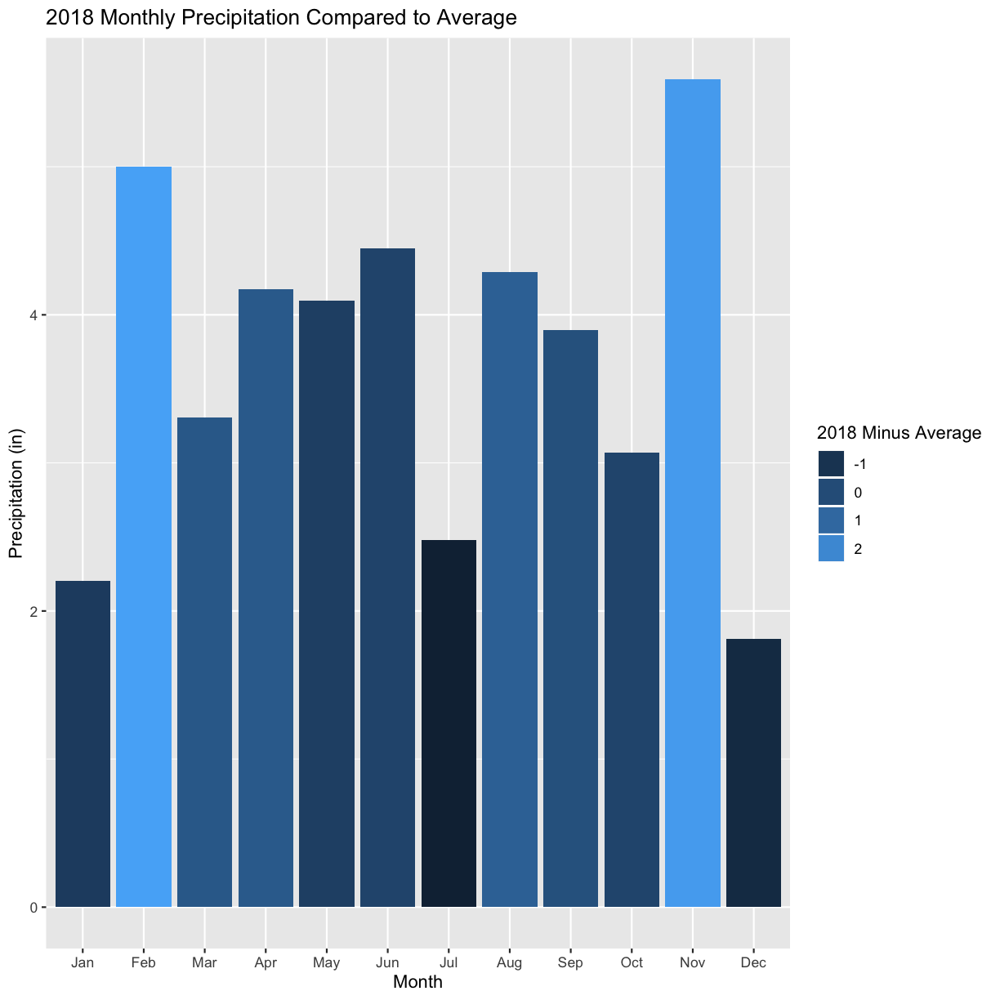

---
# Please do not edit this file directly; it is auto generated.
# Instead, please edit 09-WeatherData.md in _episodes_rmd/
title: "SSURGO & Weather Data"
include_overview: true
questions:
 - What are the common file types in agricultural data?
 - What publicly available datasets exist for my field?
objectives:
 - How to get key soil type data for your farm from the publicly available SSURGO database
 - Describe the format of public weather and soil datasets
 - Import weather data from the internet, eg. daymetr
 - Access to elevation and ssurgo data with higher resolution
 - Derive topography data from elevation data
keypoints:
 - sf is preferable for data analysis; it is easier to access the dataframe
 - Projecting your data in utm is necessary for many of the geometric operations you perform (e.g. making trial grids and splitting plots into subplot data)
 - Compare different data formats, such as gpkg, shp(cpg,dbf,prj,sbn,sbx),geojson,tif
source: Rmd
---

## Daymet Weather Data

The Oak Ridge National Laboratory produces a dataset called Daymet which contains predicted weather observations on a one meter grid. These data come from weather station climate observations in a climate model for prediction and include variables such as precipitation, snow water equivalent, temperature, day length, solar radians, and vapor pressure.

There is a package in r `daymetr` that downloads the Daymet weather data within the R environment. For a single point, you can use the command `download_daymet()`. (If you want to download the data for a set of points, there is also the command `download_daymet_batch()` which takes an argument a `csv` of the points in lat/long. If you want to use this approach, we can give you an example.)

### Using `daymetr` to download weather

Let's first start by using the function `read_sf` to load in the boundary file for our plot of land. The function `read_sf` is like the `read.csv` function we used previously to lead data, but it is designed to read in shapefiles with a simple formatting (hence the `sf` in its name for "simple figure"):

~~~
boundary <- read_sf("data/boundary.gpkg")
~~~
{: .language-r}

To use `daymetr` to find weather data for a point, we have to give it a latitude and longitude.  We'll use the `cent_long()` and `cent_lat()` functions (from `functions.R`) to calculate the centers of a box that bounds our shape file.

This should be produce a point near the center of the field.

~~~
lon <- cent_long(boundary)
lat <- cent_lat(boundary)
lat
~~~
{: .language-r}

~~~
[1] 40.84303
~~~
{: .output}

~~~
lon
~~~
{: .language-r}

~~~
[1] -82.87579
~~~
{: .output}

Now we'll use the function `download_daymet` to grab the weather from our central latitude and longitude values that we just calculated.  In addition to taking in parameters of `lat` and `lon`, we need to give this function a `start` and `end` date so that we can specify the range of years over which we want weather data.  If the data is not available for the year you request, an error will be reported. We choose 2000 to 2018 for this example; later we will use the historical data for comparison.

We also specify a name for this site - we will call the site `Field1`, but this can be the name of one of your fields if you use it in the future.

The final option `internal = TRUE` means that the daymet data is brought into the R environment rather than saved in your working directory. We may want to change the names and units of variables, so we will wait to save the data in the working directory.

~~~
weather <- download_daymet(site = "Field1", lat = lat, lon = lon, start = 2000, end = 2018, internal = TRUE)
~~~
{: .language-r}

~~~
Downloading DAYMET data for: Field1 at 40.8430279883331/-82.8757922217347 latitude/longitude !
~~~
{: .output}

~~~
Done !
~~~
{: .output}

### Exploring the daymet data

We can use `str()` function to explore the new daymetr object `weather`

~~~
str(weather)
~~~
{: .language-r}

~~~
List of 7
 $ site     : chr "Field1"
 $ tile     : num 11749
 $ latitude : num 40.8
 $ longitude: num -82.9
 $ altitude : num 310
 $ tile     : num 11749
 $ data     :'data.frame':	6935 obs. of  9 variables:
  ..$ year         : num [1:6935] 2000 2000 2000 2000 2000 2000 2000 2000 2000 2000 ...
  ..$ yday         : num [1:6935] 1 2 3 4 5 6 7 8 9 10 ...
  ..$ dayl..s.     : num [1:6935] 32832 32832 32832 33178 33178 ...
  ..$ prcp..mm.day.: num [1:6935] 0 0 8 27 0 0 0 0 0 2 ...
  ..$ srad..W.m.2. : num [1:6935] 259 234 163 182 195 ...
  ..$ swe..kg.m.2. : num [1:6935] 52 52 44 44 44 40 40 40 40 36 ...
  ..$ tmax..deg.c. : num [1:6935] 8.5 14 14.5 12 3.5 1.5 4 3.5 6.5 9 ...
  ..$ tmin..deg.c. : num [1:6935] -4.5 3 4.5 0.5 -4.5 -4.5 -4 -5.5 -1.5 3 ...
  ..$ vp..Pa.      : num [1:6935] 440 760 840 640 440 440 440 400 560 760 ...
 - attr(*, "class")= chr "daymetr"
~~~
{: .output}

The object `weather` is a list of 7 objects, the last of which is the data. In the next excerise we will explore what variables are in this dataframe.

 * **What are all those ".." in the names under `data`?** These just denote spaces in the original column labels. While it can be a little confusing to look at at first, they are just the default formatting R gives to these columns.

> ## Exercise: Explore the weather data
>
> 1. Assign the column `data` in `weather` to a variable with the name `weather_data`. (Recall how we access a column with `$` and how variables are assigned with a `<-`).
> 2. How is the date reported?
> 3. What other variables exist?
> 4. What are the units for the different variables?
>
> **Remember:** Sometimes you need to use a search engine or help("functionname") to understand what objects are created from a specific R function.
>
> > ## Solution
> >
> > 
> > ~~~
> > weather_data <- weather$data
> > str(weather_data)
> > ~~~
> > {: .language-r}
> > 
> > 
> > 
> > ~~~
> > 'data.frame':	6935 obs. of  9 variables:
> >  $ year         : num  2000 2000 2000 2000 2000 2000 2000 2000 2000 2000 ...
> >  $ yday         : num  1 2 3 4 5 6 7 8 9 10 ...
> >  $ dayl..s.     : num  32832 32832 32832 33178 33178 ...
> >  $ prcp..mm.day.: num  0 0 8 27 0 0 0 0 0 2 ...
> >  $ srad..W.m.2. : num  259 234 163 182 195 ...
> >  $ swe..kg.m.2. : num  52 52 44 44 44 40 40 40 40 36 ...
> >  $ tmax..deg.c. : num  8.5 14 14.5 12 3.5 1.5 4 3.5 6.5 9 ...
> >  $ tmin..deg.c. : num  -4.5 3 4.5 0.5 -4.5 -4.5 -4 -5.5 -1.5 3 ...
> >  $ vp..Pa.      : num  440 760 840 640 440 440 440 400 560 760 ...
> > ~~~
> > {: .output}
> >
> > The date is reported as the year and day of the year.
> >
> > Other variables include day length, precipitation, solar radiation, snow water equivalent, maximum temperature, minimum temperature, and vapor pressure.
> >
> > The units for the variables are given after the variable name. For example, day length is in seconds and solar radiation is in watts per square meter. While precipitation and temperature have intuitive names, vapor pressure and snow water equivalent are not so apparent.
> >
> > You can look at the `daymetr` [vignette](https://cran.r-project.org/web/packages/daymetr/vignettes/daymetr-vignette.html) to understand the meaning of these variables.
> {: .solution}
{: .challenge}

### Dates in Dataframes

There are many operations we might do with dates, such as eliminating the dates outside of the growing season, but we need some way to deal with their unique formatting.

You can think of "dates" as another variable type, like the integers and floats that we discussed in the previous episode.

Once a column is of the `date` data type, we can perform actions like ordering the data by time, finding the data in a certain time period, or calculating the days between two dates.

R has a built-in function `as.Date()` which converts a column to a date.  However, our data has dates in different formats–`year` is in years and `yday` is days the day of the year in question, starting on January 1st.  We will use one of our functions in `functions.R` to take this into account called `as.Date.daymetr()`. Make sure that you have run `source("functions.R")` or you will not have the function in your global environment. We create a new variable in `weather_data` called "date":

~~~
weather_data$date <- as.Date.daymetr(weather_data)
head(weather_data$date)
~~~
{: .language-r}

~~~
[1] "2000-01-01" "2000-01-02" "2000-01-03" "2000-01-04" "2000-01-05"
[6] "2000-01-06"
~~~
{: .output}

~~~
class(weather_data$date)
~~~
{: .language-r}

~~~
[1] "Date"
~~~
{: .output}

To see this code and understand how it works go to the [functions script](https://github.com/data-carpentry-for-agriculture/trial-lesson/blob/gh-pages/_episodes_rmd/functions.R) in github.

### Unit Conversions

Publicly available data are usually given in metric units as we see in the weather data above, for example, the precipitation data is in millimeters:

~~~
# print 20 entries of precipitation column in mm
head(weather_data$prcp..mm.day., n=20)
~~~
{: .language-r}

~~~
 [1]  0  0  8 27  0  0  0  0  0  2  2  0  2  1  0  0  0  2  0  6
~~~
{: .output}

We may want to have these data in imperial units as these are the units we are using to think about yield and other values in the United States. You may know the value of crop requirements and threshholds in imperial units rather than metric units. For example, a goal of 18 inches of rain during the corn season.

The R package `measurements` is used for converting different types of measurements from one unit to another. The command `conv_unit()` converts the column from one stated unit to another unit.

Another useful function in the package is `conv_unit_options` which gives the possible units for a specific kind of measure (e.g. length, area, weight, etc.).

We have made simple functions for converting units using `conv_unit()` and these are in `functions.R`. For example, the function `mm_to_in()` can convert the daily precipitation from milimeters to inches. The following lines converts `prcp..mm.day.` to inches and creates a new column called `prec`.

~~~
weather_data$prec <- mm_to_in(weather_data$prcp..mm.day.) # recall: ".." is treated just like any other letter or number in R!
head(weather_data$prec, n=20) # print 20 entries of precipitation column in inches
~~~
{: .language-r}

~~~
 [1] 0.00000000 0.00000000 0.31496063 1.06299213 0.00000000 0.00000000
 [7] 0.00000000 0.00000000 0.00000000 0.07874016 0.07874016 0.00000000
[13] 0.07874016 0.03937008 0.00000000 0.00000000 0.00000000 0.07874016
[19] 0.00000000 0.23622047
~~~
{: .output}

> ## Exercise: Unit Conversions
>
> There are two temperature columns in our dataset: `tmax..deg.c.` and `tmin..deg.c.` which give the minimum and maximum temperature measured on a particular day.
>
> 1. Convert the two temperature variables into fahrenheit from celsius using the function `c_to_f()`. The function `c_to_f()` is like the `mm_to_in` column but instead of taking in a precipitation column it takes in a temperature column.
> 2. Save these to new columns called `tmax` and `tmin`.
> 3. What is the maximum and minimum temperature recorded? (Hint: recall the `min` and `max` functions from the previous episodes)
>
> > ## Exercise Solutions
> >
> > Let's start by looking at our original columns:
> > 
> > ~~~
> > head(weather_data$tmax..deg.c., n=10) # maximum daily temp in C
> > ~~~
> > {: .language-r}
> > 
> > 
> > 
> > ~~~
> >  [1]  8.5 14.0 14.5 12.0  3.5  1.5  4.0  3.5  6.5  9.0
> > ~~~
> > {: .output}
> > 
> > ~~~
> > head(weather_data$tmin..deg.c., n=10) # minimum daily temp in C
> > ~~~
> > {: .language-r}
> > 
> > 
> > 
> > ~~~
> >  [1] -4.5  3.0  4.5  0.5 -4.5 -4.5 -4.0 -5.5 -1.5  3.0
> > ~~~
> > {: .output}
> >
> > Now let's convert them from C to F using the `c_to_f` function:
> >
> > 
> > ~~~
> > weather_data$tmax <- c_to_f(weather_data$tmax..deg.c.)
> > weather_data$tmin <- c_to_f(weather_data$tmin..deg.c.)
> > ~~~
> > {: .language-r}
> >
> > And let's look at our transformed data set:
> >
> > 
> > ~~~
> > head(weather_data$tmax, n=10) # maximum daily temp in F
> > ~~~
> > {: .language-r}
> > 
> > 
> > 
> > ~~~
> >  [1] 47.3 57.2 58.1 53.6 38.3 34.7 39.2 38.3 43.7 48.2
> > ~~~
> > {: .output}
> >
> > 
> > ~~~
> > head(weather_data$tmin, n=10) # minimum daily temp in F
> > ~~~
> > {: .language-r}
> > 
> > 
> > 
> > ~~~
> >  [1] 23.9 37.4 40.1 32.9 23.9 23.9 24.8 22.1 29.3 37.4
> > ~~~
> > {: .output}
> > Finally, let's figure out what the maximum and minimum recorded temperatures are.  The overall maximum temperature will be the maximum of the `tmax` column, and likewise with the minimum.  Remembering back to when we used the `max` function before we can calculate the overall maximum temperature with:
> >
> > 
> > ~~~
> > max(weather_data$tmax)
> > ~~~
> > {: .language-r}
> > 
> > 
> > 
> > ~~~
> > [1] 97.7
> > ~~~
> > {: .output}
> >
> > Similarly for the min temperature:
> >
> > 
> > ~~~
> > min(weather_data$tmin)
> > ~~~
> > {: .language-r}
> > 
> > 
> > 
> > ~~~
> > [1] -16.6
> > ~~~
> > {: .output}
> >
> > The maximum temperature during this time period was 97.7 degrees, and the minimum temperature was -16.6 degrees.
> {: .solution}
{: .challenge}

### Precipitation Graph

Perhaps you want to see what the weather this year was like compared to the typical year. We are going make a graph showing the total monthly precipitation from 2018 compared to the average precipitation from the years 2000 to 2017. This is a common way to look at seasonal rainfall and allows us to look at the rainfall during the critical months of July and August. First, we need to organize the data in a new dataset with the average total rainfall for each month.

#### Adding a month variable

Currently, there is no month variable in our dataframe. Once you have a date object, there is a package called `lubridate` that facilitates additional time or date related calculations. Perhaps you want a new column with the day of the week or a measure of time lapsed between two observations. We use the command `month()` to add a variable called `month` to the dataframe. The option `label = TRUE` creates a string with the month name instead of a number. We use this option because the month name will look better on the graph than a number.

~~~
weather_data$month <- lubridate::month(weather_data$date, label = TRUE)
head(weather_data$month)
~~~
{: .language-r}

~~~
[1] Jan Jan Jan Jan Jan Jan
12 Levels: Jan < Feb < Mar < Apr < May < Jun < Jul < Aug < Sep < ... < Dec
~~~
{: .output}
Hey what is this `::` we just used?  Its just to explicitly say that the function `month` comes from the library `lubridate`.  This can be important because different libraries may have the same function names.

This is a good time to save the dataframe in a file in your working directory. The function `write.csv()` writes a dataframe (`weather_data`) to the working directory with a name you supply (weather_2000_2018.csv).

~~~
write.csv(weather_data, "weather_2000_2018.csv")
~~~
{: .language-r}

#### Taking sum or average by groups

Now, we need to sum the daily precipitation for each year and month combination. There is a package called `dplyr` that helps with many kinds of data manipulation. A popular task is to perform an action over a group, like taking the sum of something. The functions `sumprec_by_monthyear()` and `avgprec_by_month()` are in `functions.R` and use the `dplyr` package to calculate total and average precipitation by month.

First we use the command to calculate the total precipitation for each month in each year.

~~~
by_month_year <- sumprec_by_monthyear(weather_data)
head(by_month_year)
~~~
{: .language-r}

~~~
# A tibble: 6 x 3
# Groups:   month [1]
  month  year prec_month
  <ord> <dbl>      <dbl>
1 Jan    2000      2.44 
2 Jan    2001      0.984
3 Jan    2002      1.69 
4 Jan    2003      1.65 
5 Jan    2004      3.31 
6 Jan    2005      7.68 
~~~
{: .output}

Why only the month of January?  Because this dataframe is ordered by months.  We can see all the months are in our dataset if we look at the `Levels` of this column:

~~~
head(by_month_year$month)
~~~
{: .language-r}

~~~
[1] Jan Jan Jan Jan Jan Jan
12 Levels: Jan < Feb < Mar < Apr < May < Jun < Jul < Aug < Sep < ... < Dec
~~~
{: .output}

Now we have a dataframe with the rainfall for each month of each year, where the first rows of the dataframe are for January.  

> ## More information about `dplyr`
>
> One great way to get more information about professionally published packages is through `vignette`: a function that will give you extensive documentation in R.  You can use this with:
>
> 
> ~~~
> vignette("dplyr")
> ~~~
> {: .language-r}
{: .callout}

#### Subsetting the data

Now we want to separate the 2018 data from the rest of the years
before we take the average monthly precipitation. Separating part of the dataframe is called subsetting. A subset is a set of observations that are all present in an existing dataframe; generally, the subset will have some characteristic in common such as year, month, etc. The function `subset()` requires two inputs, the dataframe to be subsetted and the characteristics to subset on in the form of logical expressions. We will take the subset of `by_month_year` that is in 2018.

~~~
monthprec_2018 <- subset(by_month_year, year == 2018)
~~~
{: .language-r}

> ## Why the double `==`?
>
> You'll note in our `subset()` call, we used a `==` instead of a `=`.  In a function (and in R in general), the `=` sign is reserved for a special action - setting a parameter in that function.  Here we want to *look for* places in the `year` column in our `monthprec_2018` dataframe that have the value of `2018`, so we need to call this function a little differently.
>
> We can also ask the "opposite" question and look for years that *are not* 2018 with the `!=` symbol instead of the `==` symbol in the `subset()` function call.  Let's practice this now:
{: .callout}

> ## Exercise: Subsetting
>
> 1. Find the total precipitation in June of 2015.
> 2. Create a subset of `by_month_year` that contain all the years *except* 2018.  Call this new variable `monthprec_not_2018`.
>
> > ## Exercise Solution
> >
> > 
> > ~~~
> > monthprec_2015 <- subset(by_month_year, year == 2015)
> > head(monthprec_2015)
> > ~~~
> > {: .language-r}
> > 
> > 
> > 
> > ~~~
> > # A tibble: 6 x 3
> > # Groups:   month [6]
> >   month  year prec_month
> >   <ord> <dbl>      <dbl>
> > 1 Jan    2015       2.28
> > 2 Feb    2015       1.57
> > 3 Mar    2015       2.52
> > 4 Apr    2015       3.74
> > 5 May    2015       3.58
> > 6 Jun    2015       7.24
> > ~~~
> > {: .output}
> >
> > We see that the monthly rainfall in June was 7.91 inches.
> >
> > 
> > ~~~
> > monthprec_not_2018 <- subset(by_month_year, year != 2018)
> > head(monthprec_not_2018)
> > ~~~
> > {: .language-r}
> > 
> > 
> > 
> > ~~~
> > # A tibble: 6 x 3
> > # Groups:   month [1]
> >   month  year prec_month
> >   <ord> <dbl>      <dbl>
> > 1 Jan    2000      2.44 
> > 2 Jan    2001      0.984
> > 3 Jan    2002      1.69 
> > 4 Jan    2003      1.65 
> > 5 Jan    2004      3.31 
> > 6 Jan    2005      7.68 
> > ~~~
> > {: .output}
> {: .solution}
{: .challenge}

#### Applying multiple criteria

We could also find this by taking a subset with the year and month:

~~~
subset(by_month_year, year == 2015 & month == "Jun")
~~~
{: .language-r}

~~~
# A tibble: 1 x 3
# Groups:   month [1]
  month  year prec_month
  <ord> <dbl>      <dbl>
1 Jun    2015       7.24
~~~
{: .output}

Here we use the `&` to say we want *two different* conditions to be met in our subset.

If we want to match two conditions and BOTH of them need to be present, we use the ampersand `&` ("and").  If we want to match EITHER of two conditions, we use the bar `|` ("or").  (These are called _boolean_ operators; basically, they logically combine pieces.)

> ## Exercise: Multiple Conditions
>
> Find the total precipitation in January, February, and March of 2015.  Store this as `winter_prec`.  Display the first few lines.
>
> Hint: You can use parentheses to organize your logic.  Build an expression that finds one piece of what you want, then combine it to make the full expression.
>
> > ## Exercise Solution
> >
> > 
> > ~~~
> > winter_prec <- subset(by_month_year, (year == 2015 & month == "Jan") | (year == 2015 & month == "Feb") | (year == 2015 & month == "Mar") )
> > head(winter_prec)
> > ~~~
> > {: .language-r}
> > 
> > 
> > 
> > ~~~
> > # A tibble: 3 x 3
> > # Groups:   month [3]
> >   month  year prec_month
> >   <ord> <dbl>      <dbl>
> > 1 Jan    2015       2.28
> > 2 Feb    2015       1.57
> > 3 Mar    2015       2.52
> > ~~~
> > {: .output}
> {: .solution}
{: .challenge}

#### Take the average of monthly rainfall

Instead of taking the sum let's generate the *average* precipitation per month over all years that were *not* the year 2018:

~~~
monthprec_avg_not_2018 <- avgprec_by_month(subset(by_month_year, year != 2018))
head(monthprec_avg_not_2018)
~~~
{: .language-r}

~~~
# A tibble: 6 x 2
  month prec_avg
  <ord>    <dbl>
1 Jan       2.86
2 Feb       2.31
3 Mar       2.89
4 Apr       3.69
5 May       4.61
6 Jun       4.74
~~~
{: .output}

#### Merging

We now have two separate dataframes `monthprec_2018` which gives the monthly precipitation by month in the year 2018 and `monthprec_avg_not_2018` with the average rainfall for each month in all the years prior to 2018.  We can use the common variable `month` to merge them into one dataframe using the `merge()` function.

~~~
prec_merged <- merge(monthprec_2018, monthprec_avg_not_2018, by = "month")
~~~
{: .language-r}

#### Making the graph

We will now use a function `month_prec_graph()` to make a graph with the monthly precipitation represented by the height of the bar, and the color of the bar is determined by whether the 2018 precipitation was above or below the average precipitation.

~~~
month_prec_graph(prec_merged)
~~~
{: .language-r}

The most notable feature of the weather graph is the below average rainfall in July, the most critical growing period for corn. To understand whether this affected yield on the field, we woud also need to look at historic yield. But on your field, you will know those historic average and be able to have a pretty clear idea of how weather impacted the average yield in a growing season.

There are many possible uses for this weather data. You can calculate cumulative rainfall when it rains for consecutive days or calculate the accumulated GDD. These are more complex operations, but we can help you with the code if you are interested.
