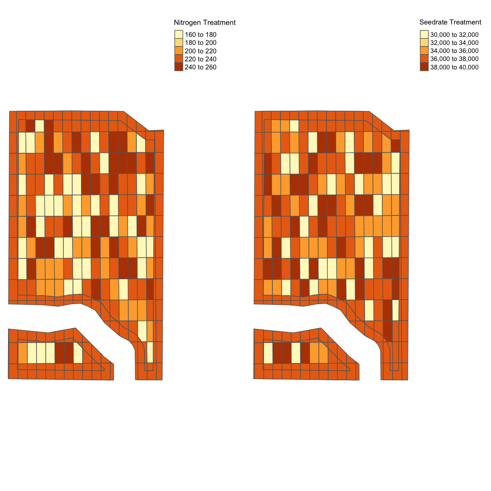
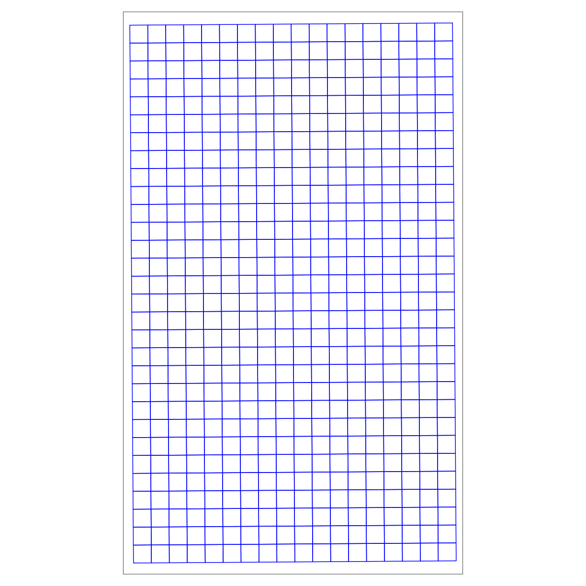
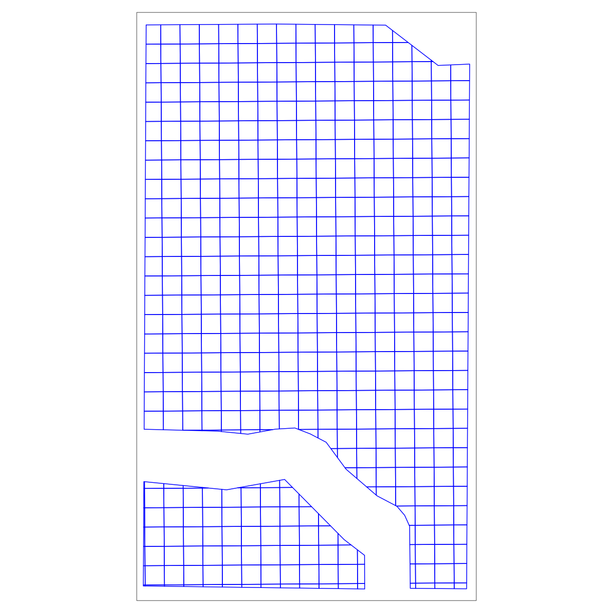
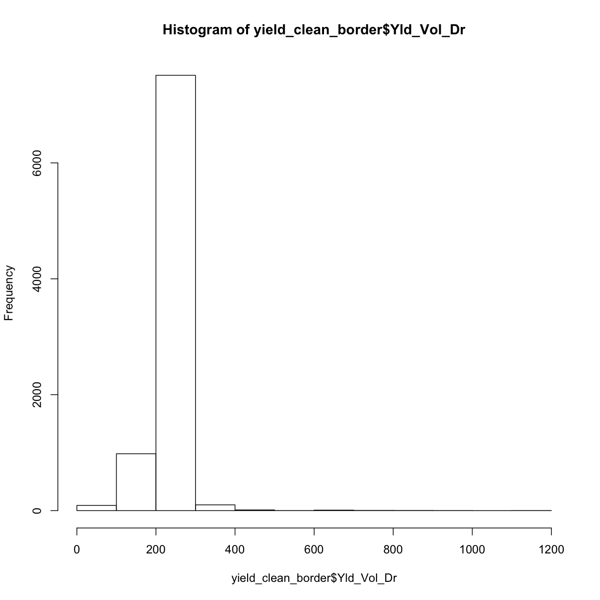
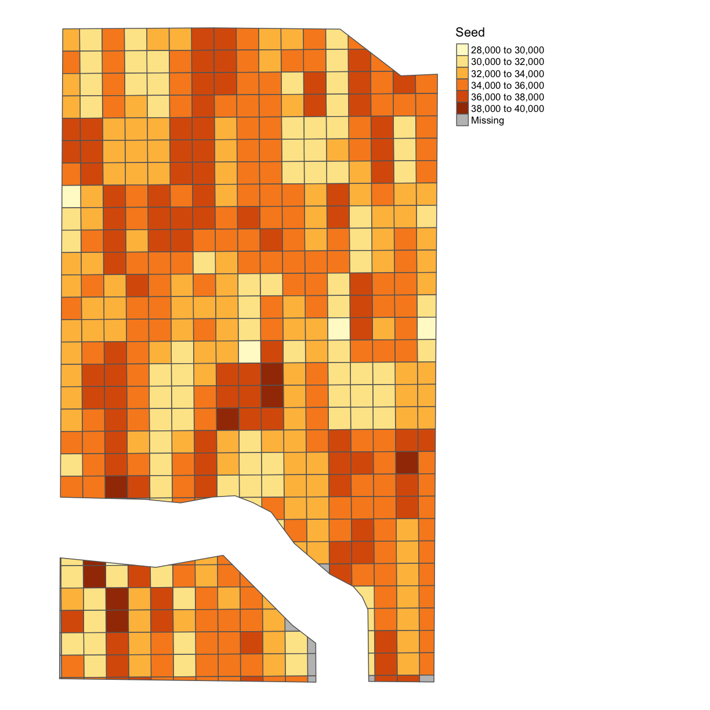
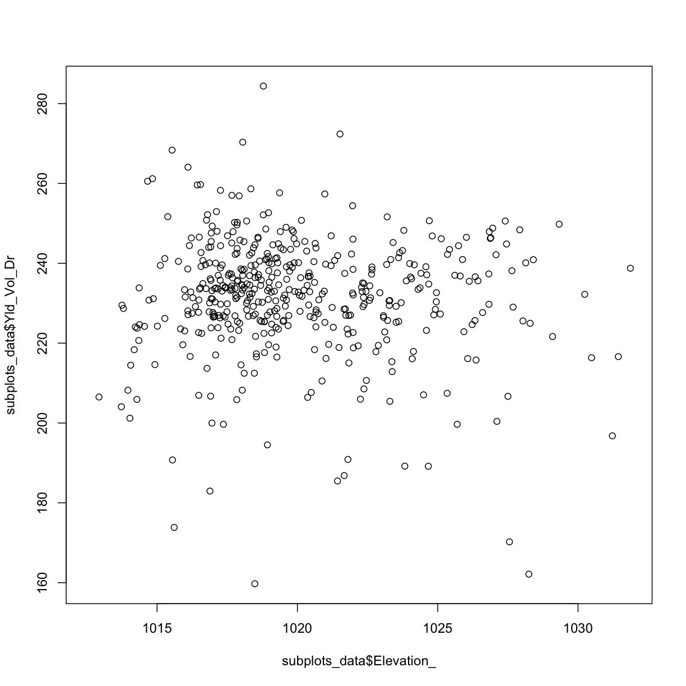
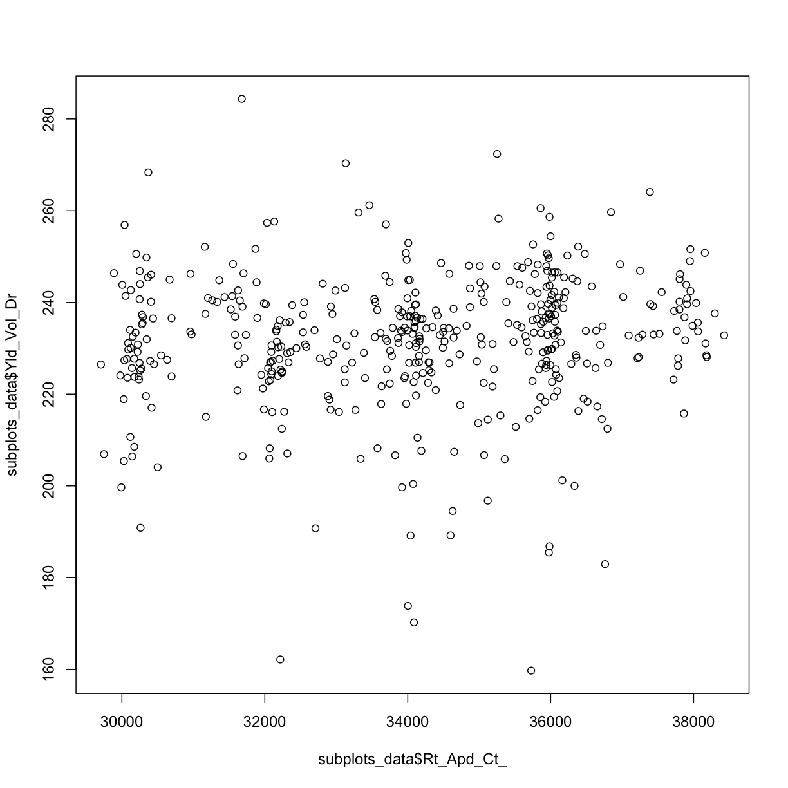
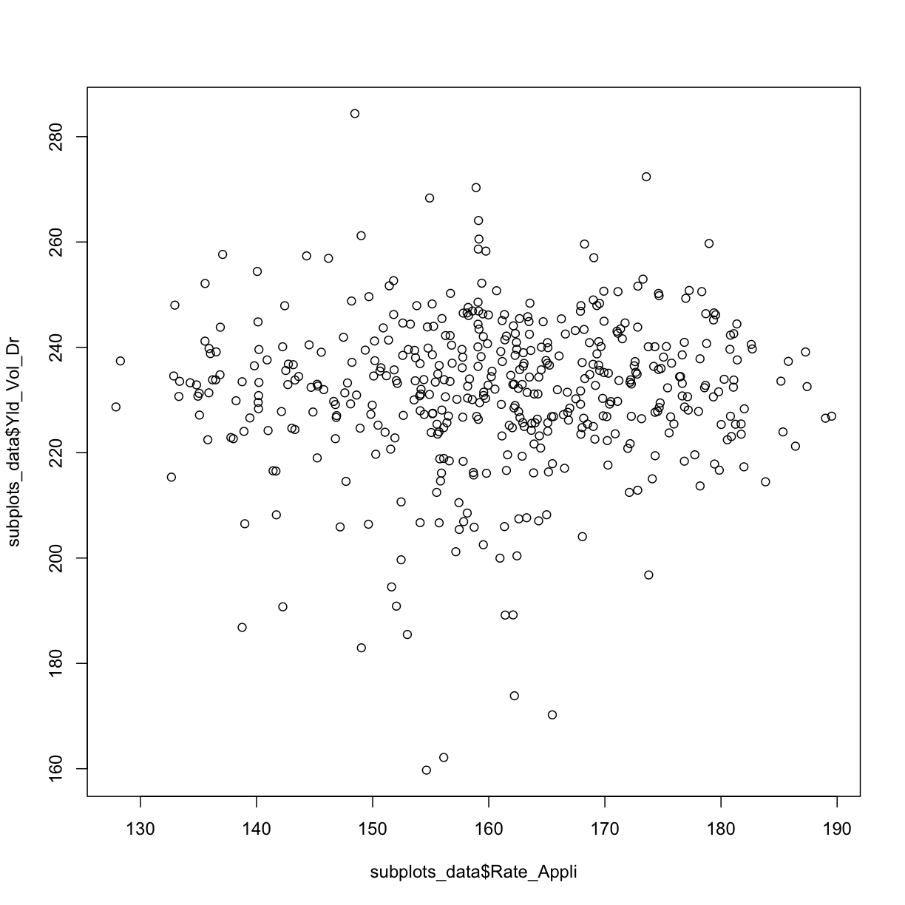

---
# Please do not edit this file directly; it is auto generated.
# Instead, please edit 15-Data-Cleaning-and-Aggregation-TEMPORARY.md in _episodes_rmd/
title: "Ag Carpentry - Data Cleaning and Aggregation"
author: "Aolin Gong"
date: "11/4/2019"
output: html_document
include_overview: true
questions:
 - Why is it important to clean the data before proceeding with analysis?
 - How can I quickly and efficiently identify problems with my data?
 - How can identify and remove incorrect values from my dataset?
objectives:
 - Confirm that data are formatted correctly
 - Enumerate common problems encountered with data formatting.
 - Visualize the distribution of recorded values
 - Identify and remove outliers in a dataset using R and QGIS
 - Correct other issues specific to how data were collected
keypoints:
 - Comparison operators such as `>`, `<`, and `==` can be used to identify values that exceed or equal certain values.
 - All the cleaning in the arcgis/qgis can be done by r, but we need to check the updated shapefile in Arcgis/qgis. Including removing observations that has greater than 2sd harvester speed, certain headlands, or being too close to the plot borders
 - The `filter` function in `dplyr` removes rows from a data frame based on values in one or more columns.
source: Rmd
---

## Data cleaning and aggregation in the DIFM project

After harvesting, we collect all the data needed for analysis, and in advance of
running analysis, we clean and organize the data in order to remove machinary
error and such. The common data that we collect for analysis includes yield
(dry), seeding rate as-planted, nitrogen rate as-applied, electronic
conductivity (EC), SSURGO, soil test, weather, etc. In particular, we need to
clean yield data, as-planted data, as-applied data, and sometimes EC data. For
public data, we simply import them into our aggregated data set
without cleaning, since they have already been cleaned before being released to
the public.

## Introduction to data cleaning

Data cleaning is the process of removing or correcting errors in a dataset, and
is very important to do before any sort of analysis.  For example, say you were
manually entering yield values into a spreadsheet, and then wanted to take the
average of all values entered.  If you accidentally typed an extra zero into
some of the cells, the average that you calculate is going to be much higher
than the true average.

~~~
real_data <- c(900, 450, 200, 320)
error_data <- c(900, 4500, 200, 320)
mean(real_data)
~~~
{: .language-r}

~~~
[1] 467.5
~~~
{: .output}

~~~
mean(error_data)
~~~
{: .language-r}

~~~
[1] 1480
~~~
{: .output}

Therefore, we want to check for values like this before we do anything else.  If
the values were manually entered and the intended value is obvious, they can be
manually corrected.  For larger scale datasets, however, it is often most
practical to discard problematic data.

For example, we can plot our `error_data` and look for values that may look off:

~~~
plot(error_data) # use plot function on error rate
~~~
{: .language-r}

By eye we can see the 2nd measurement (at `index = 2`) looks a little fishy.  In this case
we might want to apply a cut-off in our data so that we ignore all measurements above a
certain threshold when we do calculations like taking the mean of our data.

One way to do this is by setting any "weird" values to `NA`:

~~~
error_data[error_data > 2000] <- NA # set any values bigger than 2000 to the NA tag
error_data
~~~
{: .language-r}

~~~
[1] 900  NA 200 320
~~~
{: .output}

Now we can take a mean, with removing `NA`'s as we do it and recover a mean that is closer to the correct value:

~~~
mean(error_data, na.rm=TRUE)
~~~
{: .language-r}

~~~
[1] 473.3333
~~~
{: .output}

Data cleaning is a major reason why there needs to be good communication between
data scientists and end users, in agriculture or any other discipline.  As the person
who generates the data, you know best where the likely sources of error might be.
Those sources of error might be something that someone who sits behind a computer
all day would never think of.  You also know best what values are reasonable,
and what values are suspiciously high or low.

For different types of data, we have different ways to clean them. Here are the
main concerns of the original data for the major variables:

Yield, as-planted, and as-applied data:

* We remove observations where the harvester/planter/applicator is moving too slow or too fast.
* We remove observations on the edges of the plot.
* We remove observations that are below or above three standard deviations from the mean.
* We then aggregate them onto our units of observation. Do they know what these units are? I don't have a frame of refrence for this terminology

This comes up in the 03 or 04 but we need to define what a standard devation is
 
*For aggregation, we need to generate subplots (units of observation) of the
original trial design, and then aggregate the cleaned datasets for different
variables onto the subplots.  Once we have one value per variable per subplot,
we can begin examining the relationships between the variables.*

Have steps listed somewhere before we start

## Step 1: Importing and transforming our shapefile datasets

<!-- Let's apply this data-cleaning thinking to measurements of yields.  First, we will aggregate our yields into a grid overlayed on top of our boundary shapefile and look for measurements on this grid that seem too low or to high, and flag these as "outliers" of our dataset in our data-cleaning process. -->

The first step is to read in our boundary and abline shape files and transform them to UTM for later use.  Let's do this step-by-step, starting with reading in the boundary shapefile and projecting it:

~~~
boundary <- read_sf("data/boundary.gpkg")
~~~
{: .language-r}
What is the current coordinate reference system of this object?

~~~
st_crs(boundary)
~~~
{: .language-r}

~~~
Coordinate Reference System:
  EPSG: 4326 
  proj4string: "+proj=longlat +datum=WGS84 +no_defs"
~~~
{: .output}
Let's transform it to the UTM projection & check out its new coordinate reference system:

~~~
boundary_utm <- st_transform_utm(boundary)
st_crs(boundary_utm)
~~~
{: .language-r}

~~~
Coordinate Reference System:
  EPSG: 32617 
  proj4string: "+proj=utm +zone=17 +datum=WGS84 +units=m +no_defs"
~~~
{: .output}
Now we can see that the `+proj=longlat` has changed to `+proj=utm` and gives us that we are in UTM zone #17.

In the last episode, we also imported our trial design, which we will do again here:

~~~
trial <- read_sf("data/trial.gpkg")
~~~
{: .language-r}

Let's look at the coordinate reference system here as well:

~~~
st_crs(trial)
~~~
{: .language-r}

~~~
Coordinate Reference System:
  EPSG: 32617 
  proj4string: "+proj=utm +zone=17 +datum=WGS84 +units=m +no_defs"
~~~
{: .output}
Do we have a figure showing lat/long to UTM coversion somewhere?  I can add this

Our file is already in the UTM projection, but if we have one that is not we can convert this as well with:

~~~
trial_utm <- st_transform_utm(trial)
~~~
{: .language-r}

> ## Exercise: Transform the yield data
> Read in the yield shape file, look at its current CRS and transform it into the UTM projection.  Call this new, transformed variable `yield_utm`.
>
> > ## Solution
> > First, load the data:
> > 
> > ~~~
> > yield <- read_sf("data/yield.gpkg")
> > ~~~
> > {: .language-r}
> > Then take a look at the coordinate system:
> > 
> > ~~~
> > st_crs(yield)
> > ~~~
> > {: .language-r}
> > 
> > 
> > 
> > ~~~
> > Coordinate Reference System:
> >   EPSG: 4326 
> >   proj4string: "+proj=longlat +datum=WGS84 +no_defs"
> > ~~~
> > {: .output}
> > And finally transform into UTM:
> > 
> > ~~~
> > yield_utm <- st_transform_utm(yield)
> > ~~~
> > {: .language-r}
> >
> {: .solution}
{: .challenge}

Finally, let's transform our abline file.  We read in the file:

~~~
abline = st_read("data/abline.gpkg")
~~~
{: .language-r}

~~~
Reading layer `abline' from data source `/Users/jillnaiman/trial-lesson_ag/_episodes_rmd/data/abline.gpkg' using driver `GPKG'
Simple feature collection with 1 feature and 1 field
geometry type:  LINESTRING
dimension:      XY
bbox:           xmin: -82.87334 ymin: 40.84301 xmax: -82.87322 ymax: 40.84611
epsg (SRID):    4326
proj4string:    +proj=longlat +datum=WGS84 +no_defs
~~~
{: .output}
Check out its current coordinate reference system:

~~~
st_crs(abline)
~~~
{: .language-r}

~~~
Coordinate Reference System:
  EPSG: 4326 
  proj4string: "+proj=longlat +datum=WGS84 +no_defs"
~~~
{: .output}
And transform it to UTM:

~~~
abline_utm = st_transform_utm(abline)
~~~
{: .language-r}

## Step 2: Clean the yield data

Now that we have our shapefiles in the same UTM coordinate system reference frame, we will apply some of our knowledget of data cleaning to take out weird observations.  We'll do this in 2 steps.

First, we will take out observations we *know* will be weird because they are taken from the boarders

# OLD IS BELOW

The following steps read in a trial design shapefile, transform the projection
of file to utm projection, and then save the file in a geopackage. In many
cases, the trial design shapefile is already in the correct form, and we are
just checking the file in advance of creating the subplots of the trial design.

~~~
trial = read_sf("data/trial.gpkg")
st_crs(trial)
~~~
{: .language-r}

~~~
Coordinate Reference System:
  EPSG: 32617 
  proj4string: "+proj=utm +zone=17 +datum=WGS84 +units=m +no_defs"
~~~
{: .output}

~~~
trialutm = trial
~~~
{: .language-r}

After we read in the trial design file, we use a function to generate the
subplots for this trial. Because the code for generating the subplots is
somewhat complex, we have included it as a
[supplementary file](https://github.com/data-carpentry-for-agriculture/trial-lesson/blob/gh-pages/_episodes_rmd/making%20subplots.R).
For now, we will import a shapefile that already has the subplot boundaries
defined, and will convert the projection to UTM.

~~~
boundary_grid_utm = subset(boundary_utm, Type == "Trial")
plot(boundary_grid_utm$geom)
~~~
{: .language-r}

~~~
abline = st_read("data/abline.gpkg")
~~~
{: .language-r}

~~~
Reading layer `abline' from data source `/Users/jillnaiman/trial-lesson_ag/_episodes_rmd/data/abline.gpkg' using driver `GPKG'
Simple feature collection with 1 feature and 1 field
geometry type:  LINESTRING
dimension:      XY
bbox:           xmin: -82.87334 ymin: 40.84301 xmax: -82.87322 ymax: 40.84611
epsg (SRID):    4326
proj4string:    +proj=longlat +datum=WGS84 +no_defs
~~~
{: .output}

~~~
st_crs(abline)
~~~
{: .language-r}

~~~
Coordinate Reference System:
  EPSG: 4326 
  proj4string: "+proj=longlat +datum=WGS84 +no_defs"
~~~
{: .output}

~~~
abline_utm = st_transform_utm(abline)

# 24 m wide trial plots 
width = m_to_ft(24)
design_grids_utm = make_grids(boundary_grid_utm, abline_utm, long_in = 'NS', short_in = 'EW', length_ft = width, width_ft = width)
st_crs(design_grids_utm) = st_crs(boundary_grid_utm)

tm_shape(design_grids_utm) + tm_borders(col='blue')
~~~
{: .language-r}

~~~
trial_grid_utm = st_intersection(boundary_grid_utm, design_grids_utm)
~~~
{: .language-r}

~~~
Warning: attribute variables are assumed to be spatially constant throughout all
geometries
~~~
{: .error}

~~~
tm_shape(trial_grid_utm) + tm_borders(col='blue')
~~~
{: .language-r}

### Plotting our transformed shapefiles

After we read in the trial design files, we use a function to generate the
subplots for this trial. Because the code for generating the subplots is
somewhat complex, we have included it as a
[supplementary file](https://github.com/data-carpentry-for-agriculture/trial-lesson/blob/gh-pages/_episodes_rmd/making%20subplots.R).
For now, we will import a shapefile that already has the subplot boundaries
defined, and will convert the projection to UTM.

Here, we graph the subplots that we generated. Note that color indicates the ID
number of the subplots, which starts from 1, at the right upper corner. We can
check how many units of observation we are generating with this subplots shapefile.

## Importing the yield data and removing border observations

After confirming the subplots we generated (which will become our units of
observation), we bring the data sets for different variable in for cleaning.
For example, we will import and clean the yield data.  To match our subplots,
boundary, and trial design, we will also convert the yield data to UTM.

~~~
yield <- read_sf("data/yield.gpkg")
yield_utm <- st_transform_utm(yield)
~~~
{: .language-r}

We check the distribution of the yield data as we clean them to monitor the
change made by each cleaning step. First, view the distrubution of the original
data.

~~~
hist(yield_utm$Yld_Vol_Dr)
~~~
{: .language-r}

As you can see, we have some extreme values that we will want to get rid of.

We need to remove the yield observations that are on the border of the plots,
and also at the end of the plots.  The reason for this is that along the edge
of a subplot, the harvester is likely to measure a mixture of two subplots,
and therefore the data won't be accurate for either subplot.  Additionally,
plants growing at the edge of the field are likely to suffer from wind and other
effects, lowering their yields.

First we will use the function `st_buffer` to create a buffer for each plot.
We set the buffer inside the trial plots to be 4 meters to the edges, and any
yield observations that are within a 4-meter distance to the edge of the plots
are considered on the border.

Next, we determine which yield observations are inside the buffer as using the
`st_over` function, and mark those observations as "out". Finally, we
remove the yield observations that are not in the buffer zone.

~~~
yield_clean <- clean_buffer(trialutm, 15, yield_utm)
map_points(yield_clean, "Yld_Vol_Dr", "Yield")
~~~
{: .language-r}

Here again, we check the distribution of cleaned yield.

~~~
hist(yield_clean$Yld_Vol_Dr)
~~~
{: .language-r}

## Removing outliers

Even if we don't know the source of error, we can tell that some observations
are incorrect just because they are far too small or too large.  How can we
remove these in an objective, automatic way?  For yield and our other variables,
we will calculate the [standard deviation](https://en.wikipedia.org/wiki/Standard_deviation)
to get an idea of how much the observations tend to be different from the mean.
Then, we will remove observations that are three standard deviations higher or
lower than the mean.  If the data followed a normal distribution (*i.e* a bell
curve), this would eliminate about one in 1000 data points.  In a real dataset,
we can be fairly certain that those points are errors.  Our cutoff of three
standard deviations is arbitrary, which is why we have looked at histograms of
the data to help confirm that our cutoff makes sense.

In the next few steps, we use `sd` and `mean` to calculate the standard
deviation and mean of the yield distribution, respectively. Then we remove the
yield observations that are greater than mean + 3\*sd or less than mean - 3\*sd. 

~~~
yield_clean <- clean_sd(yield_clean, yield_clean$Yld_Vol_Dr)
~~~
{: .language-r}

Here again, we check the distribution of cleaned yield after taking out the
yield observations that are outside the range of three standard deviations from
the mean.

~~~
hist(yield_clean$Yld_Vol_Dr)
~~~
{: .language-r}

Finally, we save cleaned file into a geopackage.

~~~
st_write(yield_clean, "data/yield_clean.gpkg", layer_options = 'OVERWRITE=YES')
~~~
{: .language-r}

~~~
Updating layer `yield_clean' to data source `data/yield_clean.gpkg' using driver `GPKG'
options:        OVERWRITE=YES 
Updating existing layer yield_clean
Writing 8578 features with 29 fields and geometry type Point.
~~~
{: .output}

### Discussion

What do you think could have caused these outliers (extreme values)?  If you
were working with yield data from your own fields, what other sources of error
might you want to look for?

### Exercise

Import the shapefile for nitrogen as-applied.  Remove observations from the
buffer zone, as well as observations more then three standard deviations from
the mean.

##  Yield Interpolation/Aggregation

Interpolation is the estimation of a value at a point that we didn't measure
that is between two or more points that we did measure.  Aggregation is the
combining of multiple data points into a single data point.  What we'll do here
is a combination of interpolation and aggregation, where we will use multiple
measurements across each subplot to generate one value for the subplot. In this
case we will take the median value within each subplot.  Typically when the data
are not normally-distributed or when there are errors, the median is more
representative of the data than the mean is.  Here we will interpolate and
aggregate yield as an example.  The other variables can be processed in the same
way.

**Question from Lindsay: Why do we need to covert class here?  Please provide an
explanation.**

~~~
grid_sp <- as(trial_grid_utm, "Spatial")
crs(grid_sp)
~~~
{: .language-r}

~~~
CRS arguments:
 +proj=utm +zone=17 +datum=WGS84 +units=m +no_defs +ellps=WGS84
+towgs84=0,0,0 
~~~
{: .output}

**Explain more of what is happening in this code below**
**Why is one line commented out?**

~~~
merge <- sp::over(grid_sp, as(yield_clean[,"Yld_Vol_Dr"], "Spatial"), fn = median)
grid_sp@data <- cbind(merge, grid_sp@data)

subplots_data <- st_as_sf(grid_sp) 
map_poly(subplots_data, 'Yld_Vol_Dr', "Yield (bu/ac)")
~~~
{: .language-r}

### Exercise

Interpolate and aggregate nitrogen as-applied so that you have one value per
sub-plot.

**Solution**:

~~~
asapplied <- st_read("data/asapplied.gpkg")
~~~
{: .language-r}

~~~
Reading layer `asapplied' from data source `/Users/jillnaiman/trial-lesson_ag/_episodes_rmd/data/asapplied.gpkg' using driver `GPKG'
Simple feature collection with 9913 features and 19 fields
geometry type:  POINT
dimension:      XY
bbox:           xmin: -82.87852 ymin: 40.83947 xmax: -82.87304 ymax: 40.84649
epsg (SRID):    4326
proj4string:    +proj=longlat +datum=WGS84 +no_defs
~~~
{: .output}

~~~
asapplied_utm <- st_transform_utm(asapplied)

conv_unit((24/2)*0.8, 'm', 'ft')
~~~
{: .language-r}

~~~
[1] 31.49606
~~~
{: .output}

~~~
asapplied_clean <- clean_sd(asapplied_utm, asapplied_utm$Rate_Appli)

merge <- sp::over(grid_sp, as(asapplied_clean[,"Rate_Appli"], "Spatial"), fn = median)

grid_sp@data <- cbind(merge, grid_sp@data)
head(grid_sp@data)
~~~
{: .language-r}

~~~
  Rate_Appli Yld_Vol_Dr  Type plotid GRIDY GRIDX
1   154.6358   159.7329 Trial      3     3     1
2   155.3956   233.4012 Trial      4     4     1
3   152.9890   185.4852 Trial      5     5     1
4   138.7605   186.8338 Trial      6     6     1
5   140.0642   254.4135 Trial      7     7     1
6   146.8981   227.0434 Trial      8     8     1
~~~
{: .output}

Processing the other variables:

~~~
#asplanted and elevation
asplanted <- st_read("data/asplanted.gpkg")
~~~
{: .language-r}

~~~
Reading layer `asplanted' from data source `/Users/jillnaiman/trial-lesson_ag/_episodes_rmd/data/asplanted.gpkg' using driver `GPKG'
Simple feature collection with 6382 features and 30 fields
geometry type:  POINT
dimension:      XY
bbox:           xmin: -82.87843 ymin: 40.83952 xmax: -82.87315 ymax: 40.84653
epsg (SRID):    4326
proj4string:    +proj=longlat +datum=WGS84 +no_defs
~~~
{: .output}

~~~
asplanted_utm <- st_transform_utm(asplanted)

conv_unit((24/2)*0.8, 'm', 'ft')
~~~
{: .language-r}

~~~
[1] 31.49606
~~~
{: .output}

~~~
asplanted_clean <- clean_sd(asplanted_utm, asplanted_utm$Rt_Apd_Ct_)

asplanted_clean <- clean_buffer(trialutm, 15, asplanted_clean)

map_points(asplanted_clean, "Rt_Apd_Ct_", "Seed")
~~~
{: .language-r}

~~~
merge <- sp::over(grid_sp, as(asplanted_clean[,c("Rt_Apd_Ct_", "Elevation_")], "Spatial"), fn = median)

grid_sp@data <- cbind(merge, grid_sp@data)
head(grid_sp@data)
~~~
{: .language-r}

~~~
  Rt_Apd_Ct_ Elevation_ Rate_Appli Yld_Vol_Dr  Type plotid GRIDY GRIDX
1   35726.80   1018.483   154.6358   159.7329 Trial      3     3     1
2   35764.24   1019.708   155.3956   233.4012 Trial      4     4     1
3   35974.67   1021.429   152.9890   185.4852 Trial      5     5     1
4   35983.17   1021.667   138.7605   186.8338 Trial      6     6     1
5   35998.15   1021.967   140.0642   254.4135 Trial      7     7     1
6   32882.86   1021.893   146.8981   227.0434 Trial      8     8     1
~~~
{: .output}

~~~
subplots_data <- st_as_sf(grid_sp) 

st_write(subplots_data, "data/data.gpkg", layer_options = 'OVERWRITE=YES')
~~~
{: .language-r}

~~~
Updating layer `data' to data source `data/data.gpkg' using driver `GPKG'
options:        OVERWRITE=YES 
Updating existing layer data
Writing 489 features with 8 fields and geometry type Polygon.
~~~
{: .output}

~~~
map_poly(subplots_data, 'Rt_Apd_Ct_', "Seed")
~~~
{: .language-r}

~~~
plot(subplots_data$Elevation_, subplots_data$Yld_Vol_Dr)
~~~
{: .language-r}

~~~
plot(subplots_data$Rt_Apd_Ct_, subplots_data$Yld_Vol_Dr)
~~~
{: .language-r}

~~~
plot(subplots_data$Rate_Appli, subplots_data$Yld_Vol_Dr)
~~~
{: .language-r}

~~~
model <- lm(Yld_Vol_Dr ~ Rt_Apd_Ct_ +  Rate_Appli + Elevation_, data = subplots_data)
summary(model)
~~~
{: .language-r}

~~~

Call:
lm(formula = Yld_Vol_Dr ~ Rt_Apd_Ct_ + Rate_Appli + Elevation_, 
    data = subplots_data)

Residuals:
    Min      1Q  Median      3Q     Max 
-72.967  -6.095   1.150   8.300  54.346 

Coefficients:
              Estimate Std. Error t value Pr(>|t|)  
(Intercept)  4.493e+02  2.039e+02   2.204   0.0281 *
Rt_Apd_Ct_   5.650e-04  3.078e-04   1.836   0.0671 .
Rate_Appli   4.914e-02  5.442e-02   0.903   0.3671  
Elevation_  -2.399e-01  1.980e-01  -1.212   0.2262  
---
Signif. codes:  0 '***' 0.001 '**' 0.01 '*' 0.05 '.' 0.1 ' ' 1

Residual standard error: 14.72 on 446 degrees of freedom
  (39 observations deleted due to missingness)
Multiple R-squared:  0.01416,	Adjusted R-squared:  0.007532 
F-statistic: 2.136 on 3 and 446 DF,  p-value: 0.09497
~~~
{: .output}

## Conclusion

Now, we have one value per subplot for all of our variables, and because we
cleaned the data first, we can be confident that value is a good representation
of the subplot.

**Add code here to make a scatter plot of as-applied vs. yield, now that we
have one value for each for each subplot**

####Other Files To Be Cleaned/Aggregated
1. As-applied Data
2. As-planted Data
4. EC Data
5. Elevation Data (from Internet or Trial Yield/As-planted file)
6. Topography Data (Slope and Aspect generated from Elevation Data)
7. SSURGO Data (Specify the soil content)
8. Weather Data (daily/weekly/monthly data)

####Supplementary Code/Function
1. Code to generate the suplots(unit of observations) of the orginal trial design.
2. Code to clean yield data.
3. Code to generate Topography data.
4. Code to process SSURGO data.
5. Code to download weather data.
