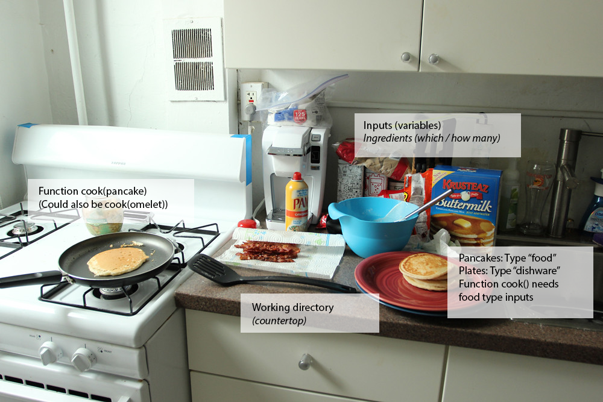
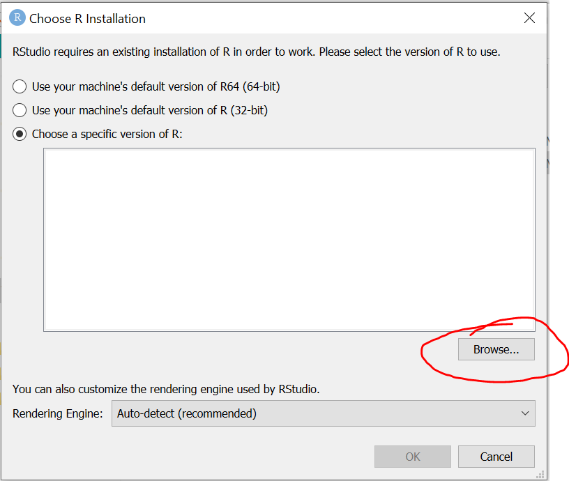
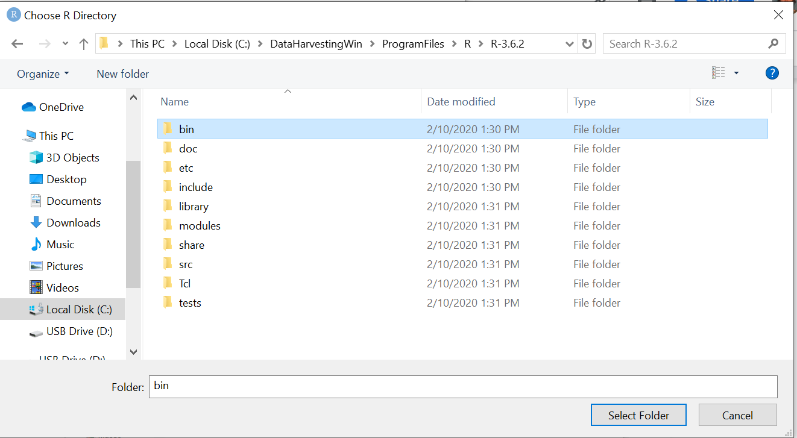
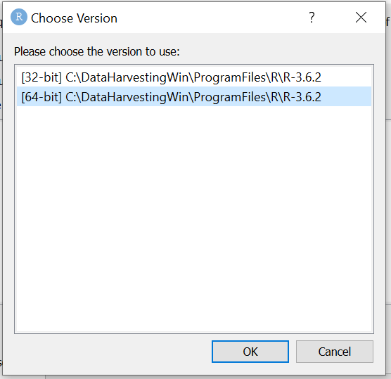
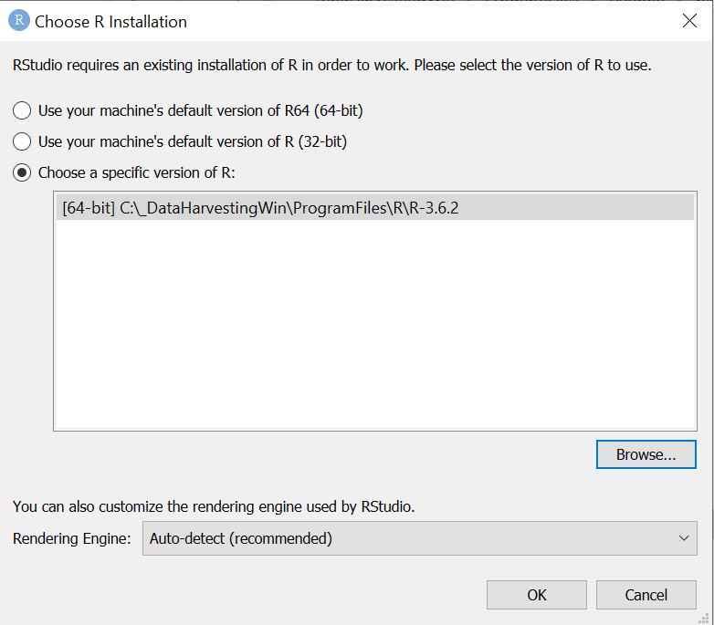
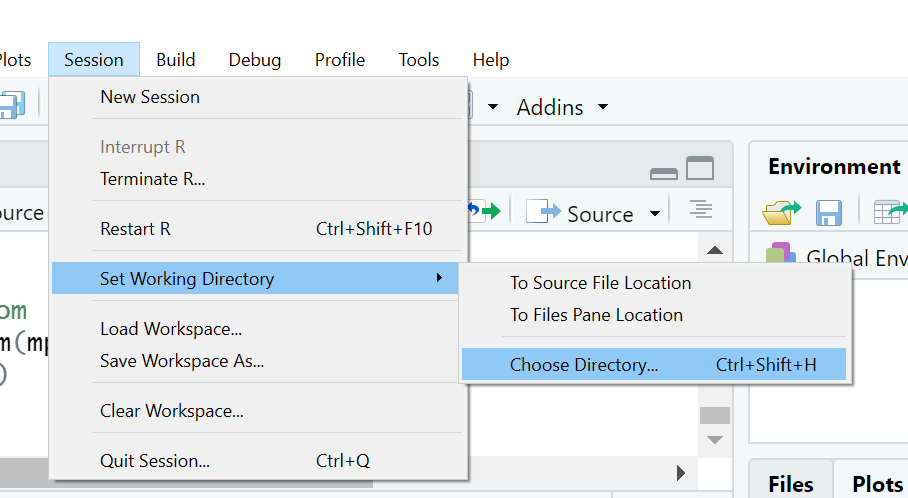
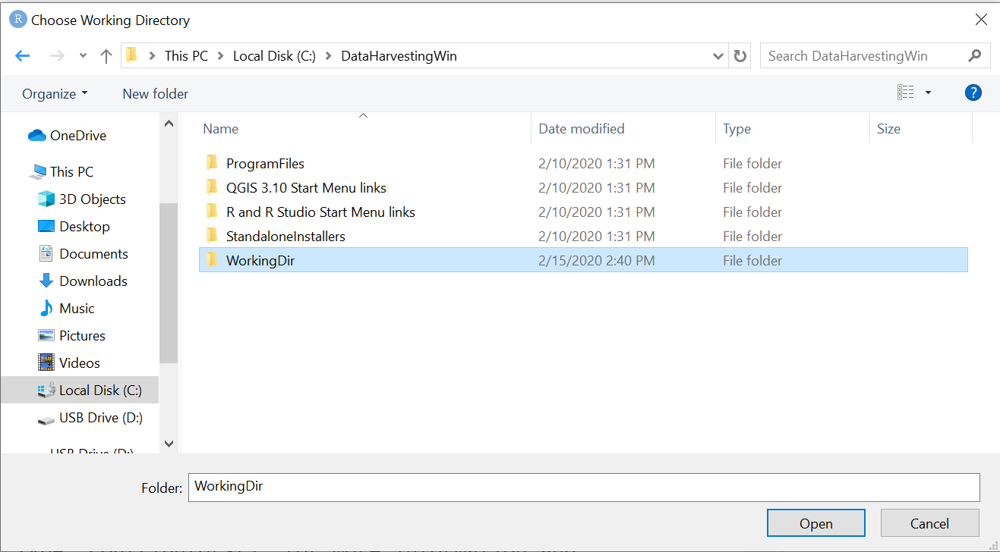
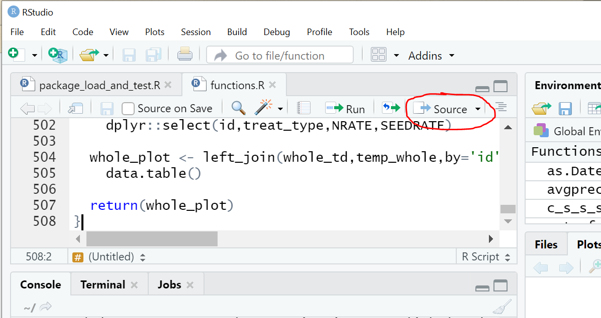

<!-- JPN: updated fig path here manually for plots to show -->

```{r setup, include=FALSE}
source("../bin/chunk-options.R")
```
<!-- JPN: attribution formatting -->
<style type="text/css" rel="stylesheet">
* {.attribution{
     position:absolute;
     bottom:0;
     right:0;
     font-size:0.5em
 }}
</style>

## <font color="magenta">TO-ADD</font>

 * vigenettes - what is it, where can you find it in R studio interface & online
 * how to use "help" *and* how to google for help
 * "::" <- what does this mean, multiple packages with the same name


<font color="magenta"> Do we need to link the terms to a glossary?</font>

# Programming concepts and language

Programming doesn’t have to be scary, and we have some real-world examples to help you understand what’s going on with these words we’re typing in a window. The words in bold will come up in a programming context later on, but it might help to have a mental reference picture to associate with these words.

Let’s imagine that instead of a program to work with numbers and letters, we’re creating a program that cooks breakfast instead.

In order to make breakfast, you need:
 * A **working directory** (the place where you’re doing things, such as your kitchen countertop)
 * Available **data** (information about what you’re working with)
     * Data could be an inventory of your pantry, a grocery shopping list, a map of the store, a collection of prices at the store, and so forth.
 * **Types** of **objects** -- a method of grouping what can be done to what types of things.
     * Food is one type of thing; people are another; pets are a third.
     * A specific food object can be an egg or a pancake; a particular pet object can be your cat or your dog.
 * Some **inputs** that may be **objects** of appropriate **types** (breakfast food ingredients)
     * You create breakfast by performing actions on objects of food types, and then you feed it to things of the people and pet types.
 * Some **functions** (recipes that work with the ingredients)
     * Inputs to functions are usually stored in **variables** -- you don’t always want to make the same thing every day, so the instructions have placeholder names for things that are similar to each other but may vary. (A “todays_cheese” variable could hold Stilton for one day’s omelet and cheddar for the next.)
 * You need to match your **object** types to your **functions**.
     * You shouldn’t use a pet-type object as an input to a breakfast-making function. (Nobody wants to eat the goldfish for breakfast.)
     * You might be able to use a dinner-type food object as an input to a breakfast-making function, but use caution.
 * Some **outputs** (food ready to be consumed) 
 * A **destination** (where to put the food that’s ready to be consumed)
     * You could put your outputs in your working directory (eat breakfast in your kitchen) or you could send it to another location (put leftovers in the refrigerator)


<span class="attribution"><a href="https://www.flickr.com/photos/11849171@N00/8330968310">"Breakfast"</a> by <a href="https://www.flickr.com/photos/11849171@N00/8330968310">viviandnguyen_</a> is licensed under <a href="https://www.flickr.com/photos/11849171@N00/8330968310">CC BY-SA 2.0</a></span>


## Intro to R and RStudio

In this episode we’ll cover the basics of using R, which is a programming language for statistics, data analysis, and data visualization. In the past decade or so, R has become very popular in both science and business, largely because (1) it is free, and (2) thousands of people have written new code extending its functionality, and that code is also free. If you perform an analysis in R, you can share that analysis so that anyone in the world can reproduce it without having to purchase proprietary software.

If you’re already proficient with Excel, you will probably already know how to accomplish a lot of what we are doing in this episode using Excel instead of R. One reason why we are teaching you this material, however, is to get you comfortable with R since we will be using R for geospatial analysis (which is not so easy in Excel).

In this lesson, we will be making use of another software called “RStudio” as a way to interact with the programming language R. RStudio makes writing our programs more user-friendly. Using RStudio instead of R is a little like having a toaster. You can make toast over a fire, but having a toaster makes the job easier and less scorch-prone.

We launch RStudio by double clicking on its icon, as we would with other software on our computers. 

> ## Windows Users: Click Here for more details
> If you’re running R Studio from a copy made from the USB stick, then the first time you launch R Studio, you’ll be asked where your installation of R is located.
> 1. Choose the “Choose a specific version of R” item next to the large text box.
> 
> 2. Use the **Browse** button to navigate to:
>    * **DataHarvestingWin/ProgramFiles/R/R-3.6.2/bin/**
>    * and choose **Select Folder**.
> 
> Next, you’ll be prompted which version you want to use. You could choose either 32 bit or 64 bit; either should work, but 64 bit is likely to be what your computer is capable of.
> 
> In the image below, the 64 bit version has been chosen and you can now press OK.
> 
> At this point, R Studio should open next.
>
{: .windowsUsers}

<!--In this episode we’ll cover the basics of using R, which is a programming language for statistics, data analysis, and data visualization. In the past decade or so, R has become very popular in both science and business, largely because (1) it is free, and (2) thousands of people have written new code extending its functionality, and that code is also free. If you perform an analysis in R, you can share that analysis so that anyone in the world can reproduce it without having to purchase proprietary software.

If you’re already proficient with Excel, you will probably already know how to accomplish a lot of what we are doing in this episode using Excel instead of R. One reason why we are teaching you this material, however, is to get you comfortable with R since we will be using R for geospatial analysis (which is not so easy in Excel). 

In this lesson, we will be making use of another software called "RStudio" as a way to interact with the programming language R.  RStudio makes writing our programs more user-friendly.  **Some sort of analogy here would be grand (Jill) -- Dena's analogy: It's a little like having a toaster. You can make toast over a fire, but having a toaster makes the job easier and less scorch-prone.**

We launch RStudio by double clicking on its icon, as we would with other software on our computers.  If this is the first time you have opened it, the entire left pane will be taken up by something called the `Console` that you can see as the left hand panel in the figure below: -->


<!--
<font color="magenta"> **Do we want a screen shot of this instead of the R code?  Or will this be enough of a "following along" type of thing that that sort of thing isn't necessary? </font><font color="green">Dena: We do want a screen shot of a successful opening of R Studio so they have checkin points.)** </font>
-->

## Getting your RStudio workspace ready for the workshop

Let’s get our “countertop” ready to “cook breakfast” by: 
  1. Setting up our working directory
  1. Loading libraries and sourcing functions in order to make the tools we’ll use available to RStudio
  1. Locating our data ingredients

### Setting your working directory

Under the **Session** menu, choose **Set Working Directory**, then **Choose Directory**.



In each software collection on the USB drive (both Windows and Mac), we’ve made subdirectories called **WorkingDir** with another subdirectory called **data**. (Even if you’ve installed from scratch rather than copying from the USB drive, the instructions will be easier to follow if you have a folder called **WorkingDir** that contains another one called **data**.)

So if you’re using our file collection after copying it to your local hard drive on Windows, choosing your working directory will look like this:


(If you’re running from the USB drive, the drive letter there will likely say D instead of C, but the rest will be the same.)

<font color="magenta"> JPN: needs to put in how this looks for Mac </font>

After you click the Open button, you’ll see a new command has been added to your console, which is the text-based way of saying your home directory has been set:

> ## Windows
> (console)
>
> setwd("C:/DataHarvestingWin/WorkingDir")
>
{: .callout}

> ## Mac
> <font color="magenta"> JPN: put in for mac </font>
{: .callout}

Now we’ve identified where we want to work and can start loading libraries and data.

### Loading libraries

R and RStudio are used in many different fields, including biology, genomics, and geospatial data. If we loaded everything that R was capable of handing at once, though, it would take even more space than it already does! 

So with this set of instructions, we’re telling R that we want a set of published tools that are appropriate for working with geospatial data and public data sources, and also some custom-written scripts specifically for this workshop.

 1. Right-click to open  the code for the <a href="https://raw.githubusercontent.com/data-carpentry-for-agriculture/trial-lesson/gh-pages/_episodes_rmd/package_load_and_test.R">package_load_and_test.R script</a> in a new web browser window. This file will tell R which published tools should be loaded into its memory and make sure they’re all working.
 1. Create a new R script file for yourself in R Studio by clicking on **File -> New File -> R Script**.
 1. Copy and paste the test script from the browser window into your new script file.
 1. Save the file as **package_load_and_test.R** in your working directory so that you’ll be able to use it again. 
 1. Run each line by selecting it and clicking the **Run** key. Each test should let you know whether an error was encountered in the loading process.


After you’ve finished with the library loading part of the script, the testing part of the script should make sure each library component is working. 

Just as above, select what you want to run and click the Run button. (Tip: Select everything between pairs of green # lines to run one test at a time and see its output.)


### Sourcing functions for this workshop

The library loading process above uses formally published and reviewed software packages that are available to everyone in the world. However, we’ve also written some custom functions to make this workshop easier, and you can add them to your R environment in a similar method. 

Instead of using the “library” command, though, we’ll use the “source” button instead. (You can also do this with functions you write for yourself, if you wish to make more functions.)

 1. Open the <a href="https://raw.githubusercontent.com/data-carpentry-for-agriculture/trial-lesson/gh-pages/_episodes_rmd/functions.R">functions.R script</a> in a new browser window.
 1. As above, create a new R script file in R Studio by clicking on **File -> New File -> R Script**.
 1. Copy and paste the functions script from the browser window into your new script file.
 1. Save it as **functions.R** in your working directory.
 1. Click the **Source** button near the top right of your script window to load these functions as well.



**Tip:** You’ll want to re-run the library loading script and re-source the functions script whenever you restart R Studio, so remember to re-open them tomorrow morning!

<font color="magenta"> Could also do source() here, maybe add if we have time </font>

### Locating data ingredients - <font color="red">LOOP BACK HERE</font>

<font color="red">This section needs fleshing out once we know whether we’ll have the data done and verified complete in time to feed them onto the USBs or not? Skipping to next section</font>

## The stuff in your “kitchen”: Getting oriented with R Studio

So far, we’ve seen some things happen in the four quadrants of R Studio:
 * **New R script files** are made in the top left quadrant, and if you have more than one of them open at a time, you’ll see more than one tab with the file names on them.
   * **Tip:** If you want to save the commands you’re working on, this is where you’ll put your work. There’s no real downside to keeping your notes in a script file; you can easily come back to your work later.
 * **The console** is in the lower left quadrant, and that’s where the “action items” happen. When you clicked through the test script elements, text-based responses came up in the console whether or not a graphic was rendered with that test.
   * **Tip:** In R Studio, it’s helpful to get in the habit of typing your work in a script window, selecting your section, and hitting Run instead of typing directly in the console. You can’t easily get back what you typed in the console in a previous session. (Script files are like recipe cards that you save; entries on the console are like scribbling on the back of a napkin.)
 * Information about your **environment** is in the top right quadrant. This includes libraries that are loaded, variables that have had information put into them, and so forth. Several of the tests caused changes in this area.
 * The lower right quadrant holds several tabs, but the two you’ll use most often are the **Plots** tab and the **Packages** tab. 
    * The map-drawing tests produced images in the Plots tab.
    * When you ran the library-loading lines, checkmarks appeared by those libraries’ names in the Packages tab. 
    * (Tip: That’s a handy way to know what your current environment includes. If you’ve just reopened RStudio after a time away, and you’re not sure what RStudio remembers from your last session, look at the Packages tab to see if your libraries are loaded or not. In our case, **dplyr** is an easy one to find near the start of the alphabet; if it’s not checked when you open RStudio, you’ll want to re-run the package_load_and_test.R script.)
    * Check it out: Click from tab to tab to see what’s in each of them.


## Let’s crack some eggs: Getting started with functions and variables

From our cooking-breakfast example earlier, here are some of the programming terms and analogies for what they mean.

### What is a function?
A **function** is a bit of code that we want to be able to reuse again and again. For example, let’s say you want to make omelets every morning, wouldn’t it be great if you had some sort of machine that would do it for you?

Let’s imagine an omelet-making scenario. You start with some eggs, some cheese, and some other ingredients, use utensils and heat, and end up with something cooked and edible on a plate -- or more than one plate, if several people want omelets that morning.

The number of eggs and amount of cheese you use can vary depending on how many you want, so we call the bit of space that stores that information a **variable**.

Sometimes the recipe you received is dependent on other things that you want to leave yourself notes about as well. Just like scribbling on a recipe card, you can leave **comments** in your code by beginning a commented section with a # character.

Here’s what that omelet process might look like in terms a step closer to programming:

<pre>function make_omelet(how_many, todays_cheese, cheese_quantity, other_ingredients) {

# Multiply number of omelets wanted by 2 eggs each
   eggs <- how_many * 2 

# Multiply cheese per omelet by number of omelets to decide how much cheese is needed
   total_cheese <- how_many * cheese_quantity 

# Mix ingredients
   for each bowl
       crack eggs
       discard shells
	add total_cheese
       if other_ingredients
           bowl <- bowl + other_ingredients
       else
           ready to cook

# When ready to cook
  pour bowl into hot pan 
	# if more than 3 eggs, get more hot pans
  cook
  serve
  wash_dishes
}
</pre>

In this example, we’re telling the system these things:
  * A function (repeatable sequence of commands) named make_omelet takes several inputs (the ingredients list in parentheses)
  * The part in the curly braces {} tells the function what to do with the inputs (also called arguments or parameters – you can think of this as an ingredients list if it helps)

To use a function we have to *call* it in a specific way. Let’s try with an R function called `print` which will just echo back what we give it as an input parameter:

```{r}
todays_cheese <- "Stilton" # assign the value of Stilton to a variable called "todays_cheese" -- we don’t want to use apostrophes in variable names, so today’s_cheese wouldn’t work.

print(todays_cheese) # print out the value of the variable to the screen
```

From now on, whenever we use `todays_cheese`, R will substitute the value we assigned to it. In layman’s terms, **a variable is a placeholder name for something that can be changed regularly**.

In R, variable names:
  * can include letters, digits, and underscores
  * cannot start with a digit
  * are case sensitive. <font color="magenta">There is no glossary link here</font>
  
This means that, for example:
  * `cheese1` is a valid variable name, whereas `1cheese` is not
  * `eggs` and `Eggs` are different variables

> ## Variable Naming Conventions
> Historically, R programmers have used a variety of conventions for naming variables. The `.` character in R can be a valid part of a variable name; thus the above assignment could have easily been `todays.cheese <- "Stilton"`.
>
> This is often confusing to R newcomers who have programmed in languages where `.` has a more significant meaning, or to people who are used to file names like `resume.doc` where the component after `.` identifies the type of a file. 
>
> Today, most R programmers prefer these standards:
>   * Start variable names with lower case letters
>   * Separate words in variable names with underscores
>   * Use only lowercase letters, underscores, and numbers in variable names. (The book R Packages includes a chapter on this and other style considerations.)
>
{: .callout}
 

## Variables and data types

<font color="magenta">I think a lot of these variable names here should be put in R so that students can see how it looks when it compiles</font>

Something that it’s important to keep track of is what type of data you’ve stored in a particular variable. Words are treated differently than numbers, and numbers with decimals are treated differently than numbers without decimals. So, for example:
  * `cheese_variety` could be "Stilton" or "cheddar", but you probably don’t want a number here. This variable type is called a **text string**.
  * `cheese_amount` could be “a quarter cup”, but numbers are much easier to calculate with than words, so we might represent that as “0.25”. This variable type is called a **floating point number**.
  * `eggs` *could possibly* be 2.5, but it’s much easier to use either 2 whole eggs or 3 whole eggs. When you want to make sure you’re working with whole units, this variable type is called an **integer**.
     * **Tip:** The first time you use a number-type variable, if you want it to always be an integer, don’t include a decimal point when you assign it (**eggs <- 2**). On the other hand, if you do want to have the ability to have decimal points in that variable in the future, make sure to include the decimal point even if it’s .0 (**cheese_quantity <- 2.0**)
  * Another variable type we’ll be introducing in a few minutes is a **dataframe**, which lets you hold a whole spreadsheet’s worth of information in one variable. This will be very useful for working with things more complicated than omelets, such as agricultural data!

Notice that they can all be named in similar ways; you don’t have to tell the system what type of variable you’ve just created, but it might be handy to leave `#comments` for yourself.

### How many eggs? Passing variables and data to functions

Your breakfast function `make_omelet()` may default to “make omelets for two people,” but maybe one day you’re the only person who wants an omelet and another day you’re having a party. Being able to tell the function how many omelets you want to make without rewriting your code saves a bunch of time. 

So when you look at the arguments list requested in `make_omelet()`:

<pre>function make_omelet(how_many, todays_cheese, cheese_quantity, other_ingredients)</pre>

The list of items it’s asking for includes the things that are likely to change based on the day, and then the mathematical transformations from “how many omelets” to “how many eggs and how much cheese is needed” are handled inside the function.

The thing that you pass in to a function or assign to a variable can also be a data set. Let’s take a look at how to do that next. 

As an example of a dataset in spreadsheet form that we can use to demonstrate the R language, we are using the <a href="https://www.ers.usda.gov/data-products/fertilizer-use-and-price.aspx">USDA - Economic Research Service’s fertilizer use and price dataset</a>. Of the various tables of data on this website, will be looking at Table 2 called “Estimated U.S. plant nutrient use by selected crops” which shows 1,000 nutrient short tons of nitrogen, phosphorus, and potash used on corn, soy, cotton, wheat, and other crops in the US from 1964-2016.

This table has been reformatted into a CSV file for ease of import into R. You can download the CSV from: [https://raw.githubusercontent.com/data-carpentry-for-agriculture/trial-lesson/gh-pages/_episodes_rmd/data/fertilizer_use.csv](https://raw.githubusercontent.com/data-carpentry-for-agriculture/trial-lesson/gh-pages/_episodes_rmd/data/fertilizer_use.csv).

<font color="green">Dena has some comments to self here - is it in data folder?</font>

> ## What’s a CSV file and why are they helpful?
> CSV stands for “comma separated values.” What’s stored in a CSV file is spreadsheet-type data, and it can be opened in Microsoft Excel (among many other things). 
> 
> You might be used to seeing spreadsheet-type files saved with a .xls or .xlsx format type. But while the Excel format is complicated to take apart, a CSV is really easy for many programs to read, including text viewers and R Studio.
>
{: .callout}


## Getting your data into RStudio

The top few lines of this file look like:

```{r echo = FALSE}
tmp <- read.csv("data/fertilizer_use.csv", header = FALSE, nrows = 5)
write.table(tmp, quote = FALSE, sep = ",", row.names = FALSE, col.names = FALSE)
rm(tmp)
```

It can be opened in Excel if you want to get a quick look at it that way, or we can dive straight into looking at it in R. Save it into your `data` folder in your RStudio project for this lesson.

Next, we’ll use the function called `read.csv` to import data from a CSV (comma-separated value) file. (In this case the .csv is part of the name of the function, not the name of a separate file. Sorry about that -- we didn’t name it!)

To do this, put this line in your script area (upper left hand quadrant) and click Run.


```{r}
fert_use <- read.csv("data/fertilizer_use.csv")
```

Note here that the name of the function is `read.csv`, the *input parameter* is the name of the file we want to read in, including the data folder we created earlier. The `/` after `data` just indicates to R that it should look inside this folder for the file named `fertilizer_use.csv`.

We assigned the value of this table – all of its row and column data – into a variable called `fert_use`. It now shows up in the *Global Environment* window at the upper left of RStudio.


## Explore your data in R 

Now that you have your data imported into R, it would be nice to take a look at it!  One quick way to do this is using the `head` function like so:

```{r}
head(fert_use)
```

This lets us look at our table of data, but it formats things in a nice way, with the name of each column at the top and the row numbered on the left side.

We can also control how many rows print out by including an _optional parameter_ in our function call:

```{r}
head(fert_use, n=4)
```

Note that we can call the `head` function without this parameter and it will run just fine with some default value.  If we want to specify the number of rows, we include this as `parameter name = parameter value`.  In this case, our `parameter name` for the `head` function is `n` and the `parameter value` is `4`.

> ## Getting help: How do you know what parameters a function wants?
>
> Different functions will have different parameter names. For most professionally published software, you can get more information by appending a ? to the front of our function call:
>
> ```{r eval=FALSE}
> ?head
> ```
> <font color="magenta">JPN: put in a link to how to google for functions</font>
>
{: .callout}


<!-- JPN: this looks not great
> ### Finding Help for a Function
>
> ```{r eval=FALSE}
> ?head
> ```
>
> Will output:
> 
> ```{r, echo = FALSE, results = "asis"}
> static_help <- function(pkg, topic, out, links = tools::findHTMLlinks()) {
>  pkgRdDB = tools:::fetchRdDB(file.path(find.package(pkg), 'help', pkg))
>  force(links)
>  tools::Rd2HTML(pkgRdDB[[topic]], out, package = pkg,
>                 Links = links, no_links = is.null(links))
> }


> tmp <- tempfile()
> static_help("utils", "head", tmp)
> out <- readLines(tmp)
> headfoot <- grep("body", out)
> cat(out[(headfoot[1] + 1):(headfoot[2] - 1)], sep = "\n")
> ```
{: .callout}
-->


Now let's say we want to look at only the first few entries of the `Years` column of our dataset?  We can do this by making use of the fact that our variable `fert_use` is a special type of variable called a _dataframe_ which allows us to use special notation to print out individual columns by saying `dataframe name $ dataframe column`:

```{r}
head(fert_use$Year, n=4)
```

Here the label of the column, `Year` is used to access this column alone and print out its first 4 entries.  Let's try another one:

```{r}
head(fert_use$Crop, n=4)
```

We'll note we got a bit of extra information when we are looking at the `Crop` column.  With the column `Years`, R stored the data as pure numbers (integer, or "whole" numbers without decimal places in this case).  With `Crop`, R has stored this column as something called a _factor_ which is a way to store information that is best sorted into different categories instead of numbers -- this is often called a _categorical variable_ while `Years` is called a _numerical variable_.  R also tells us how many _levels_ this categorical column has, which is just R's way of counting up the number of categories that `Crop` can be.  In this case, we see there are 5 categories of crops in this dataset, `Corn`, `Cotton`, `Other`, `Soybeans` and `Wheat`.  Note that by default R is ordering them alphetetically.


### Using `str` to get column types

<font color="magenta">I think we should do this after head and discussing different types of data. </font><font color="green">DENA: Can we ditch this entirely? Do we need str if we've given them the head example already? </font><font color="purple">BRITTANI: I would say that we need both str and head. str contains information that head does not, such as the class of the object and variables.)</font>

Like with the function `head`, the `str` function is helpful for getting a quick look at your data and summarizing what kinds of columns you have:

```{r}
str(fert_use)
```

Note here that `str` is the function name that we _called_ with the _input parameter_ of `fert_use` which is the variable that is storing our table of data.

The `str` function prints out the first few entries of each row, the `...` just means that it has truncated its output for the sake of clarity.

We see that the `str` function is also telling us something about how our data is formatted:
 * There are 5 columns (variables) in our dataset - `Year`, `Crop`, `Nitrogen` <font color="magenta">(something? units?)</font>, `Phosphate`, and `Potash`.
 * There are 265 `observations`, or rows, in our dataset
 * The `Year`, `Nitrogen`, `Phosphate`, and `Potash` columns are `int` types, meaning they are comprised of whole numbers (numbers without decimals)
 * The `Crop` column is being interpreted in R as something called a `factor`.  This is a way to represent data that is comprised of categories, in this case we are told there are 5 `levels` which just means there are only 5 categories of crop in this dataset.  The trailing 1's are just R's way of tagging which row entry in this column is in what category - a 1 means an entry that is tagged as "Corn".  <font color="magenta">(I am not 100% on this, I *think* this is what R is doing but I am not sure)</font>

The `str` function also tells us that our variable `fert_use` is a _dataframe_ by printing `'data.frame'` at the top of its output.


## Doing stuff with your data in R

<!--
### <font color="magenta">Outline for this section</font>
 1. <font color="magenta">We can manipulate columns with functions</font>
    * <font color="magenta">example: min function (or something)</font>
    * <font color="magenta">How to learn about functions you might want to use? -> We already learned a bit about the helping "?" function, but we can also look at how to google things.</font>
--> 

Now that we have read in some data and have some idea of what our dataset contains, let's actually think about manipulating our dataset!  One thing we might want to know is find out the time span overwhich this data was taken.  We can find out the minimum time in our dataset by applying the the `min` function on our `Year` column:

```{r}
min(fert_use$Year)
```

And we can find the maximum year in our dataset in a similar fashion:

```{r}
max(fert_use$Year)
```

Now we know our dataset is taken from 1964-2016!  This is of course something we could have known by reading the description of this table, so let's try something more interesting: the minimum measurement of Nitrogen:
```{r}
min(fert_use$Nitrogen)
```

Whoa!  What just happened?  In R, `NA` means missing data.  Let's take a look at a the first 50 entries of our `Nitrogen` column:

```{r}
head(fert_use$Nitrogen, n=50)

```

You can see from these first 50 entries, that we have a lot of `NA`
values.  By default, if I apply the `min` function and it encounters any `NA` values, it returns `NA`.  To
figure out what to do, let's look at the help page.  To find the help page for any
function, type a question mark and then the name of the function.

```{r eval=FALSE}
?min
```

Ah, there is an _optional parameter_ called `na.rm`, and the description of it says that it
controls whether or not `NA` values are stripped out before calculating the mean.
We can make R take out `NA`'s before calculating the minimum by setting the optional parameter to `TRUE`.
(In R, `TRUE` and `FALSE` should always be in all caps.)

```{r}
min(fert_use$Nitrogen, na.rm = TRUE)
```

Hey it worked!  Let's try a few more examples.


> ## Finding the Maximum Nitrogen Measurement
>
> Use the `max` function to calculate the maximum nitrogen measurement in your dataset.
>
> > ## Solution
> >
> > ```{r}
> > max(fert_use$Nitrogen, na.rm=TRUE)
> > ```
> > 
> > 
> {: .solution}
{: .challenge}

> ## Maximum Crop
>
> What happens when you try to apply the max function to the `Crop` column?  Why do you think that is?
>
> > ## Solution
> >
> > ```{r}
> > #max(fert_use$Crop, na.rm=TRUE)
> > ```
> >
> > The `max` function only is meaningful for numerical data, in this case you are trying to apply it to a column that is made up of categories and R got confused and printing out an error message.
> > 
> {: .solution}
{: .challenge}

