```{r setup, include=FALSE}
library(sf)
library(fasterize)
library(gstat)
library(raster)
library(rjson)
library(httr)
library(rgdal)
library(rgeos)
library(maptools)
library(tmap)
library(ggplot2)
library(gridExtra)
library(grid)
library(FedData)
library(plyr)
library(knitr)
library(httr)
source("../bin/chunk-options.R")
source("./functions.R")
```

## R Studio and QGIS: Better together

While R Studio is fantastic at doing calculations that you could then turn into visualizations, the visualizations themselves are sometimes not very high resolution.

For example, the as-planted.gpkg file R Studio displays like this:

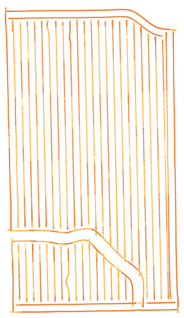

The same file would look more like this in QGIS:

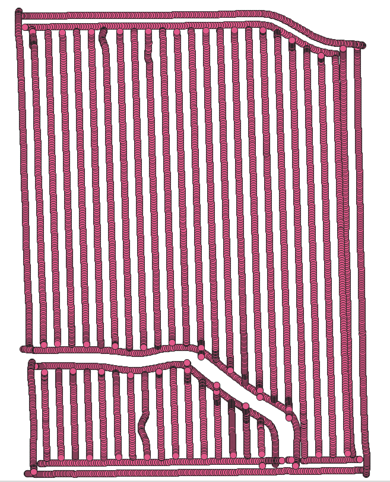

You can zoom in on each of those areas for higher resolution and see that the wavy areas have higher density application than originally intended:

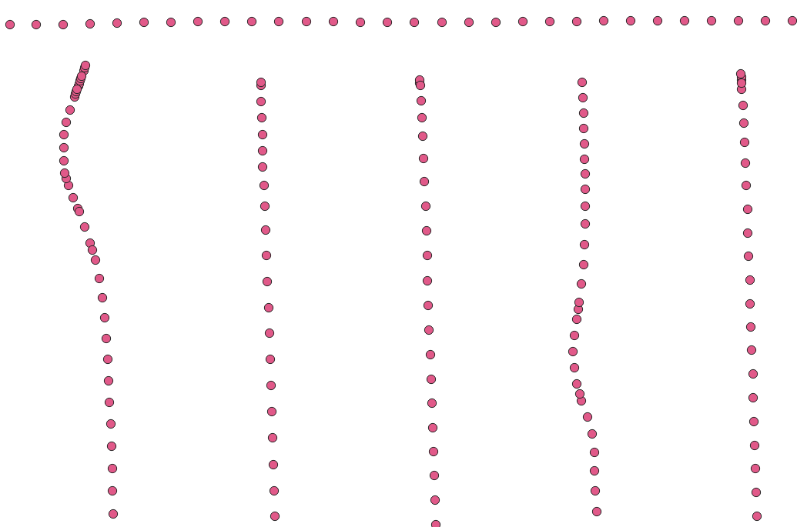

In QGIS, you can place one layer over another for comparison, as well.

Later on in the lessons, we’ll be using R Studio to provide us with calculations that compare the intended rate of application with the actual rate of application to see how accurate the equipment was. However, R Studio provides those visualizations side by side:

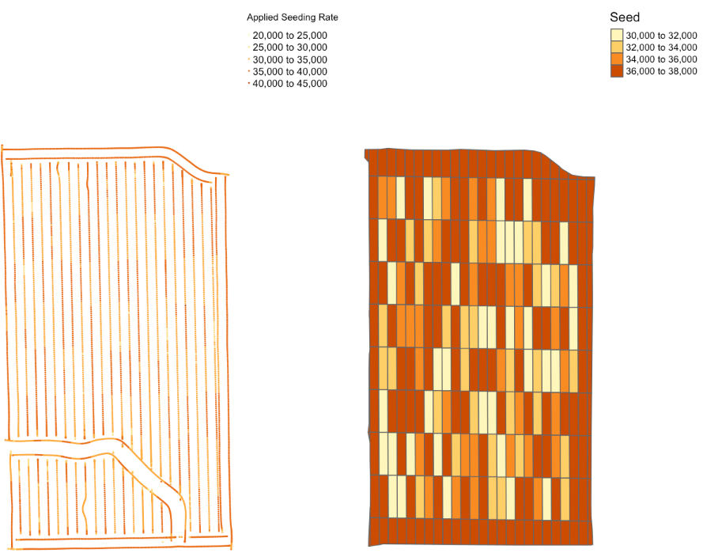

QGIS lets you layer them directly on top of each other and zoom in for more visual comparisons of particular segments, such as identifying where your actual planting or fertilization rates may be higher or lower than intended because of the way the equipment was driven:

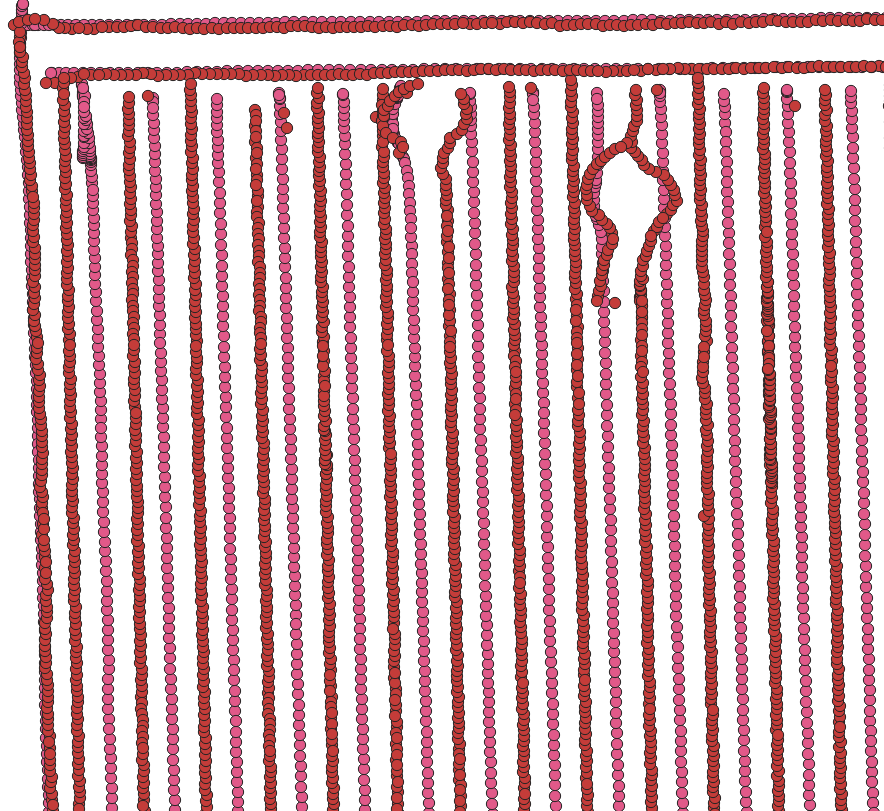

This will be helpful during the data cleaning phase of the process.

## Getting Started with QGIS

> ## Windows Users: Click here for more details
>
> > ### Windows version, C drive copy:
> >
> > The USB drives were built so that when you copy the DataHarvestingWin folder from the USB drive to your `C:\` drive, the QGIS Start Menu item will launch the software from that location for you.
> >
> > The shortcuts are located in `C:\DataHarvestingWin\QGIS 3.10 Start Menu Links`. If you'd like, you can copy the icons inside that folder (and inside the R and R Studio folder) to your desktop for easier access later.
> {.callout}
>
> > ### Windows version, running from USB drive:
> >
> > QGIS takes about 2.5 GB of space when installed. If you don’t have enough hard drive space free for QGIS and are running from the USB drive during the lesson, we’ll need to modify the environment file that tells QGIS where to find its components when launching.
> >
> > Inside `C:\DataHarvestingWin\ProgramFiles\QGIS 3.10\bin\`, look around the `qgis-bin.env` section of the alphabet:
> >
> > 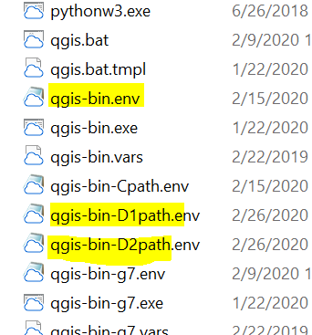
> >
> > You’ll want to use one of the D path files if your USB is assigned the letter D.
> >
> > * First, rename `qgis-bin.env` to something like `qgis-bin1.env`. (This gets it out of the way without deleting it entirely.)
> > * Next, rename `qgis-bin-D1path.env` to `qgis-bin.env`. (This puts it where QGIS is expecting to see it.)
> > * Next, try running your Start Menu launcher again.
> >
> > _If this doesn’t work for you and/or your USB is assigned a different letter, ask Dena or one of the helpers for assistance with modifying the D1path or D2path files to match your USB’s drive letter._
> {.callout}
{: .windowsUsers}

> ## Mac Users: Click here for more details
>
> To open QGIS, click on its icon in your Applications folder:
>
> 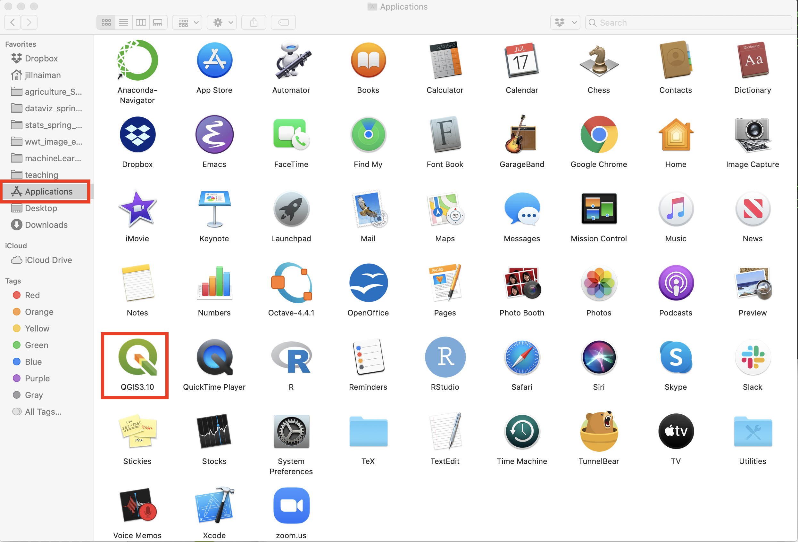
>
> When you double click QGIS should open up:
>
> 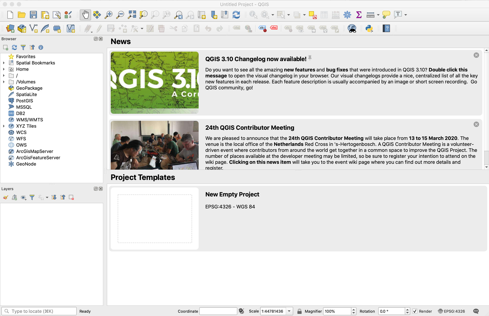
{: .windowsUsers}

### First Launch

When you first launch QGIS, it’ll look something like this:

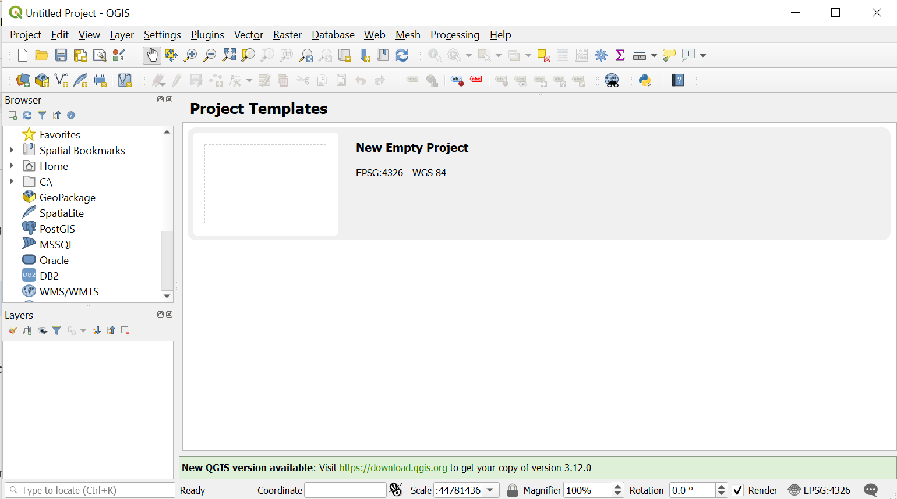

Double-click the `New Empty Project` blank piece of paper image to create a new QGIS project.

Next, go to the `Layer` menu→`Add Layer`→`Add Vector Layer`:

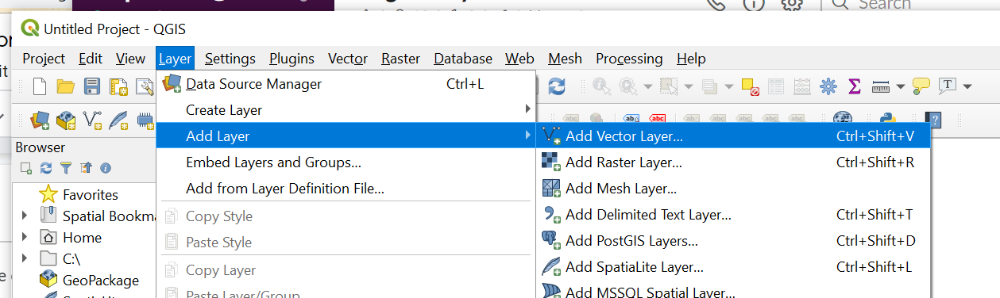

We’ll use the … button by Vector Dataset(s) to browse to `WorkingDir/data` in order to open up one of the .gpkg files - in this case `asplanted.gpkg`.

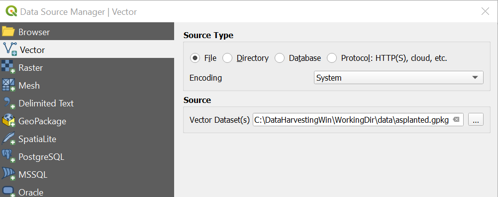

Click the `Add` button toward the bottom of this gray window, and you should see an image like this (though your color may be different):

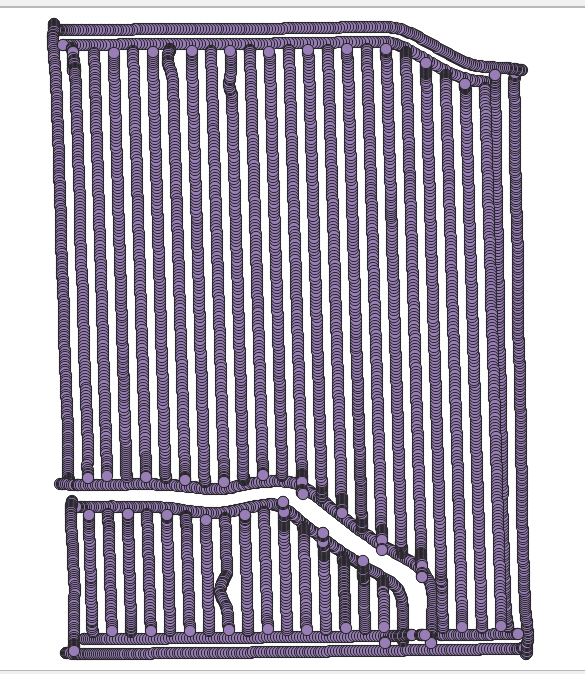

You can add additional layers as well - let’s add the asapplied.gpkg file next by following the same `Layer→Add Layer→Add Vector Layer` process:

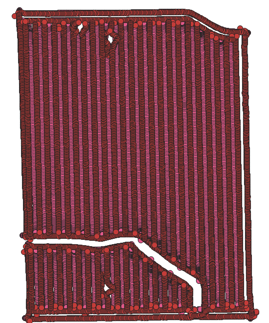

You can see a couple wiggles in the applicator’s driving path here, more clearly shown in the zoomed-in view:


Being able to see places where more (or less) seed or nitrogen was applied than intended can help explain differences in yield in that particular area. That can then help you decide whether or not to use the data from that part of the field when calculating your optimal rates. (We’ll go into this in greater detail in the “Data Cleaning” segment of the lesson.)
