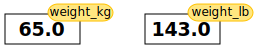

<!-- JPN: updated fig path here manually for plots to show -->

```{r setup, include=FALSE}
knitr::opts_chunk$set(echo = TRUE, fig.path='../figure/')
```


## Assumptions -- FOR DEBUGGING

 1. Everybody has installed R and R studio
 1. They have been able to run the install script we sent them and have all packages installed
 1. They *do* need an intro to the layout of RStudio, and what everything does.

## Getting to know R and RStudio

<span style="color:magenta">A good bit of this might be more suitable to the Setup section as it's got a lot about the setup and running of Rstudio.</span>

### <span style="color:magenta">Outline for this section</span>
 1. <span style="color:magenta">Let's open RStudio </span>
 1. <span style="color:magenta">Where is the console? (screen shot) Vocab: *console*</span>
 1. <span style="color:magenta">Let's use RStudio as a calculator by putting numbers into the console</span>


In this episode we’ll cover the basics of using R, which is a programming language for statistics, data analysis, and data visualization. In the past decade or so, R has become very popular in both science and business, largely because (1) it is free, and (2) thousands of people have written new code extending its functionality, and that code is also free. If you perform an analysis in R, you can share that analysis so that anyone in the world can reproduce it without having to purchase proprietary software.

If you’re already proficient with Excel, you will probably already know how to accomplish a lot of what we are doing in this episode using Excel instead of R. One reason why we are teaching you this material, however, is to get you comfortable with R since we will be using R for geospatial analysis (which is not so easy in Excel). 

In this lesson, we will be making use of another software called "RStudio" as a way to interact with the programming language R.  RStudio makes writing our programs more user-friendly.  **Some sort of analogy here would be grand**

We launch RStudio by double clicking on it's icon, as we would with other software on our computers.  If this is the first time you have opened it, the entire left pane will be taken up by something called the `Console` that you can see as the left hand panel in the figure below:


<span style="color:magenta">Do we want a screen shot of this instead of the R code?  Or will this be enough of a "following along" type of thing that that sort of thing isn't necessary?</span>

This has a prompt where commands can be entered.

```{r}
5 + 7
```

<!-- JPN: here is a test plot you can uncomment if you wanna try it
I'm gonna trya thing

```{r}
plot(c(1,2,3), c(4,5,6))
```
-->


<!-- JPN: this is just a test to see if I get what is going on here
```{r}
data = read.csv('data/fertilizer_use.csv')
print(head(data))
```
-->

After you hit enter, you will see the result of the command.  Let's try a few others:

```{r}
# Performing arithmetic
6 + 2
```

Whoa!  What did I do just there with this `#`?  This is called "leaving a comment in your code" and everything following the `#`
symbol is called a *comment*. A
comment is a line, or part of a line, that is ignored by R.  This means you can
use comments to explain what is happening in the code or why you did something
a certain way.  Comments start with the `#` character, and can take up the
whole line or just the end of a line.  As we go through this workshop, I
encourage you to put lots of comments in your code. Think of them as a way to
take notes!  Here is an example of a comment at the end of a line while we are doing some arithematic:

```{r}
2 ^ 3 # this raises two to the third power
```


## Variables in R

<span style="color:magenta">I stole this bit from the Python Fundementals Episode, not sure if that is groovy or not.  I *think* its ok if we follow the rules of their license but we should double check. Also I've left in the links to glossary references that may or may not be there </span>

<span style="color:magenta">Also, we should change this whole `weight_kg` thing into something that is more agri-centric?  I think?</span>

This is great but not very interesting.
To do anything useful with data, we need to assign its value to a _variable_.
In R, we can [assign]({{ page.root }}/reference/#assign) a value to a
[variable]({{ page.root }}/reference/#variable), using the equals sign `=`.
For example, to assign value `60` to a variable `weight_kg`, we would execute:

```{r}
weight_kg = 60
```

From now on, whenever we use `weight_kg`, R will substitute the value we assigned to
it. In layman's terms, **a variable is a name for a value**.

In R, variable names:

 - can include letters, digits, and underscores
 - cannot start with a digit
 - are [case sensitive]({{ page.root }}/reference/#case-sensitive).

This means that, for example:
 - `weight0` is a valid variable name, whereas `0weight` is not
 - `weight` and `Weight` are different variables

## Types of data
R knows various types of data. The ones you are likely to come across are:

* integer numbers
* floating point numbers, and
* names or words that sort data into "categories" <span style="color:magenta">(maybe something better here?)  Save types of data until we get into the columns stuff?</span>

In the example above, variable `weight_kg` has an integer value of `60`.
To create a variable with a floating point value, we can execute:

```{r}
weight_kg = 60.0
```

<span style="color:magenta">Here I don't know if we should get into the print function right now like they do in the Python lesson or not</span>

<span style="color:magenta">I also don't know if we want to use "<-" all the time or the "=" sign.  I *feel* like "=" is more intiuative but I'm not 100% sure on that one, could be my Python bias showing :)</span>

We can do arithematic with variables like we did with numbers before:

```{r}
# Performing arithmetic with our variable
weight_kg = 60.0 + 5.5
```
<!-- wieght in lbs = 2.2 x weight in kg -->


The above command, however, did not change the value of `weight_kg`:

```{r}
weight_kg
```

To change the value of the `weight_kg` variable, we have to
**assign** `weight_kg` a new value using the equals `<-` sign:

```{r}
weight_kg <- 65.0
weight_kg
```


> ## Variables as Sticky Notes
>
> A variable is analogous to a sticky note with a name written on it:
> assigning a value to a variable is like putting that sticky note on a particular value.
>
> 
>
> This means that assigning a value to one variable does **not** change
> values of other variables.
> For example, let's store the subject's weight in pounds in its own variable:
>
> ```{r}
> # There are 2.2 pounds per kilogram
> weight_lb <- 2.2 * weight_kg
> weight_kg
> weight_lb
> ```
>
>
> 
>
> Let's now change `weight_kg`:
>
> ```{r}
> weight_kg <- 100.0
> weight_kg
> weight_lb
> ```
> We can see that even though we updated `weight_kg`, the variable `weight_lb` was not changed.
>
> 
>
> Since `weight_lb` doesn't "remember" where its value comes from,
> it is not updated when we change `weight_kg`.
{: .callout}


 1. <span style="color:magenta">what is a variable? Vocab: *variable*</span>
 1. <span style="color:magenta">how do we assign a variable? Vocab: *assign*</span>
 1. <span style="color:magenta">What can we do with this variable? -> Generic manipulations (addition, multiplication, etc)</span>
     * <span style="color:magenta">for this, use a "real world" thing that farmers might be into... something something nitrogen levels?</span>
 1. <span style="color:magenta">Talk about how this variable now shows up in the data area and have a screen shot of where that is</span>

## Writing and Savings R Scripts

 1. Analogy - scripting is like writing a set of instructions, a letter, something. Vocab: *scripts/scripting*
 1. Where do we write scripts in RStudio - screen shot of window, a screen shot of what to do if there is only the console and no script - how do you open a script interface
 1. Redo stuff with variable in script (nitrogen levels calculation), but call it something different
 1. How to run a script - Run vs. Source -> they are in the same place!  Screenshot of this. Vocab: *running a script*
 1. Point out that it shows up in the data-listing place
 1. ~~How do we find out the value of our new variable that we wrote in a script?~~
    1. ~~Using the console like before - because in RStudio the console and scripting interface are linked! (this is not true in other things like PyCharm... this is slightly an aside though so use an aside thing)~~
    1. ~~Using a print statement - emphasize that you *have* to use print in the script to see the variable!~~
 1. How to save our script -> where does it save to?
 1. Closing and re-opening a script to re-run.

## OPTIONAL: What is a function?

<span style="color:magenta">Not 100% sure we want to go into this much detail, but we could do a thing here where we put everything we just did with our variable into a function.  I think this might be too much at this point, and maybe if we get them into writing their own functions we can circle back around to this.</span>

## Getting your data into R

 1. Let's talk about the dataset we are going to use here -- facts about this dataset
 1. This is what this dataset looks like (show snapshot of csv)
 1. To get this data into R where we can do math to it like we did with our variable above we have to do something called "reading in our data".  To do this, we'll use something called a *function* to assign a variable the value of this table -- i.e. we want a variable that will store all the rows and columns of our dataset
     * Talk a bit about what a function is here -- omelets? Vocab: *function*
     * we also have to talk about the fact that we give the file name as a parameter to this function. Vocab: *function parameter*

### Explore your data in R (could be part of previous or own thing, not sure)

 1. Another function example: using `str()` to look at your data real quick
 1. Also show how to look at your data in R (like "View(data)")? Maybe?  Or you can click on it?


## Doing stuff with data in R (better name obvs)

 1. Your data is stored as a special thing called a dataframe - explain what this is. Vocab: *dataframe*
 1. We can access the columns of your tabular dataset with a $ thing
 1. We can access the rows of your tabular dataset with ... (not sure we wanna do this)
 1. We can manipulate columns with functions
    * example: min function (or something)
    * How to learn about functions you might want to use? --> teach googling & how to look up info about functions in R


