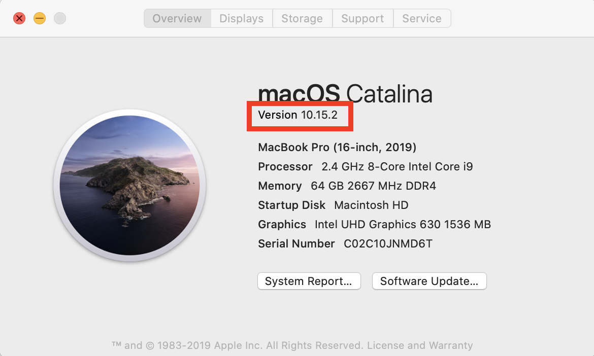

<!-- JPN: updated fig path here manually for plots to show, it turns out this is unneccesary though-->

```{r setup, include=FALSE}
knitr::opts_chunk$set(echo = TRUE, fig.path='../figure/')
```

# Installing R and RStudio

## Before you start

1. Check which version of Mac OS you have. To do this, click on the Apple icon on the top-left of your screen, then click "About This Mac". A little window should pop up with version information.

  


2. Make sure that you have about 500 MB of free space on your machine. We will need this space to install both R and RStudio, and when the program installs the compressed files expand to take much more space.  

## Installing R

1. Go to [this website](https://cran.r-project.org/bin/macosx/).

2. If your mac is OS X 10.11 and higher (this should be the case for most of you), click the `R-3.6.2.pkg` link. If your mac is OS X 10.9 or 10.10, click the `R-3.3.3.pkg` link.  

3. After clicking on the link, the file (package installer) will be downloaded onto your computer. Once the file has been downloaded, click on the `.pkg` file that downloads in your default Download folder and walk through the installation process. Accept the default options for now.

R is now **installed** on your computer.  

### Testing R

1. Double-click on the R icon in the Applications folder:


A window titled "R Console" should pop up:

  

The `>` character is called the prompt and is the place where we enter commands for the program to interpret. For instance, if you type `25+5` followed by the return/enter key, you will see:

```{r}
25+5
```


2. To quit R, call the quit function by going to `File -> Quit R`.


R will ask you if you want to save your work:


Click on "Don't Save". You have now left R.  

We are not going to use R this way often, as we will use an integrated environment called RStudio.  

## Installing RStudio

1. Go to [this website](https://rstudio.com/products/rstudio/download/).

2. Click on the `Free` link (note: there are paid options, but we won't be using those!). The file download will begin.
  * If you have an older computer, you *may* have to find your installer on [this page](https://support.rstudio.com/hc/en-us/articles/206569407-Older-Versions-of-RStudio), but feel free to contact us about that!

3. Once the file has been downloaded, click on it. A window should pop up:


Click on the RStudio icon and drag it into the Applications folder. 

RStudio is now **installed** on your computer.

**Note**: For RStudio to work, R needs to be installed first.

### Testing RStudio

1. Double-click on the RStudio icon in the Applications:

  

A window titled "RStudio" should pop up, looking something like this:


2. Just as in R, the `>` character in the Console window is where we enter commands for the program to interpret.  You can try entering something there and then hitting the `Enter` key to see:

```{r}
25+5
```


3. To exit RStudio, click "RStudio" in the menu bar, then click "Quit RStudio". Alternatively, use the `Cmd-Q` shortcut. If prompted to save the workspace, do not save it.


### Installing the geospatial and federal data packages
  
* When RStudio is open and working, create a new R script file and copy in the 
contents of [this installation script file](https://github.com/data-carpentry-for-agriculture/trial-lesson/blob/gh-pages/_episodes_rmd/package_install_script.R). 

Here's where to make a new script:


* Run each line in this script by selecting it and clicking Run. 
* Watch for any error messages along the way.
* If the red stop sign in the top right corner of the console is still highlighted and the cursor is a gray \|, an installation process is still running.
* If you see a blue > in the console , you're ready to run the next line.
(Note that this process can take **3 - 4 hours on Windows 10** because of virus checking procedures
that were already taken care of on the USB sticks. If you can wait for the USB sticks, you'll have
a faster way to get up and running.)


### Checking that the packages installed correctly

* After you've run the installation items, create a new R script file and copy in the 
contents of [the package load and test file](https://raw.githubusercontent.com/data-carpentry-for-agriculture/trial-lesson/gh-pages/_episodes_rmd/package_load_and_test.R). 
* Run each line by selecting it and clicking the Run key. Each test should let you know whether an error was encountered in the loading process.


An example of one of the tests' output:


# Download and Install QGIS

To download QGIS, visit [the QGIS download site](https://qgis.org/en/site/forusers/download.html) and choose one of the standalone installers. Be sure to check your Mac version to download the correct package.

Note: This is a ~1Gb file, so it's likely to take some time to download.

You should see a new icon in your Applications folder:


When you double click QGIS should open up:


Citation: R/RStudio install structure from <a href="https://github.com/kjytay">Kenneth Tay</a>
