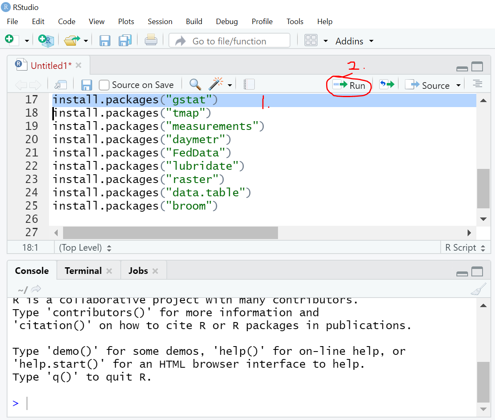

---
# Please do not edit this file directly; it is auto generated.
# Instead, please edit extra-Installing-R-on-Windows.md in _extras_rmd/
title: "Installing R, RStudio, and QGIS on Windows"
questions:
- Do I want to install the software before the workshop?
- Can I download 5 Gb of installation files and data files over my network?
- Am I comfortable with running package installation scripts in R Studio?
objectives:
- If you'd like an instructor's assistance, we recommend you wait until the workshop.
- If you'd like to experiment on your own, you can follow these instructions.
source: Rmd
---

<!-- start cut from Windows veresion -->

## If you choose to install before the workshop begins

If you're installing R, R Studio, and QGIS before the workshop begins, you can follow these
instructions instead of the USB instructions. (All the steps below have been taken on the USB drives.)

### Before you start

Check that you have about 5 Gb of free space on your computer's hard drive. On Windows 10, you can open File Manager and click This PC for a look at your drive space.

### R and R Studio

You'll need to install R before R Studio, and after you've installed R Studio you'll need to run some manual package installation and library loading scripts. We'll start with R.

* Download R from
  the [CRAN website](http://cran.r-project.org/bin/windows/base/release.htm).
* Run the `.exe` file that was just downloaded
* In the command line window that launches, you should see some R descriptive text and a ">" symbol. 
* You can do some simple math on the command line (such as 5+12) to make sure it's fully loaded and responding.

Next:

* Go to the [RStudio download page](https://www.rstudio.com/products/rstudio/download/#download)
* Under *Installers* select **RStudio x.yy.zzz - Windows
  Vista/7/8/10** (where x, y, and z represent version numbers)
* Double click the file to install it
* Once it's installed, open RStudio to make sure it works and you don't get any
  error messages.

### Installing the geospatial and federal data packages
  
* When RStudio is open and working, create a new R script file and copy in the 
contents of [this installation script file](https://github.com/data-carpentry-for-agriculture/trial-lesson/blob/gh-pages/_episodes_rmd/package_install_script.R). 

Here's where to make a new script:

 * Run each line in this script by selecting it and clicking Run. 
 * Watch for any error messages along the way.
 * If the red stop sign in the top right corner of the console is still highlighted and the cursor is a gray \|, an installation process is still running.
 * If you see a blue > in the console , you're ready to run the next line.

(Note that this process can take **3 - 4 hours on Windows 10** because of virus checking procedures
that were already taken care of on the USB sticks. If you can wait for the USB sticks, you'll have
a faster way to get up and running.)

### Checking that the packages installed correctly

* After you've run the installation items, create a new R script file and copy in the 
contents of [the package load and test file](https://github.com/data-carpentry-for-agriculture/trial-lesson/blob/gh-pages/_episodes_rmd/package_load_and_test.R). 
* Run each line by selecting it and clicking the Run key. Each test should let you know whether an error was encountered in the loading process.

An example of one of the tests' output:

## QGIS

To download QGIS, visit [the QGIS download site](https://qgis.org/en/site/forusers/download.html) and choose one of the standalone installers. (Most people can run the 64 bit version, though if you're not sure, use the 32 bit package, because 64 bit computers can run the 32 bit edition.)

Note: This is a 500 Mb file, so it's likely to take some time to download.

Double-click the installation file once it's downloaded and follow the prompts.

Once you've completed the process, you'll have a new Start Menu folder with several icons in it:

Most of the time you'll want the regular Desktop version.

