<!-- JPN: updated fig path here manually for plots to show, it turns out this is unneccesary though-->

```{r setup, include=FALSE}
#knitr::opts_chunk$set(echo = TRUE, fig.path='../figure/')
library(knitr)
library(httr)
source("../bin/chunk-options.R")
```

# Installing R and RStudio

## Before you start

1. Check which version of Mac OS you have. To do this, click on the Apple icon on the top-left of your screen, then click "About This Mac". A little window should pop up with version information.

  


2. Make sure that you have about 500 MB of free space on your machine. We will need this space to install both R and RStudio, and when the program installs the compressed files expand to take much more space.  

## Installing R

1. Go to [this website](https://cran.r-project.org/bin/macosx/).

2. If your mac is OS X 10.11 and higher (this should be the case for most of you), click the `R-3.6.2.pkg` link. If your mac is OS X 10.9 or 10.10, click the `R-3.3.3.pkg` link.  

3. After clicking on the link, the file (package installer) will be downloaded onto your computer. Once the file has been downloaded, click on the `.pkg` file that downloads in your default Download folder and walk through the installation process. Accept the default options for now.

R is now **installed** on your computer.  

### Testing R

1. Double-click on the R icon in the Applications folder:

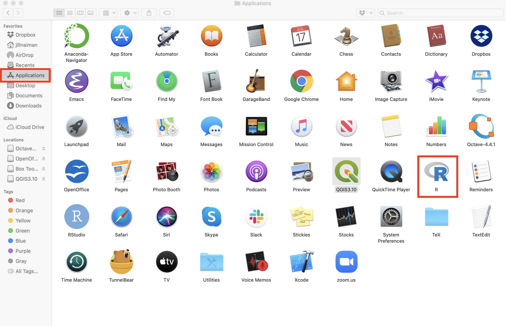

A window titled "R Console" should pop up:

  

The `>` character is called the prompt and is the place where we enter commands for the program to interpret. For instance, if you type `25+5` followed by the return/enter key, you will see:

```{r}
25+5
```

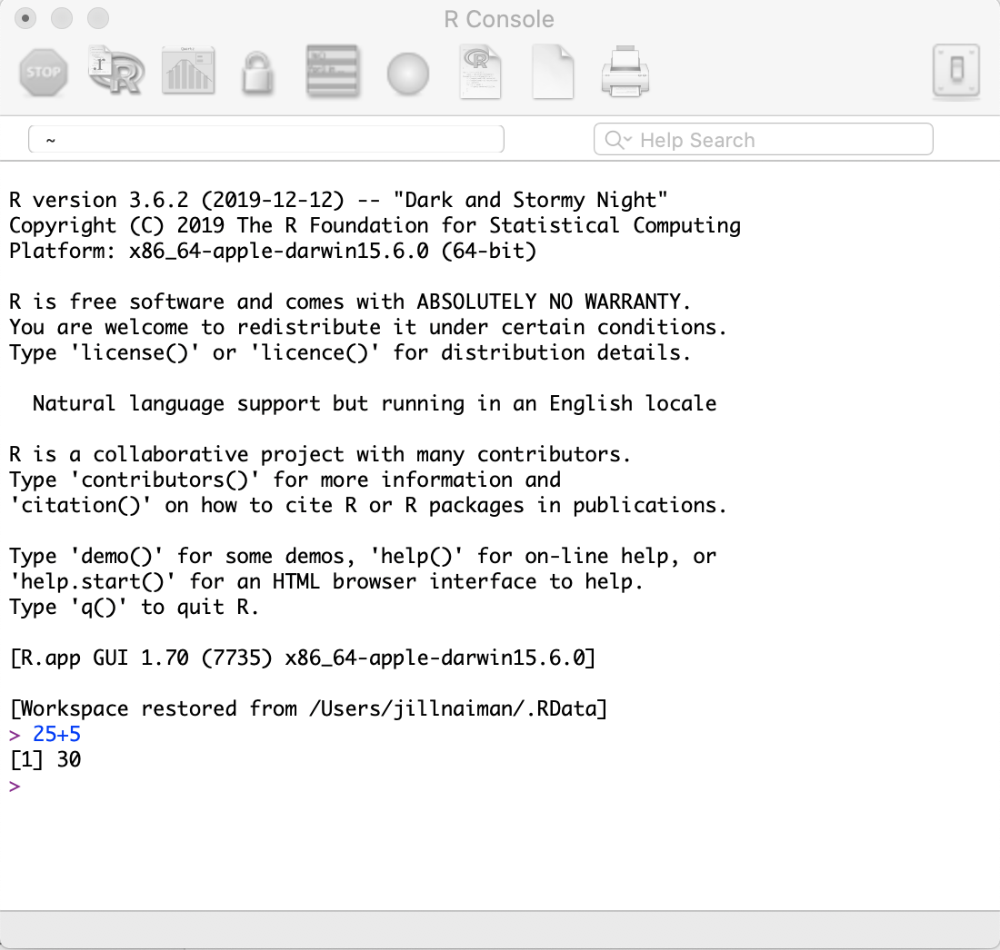

2. To quit R, call the quit function by going to `File -> Quit R`.


R will ask you if you want to save your work:

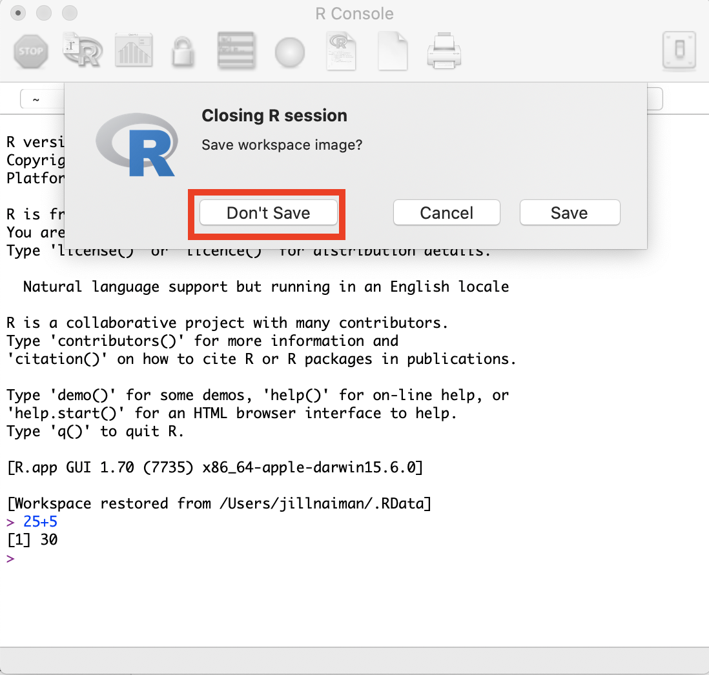

Click on "Don't Save". You have now left R.  

We are not going to use R this way often, as we will use an integrated environment called RStudio.  

## Installing RStudio

1. Go to [this website](https://rstudio.com/products/rstudio/download/).

2. Click on the `Free` link (note: there are paid options, but we won't be using those!). The file download will begin.
  * If you have an older computer, you *may* have to find your installer on [this page](https://support.rstudio.com/hc/en-us/articles/206569407-Older-Versions-of-RStudio), but feel free to contact us about that!

3. Once the file has been downloaded, click on it. A window should pop up:


Click on the RStudio icon and drag it into the Applications folder. 

RStudio is now **installed** on your computer.

**Note**: For RStudio to work, R needs to be installed first.

### Testing RStudio

1. Double-click on the RStudio icon in the Applications:

  

A window titled "RStudio" should pop up, looking something like this:

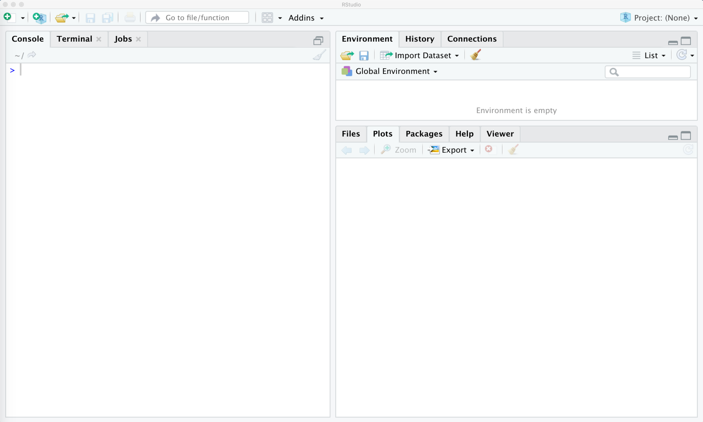

2. Just as in R, the `>` character in the Console window is where we enter commands for the program to interpret.  You can try entering something there and then hitting the `Enter` key to see:

```{r}
25+5
```


3. To exit RStudio, click "RStudio" in the menu bar, then click "Quit RStudio". Alternatively, use the `Cmd-Q` shortcut. If prompted to save the workspace, do not save it.


# Installing the geospatial and federal data packages

When RStudio is open and working, create a new R script file.

Here's where to make a new script:


When you open a new script, your RStudio will now look like this (without the red labels):

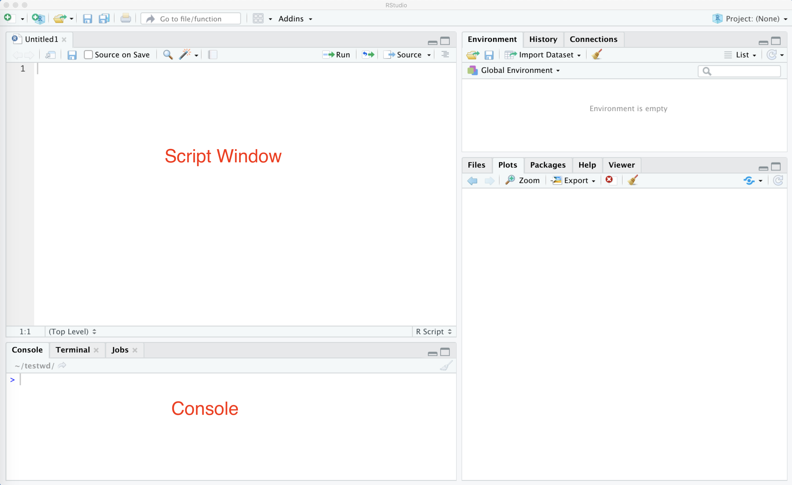

Once this is done copy the following into your script window:
```{r copyfuncscript, eval=FALSE}
source('https://raw.githubusercontent.com/data-carpentry-for-agriculture/trial-lesson/gh-pages/_episodes_rmd/package_install_script.R')
```

And follow it by pressing the `Source` button.  You might get some red words showing up, and that is normal!  If you see any red with the word `Error` in it, this may indicate a problem however.

This looks like:


<!-- JPN: streamlined
* When RStudio is open and working, create a new R script file and copy in the 
contents of [this installation script file](https://github.com/data-carpentry-for-agriculture/trial-lesson/blob/gh-pages/_episodes_rmd/package_install_script.R). 

Here's where to make a new script:


Once you copy and paste this in your script window, you can press the `Source` button to install the packages:


-->

* If the red stop sign in the top right corner of the console is still highlighted, an installation process is still running.
* If you see a blue > in the console , you're ready to go.

This action is "sourcing" i.e. running a bit of code from the internet that installs a bunch of libraries that provide functionality that is not included with standard R installation.

Alternatively, you can copy the following into the script window or console:

```{r altInstall, eval=FALSE}
install.packages("ggplot2")
install.packages("rgdal") 
install.packages("dplyr") 
install.packages("sf")
install.packages("gstat")
install.packages("tmap")
install.packages("measurements")
install.packages("daymetr")
install.packages("FedData")
install.packages("lubridate")
install.packages("raster")
install.packages("data.table")
install.packages("broom")
```

## Checking that the packages installed correctly

We have a test script to make sure all packages have installed correctly.  To run this test script, we will "Source" it's location like we did above for the package installation script.

In your script window you can type in:

```{r installScriptFtest, eval=FALSE}
source('https://raw.githubusercontent.com/data-carpentry-for-agriculture/trial-lesson/gh-pages/_episodes_rmd/functions.R')
```

... and then press the `Source` button.  This will look like:

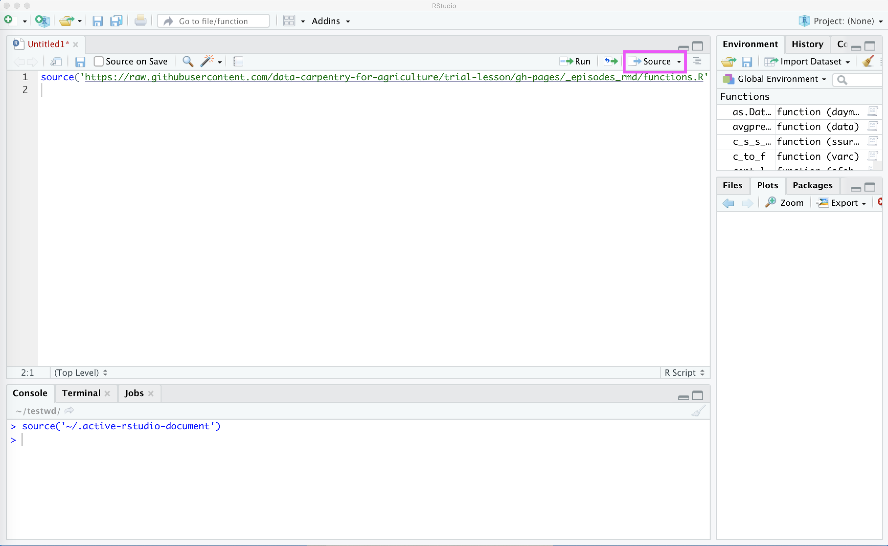

Next, we will run the test script to see what happens.  When we run this script, it will create a new directory called `WorkingDir` to save all of our test images in.  This directory will also be used to store data for this workshop.  (You can change the default creation location for `WorkingDir` by calling the function as `run_workshop_test(workingDir='YOUR DIR')`, shown below is how this looks for the default).

Once we press the `Source` some things will download and be calculated, and a new file called `WorkingDir` will show up in our file list:


To check that all our images have been created, we can click on `WorkingDir` in our **File** list in RStudio (see #2 in above figure), and then navigate to `test_images`:


Once you open this file, you should see several images:


You can click on each of these to open them up.  Here is a grid of what each one should look like:

| &nbsp;    |  &nbsp;  |     &nbsp; |
|:---------:|:-------:|:--------:|
| plot1_ggplot2.jpg <br> 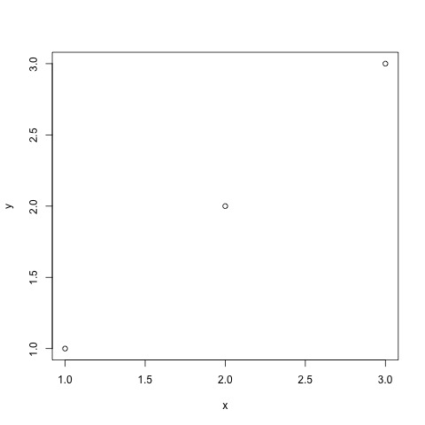 | plot2_sf.jpg <br>  | plot3_gstat.jpg <br>  | 
| plot4_tmap.jpg <br>  | plot5_daymetr.jpg <br> 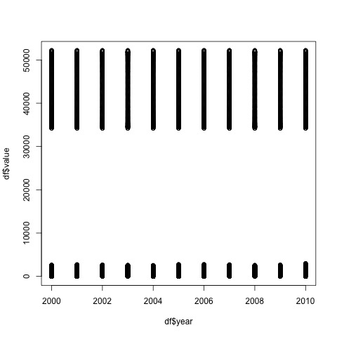 | plot6_ssurgo.jpg <br> 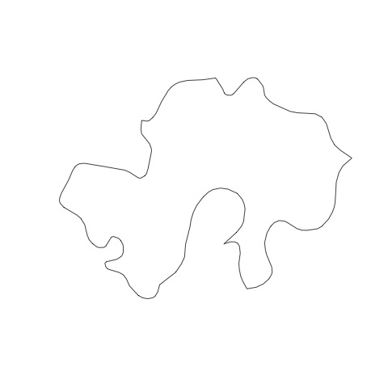 | 
| plot7_raster.jpg <br>  | plot8_datatable.jpg <br> 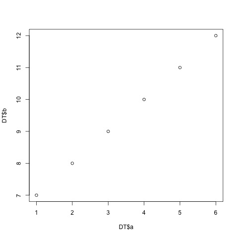 | plot9_broom.jpg <br>  | 


# Download data for this workshop

The final thing we need to do for this workshop is to download the data.  To do this, we need to run one more function.  To avoid re-running our test function, we can put a little `#` in front of this line.  So the code in our script will now look like:
```{r codeCommentROut, eval=FALSE}
source('https://raw.githubusercontent.com/data-carpentry-for-agriculture/trial-lesson/gh-pages/_episodes_rmd/functions.R')

#run_workshop_test()

download_workshop_data()
```

If we navigate to our `WorkingDir` directory we will see that a folder called `data` and a script called `functions.R` have now appeared.  This process looks like:

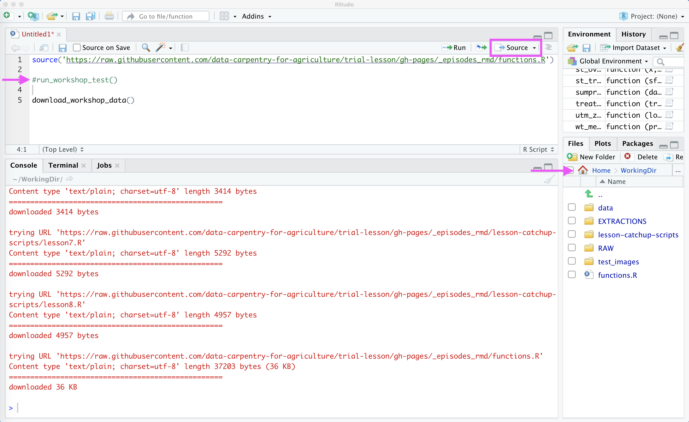


<!-- JPN this is in the intro

### Checking that the packages installed correctly

* After you've run the installation items, create a new R script file and copy in the 
contents of [the package load and test file](https://raw.githubusercontent.com/data-carpentry-for-agriculture/trial-lesson/gh-pages/_episodes_rmd/package_load_and_test.R). 
* Run each line by selecting it and clicking the Run key. Each test should let you know whether an error was encountered in the loading process.


An example of one of the tests' output:

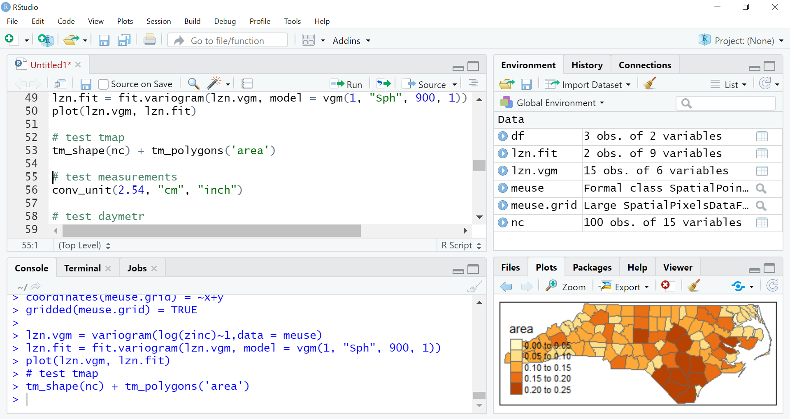
-->


# Download and Install QGIS

To download QGIS, visit [the QGIS download site](https://qgis.org/en/site/forusers/download.html) and choose one of the standalone installers. Be sure to check your Mac version to download the correct package.

Note: This is a ~1Gb file, so it's likely to take some time to download.

You should see a new icon in your Applications folder:


When you double click QGIS should open up:

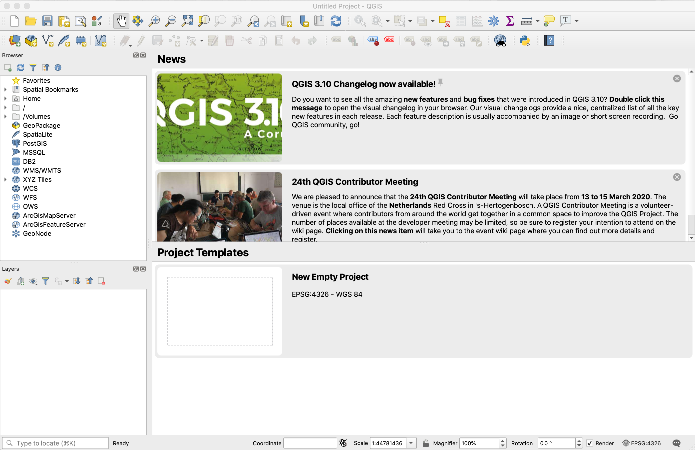


Citation: R/RStudio install structure from <a href="https://github.com/kjytay">Kenneth Tay</a>
