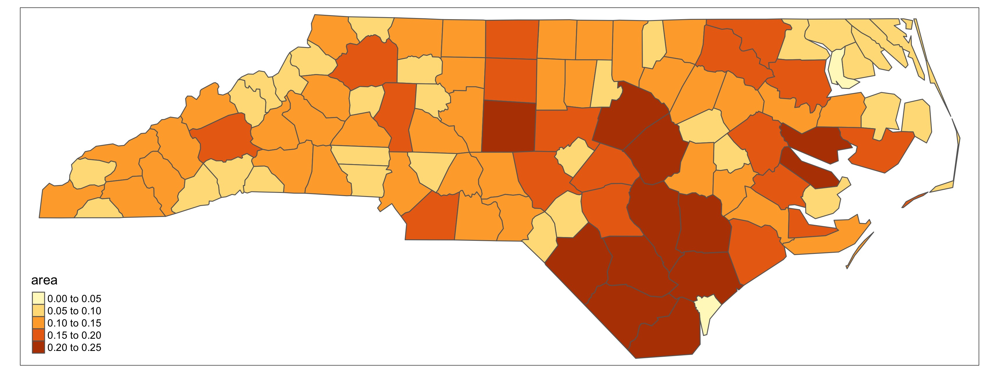
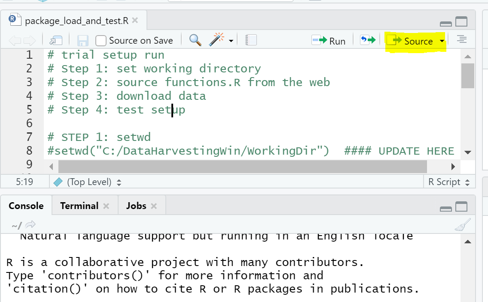

<!-- start cut from Windows veresion -->
<hr>

## If you choose to install before the workshop begins

If you're installing R, R Studio, and QGIS before the workshop begins, you can follow these
instructions instead of the USB instructions. (All the steps below have been taken on the USB drives.)

### Before you start

Check that you have about 5 Gb of free space on your computer's hard drive. On Windows 10, you can open File Manager and click This PC for a look at your drive space.


### R and R Studio

You'll need to install R before R Studio, and after you've installed R Studio you'll need to run some manual package installation and library loading scripts. We'll start with R.


* Download R from
  the [CRAN website](http://cran.r-project.org/bin/windows/base/release.htm).
* Run the `.exe` file that was just downloaded
* In the command line window that launches, you should see some R descriptive text and a ">" symbol. 
* You can do some simple math on the command line (such as 5+12) to make sure it's fully loaded and responding.


Next:

* Go to the [RStudio download page](https://www.rstudio.com/products/rstudio/download/#download)
* Under *Installers* select **RStudio x.yy.zzz - Windows
  Vista/7/8/10** (where x, y, and z represent version numbers)
* Double click the file to install it
* Once it's installed, open RStudio to make sure it works and you don't get any
  error messages.


# Installing the geospatial and federal data packages

<!-- JPN changed
* When RStudio is open and working, create a new R script file and copy in the 
contents of [this installation script file](https://github.com/data-carpentry-for-agriculture/trial-lesson/blob/gh-pages/_episodes_rmd/package_install_script.R).
-->

When RStudio is open and working, create a new R script file.

Here's where to make a new script:


When you open a new script, your RStudio will now look like this (without the red labels):


Once this is done copy the following into your script window:
```{r copyfuncscript, eval=FALSE}
source('https://raw.githubusercontent.com/data-carpentry-for-agriculture/trial-lesson/gh-pages/_episodes_rmd/package_install_script.R')
```

And follow it by pressing the `Source` button.  You might get some red words showing up, and that is normal!  If you see any red with the word `Error` in it, this may indicate a problem however.

This looks like:


<!-- JPN: streamlined
* When RStudio is open and working, create a new R script file and copy in the 
contents of [this installation script file](https://github.com/data-carpentry-for-agriculture/trial-lesson/blob/gh-pages/_episodes_rmd/package_install_script.R). 

Here's where to make a new script:


Once you copy and paste this in your script window, you can press the `Source` button to install the packages:


-->

* If the red stop sign in the top right corner of the console is still highlighted, an installation process is still running.
* If you see a blue > in the console , you're ready to go.

This action is "sourcing" i.e. running a bit of code from the internet that installs a bunch of libraries that provide functionality that is not included with standard R installation.

Alternatively, you can copy the following into the script window or console:

```{r altInstall, eval=FALSE}
install.packages("ggplot2")
install.packages("rgdal") 
install.packages("dplyr") 
install.packages("sf")
install.packages("gstat")
install.packages("tmap")
install.packages("measurements")
install.packages("daymetr")
install.packages("FedData")
install.packages("lubridate")
install.packages("raster")
install.packages("data.table")
install.packages("broom")
```

## Checking that the packages installed correctly

We have a test script to make sure all packages have installed correctly.  To run this test script, we will "Source" it's location like we did above for the package installation script.

In your script window you can type in:

```{r installScriptFtest, eval=FALSE}
source('https://raw.githubusercontent.com/data-carpentry-for-agriculture/trial-lesson/gh-pages/_episodes_rmd/functions.R')
```

... and then press the `Source` button.  This will look like:


Next, we will run the test script to see what happens.  When we run this script, it will create a new directory called `WorkingDir` to save all of our test images in.  This directory will also be used to store data for this workshop.  (You can change the default creation location for `WorkingDir` by calling the function as `run_workshop_test(workingDir='YOUR DIR')`, shown below is how this looks for the default).

Once we press the `Source` some things will download and be calculated, and a new file called `WorkingDir` will show up in our file list:


<font color="magenta">NOTE: the above has been copied from the Mac install instructions, the Windows filepaths will look a little different.</font>

To check that all our images have been created, we can click on `WorkingDir` in our **File** list in RStudio (see #2 in above figure), and then navigate to `test_images`:


Once you open this file, you should see several images:


You can click on each of these to open them up.  Here is a grid of what each one should look like:

| &nbsp;    |  &nbsp;  |     &nbsp; |
|:---------:|:-------:|:--------:|
| plot1_ggplot2.jpg <br>  | plot2_sf.jpg <br>  | plot3_gstat.jpg <br>  | 
| plot4_tmap.jpg <br>  | plot5_daymetr.jpg <br>  | plot6_ssurgo.jpg <br>  | 
| plot7_raster.jpg <br>  | plot8_datatable.jpg <br>  | plot9_broom.jpg <br>  | 


# Download data for this workshop

The final thing we need to do for this workshop is to download the data.  To do this, we need to run one more function.  To avoid re-running our test function, we can put a little `#` in front of this line.  So the code in our script will now look like:
```{r codeCommentROut, eval=FALSE}
source('https://raw.githubusercontent.com/data-carpentry-for-agriculture/trial-lesson/gh-pages/_episodes_rmd/functions.R')

#run_workshop_test()

download_workshop_data()
```

If we navigate to our `WorkingDir` directory we will see that a folder called `data` and a script called `functions.R` have now appeared.  This process looks like:


<!-- JPN changed
 * Run each line in this script by selecting it and clicking Run. 
 * Watch for any error messages along the way.
 * If the red stop sign in the top right corner of the console is still highlighted and the cursor is a gray \|, an installation process is still running.
 * If you see a blue > in the console , you're ready to run the next line.

(Note that this process can take **3 - 4 hours on Windows 10** because of virus checking procedures
that were already taken care of on the USB sticks. If you can wait for the USB sticks, you'll have
a faster way to get up and running.)




### Checking that the packages installed correctly

* After you've run the installation items, create a new R script file and copy in the 
contents of [the package load and test file](https://github.com/data-carpentry-for-agriculture/trial-lesson/blob/gh-pages/_episodes_rmd/package_load_and_test.R). 
* Run each line by selecting it and clicking the Run key. Each test should let you know whether an error was encountered in the loading process.


An example of one of the tests' output:


-->

## QGIS

To download QGIS, visit [the QGIS download site](https://qgis.org/en/site/forusers/download.html) and choose one of the standalone installers. (Most people can run the 64 bit version, though if you're not sure, use the 32 bit package, because 64 bit computers can run the 32 bit edition.)

Note: This is a 500 Mb file, so it's likely to take some time to download.

Double-click the installation file once it's downloaded and follow the prompts.

Once you've completed the process, you'll have a new Start Menu folder with several icons in it:


Most of the time you'll want the regular Desktop version.


